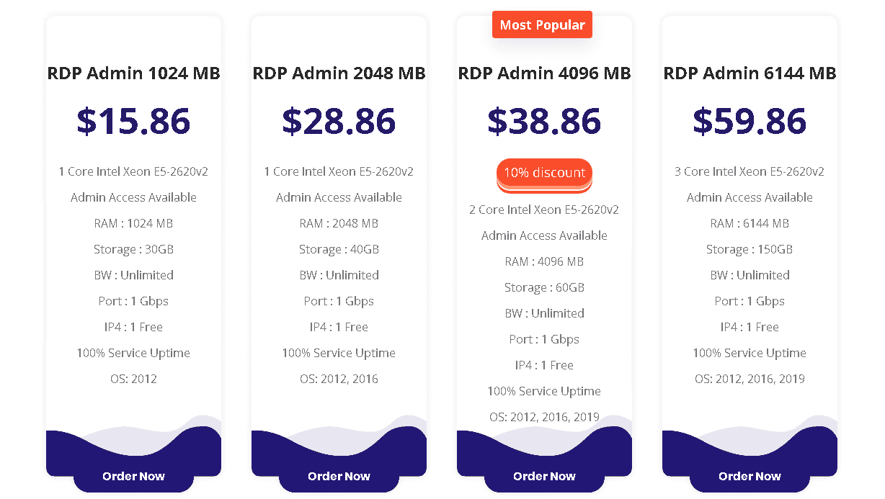
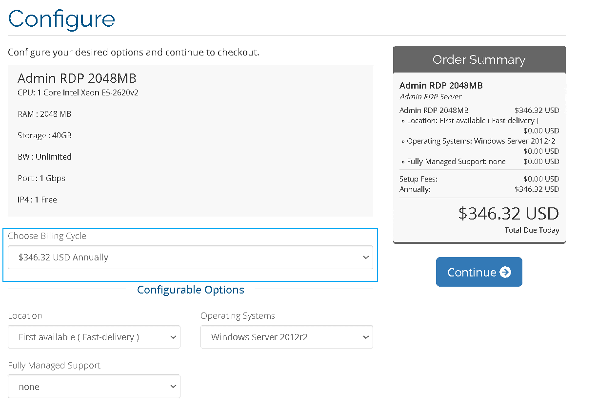
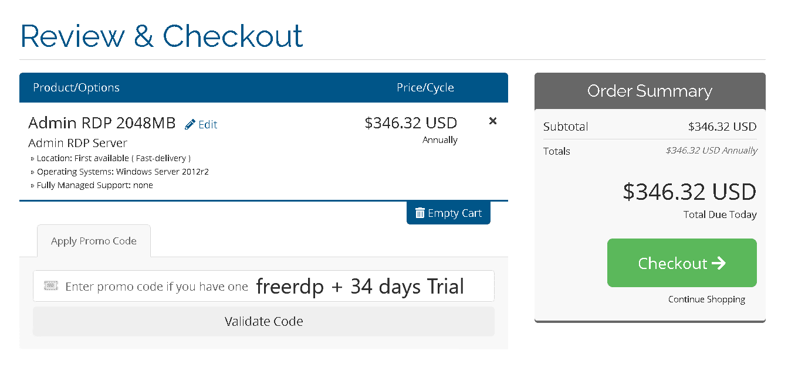
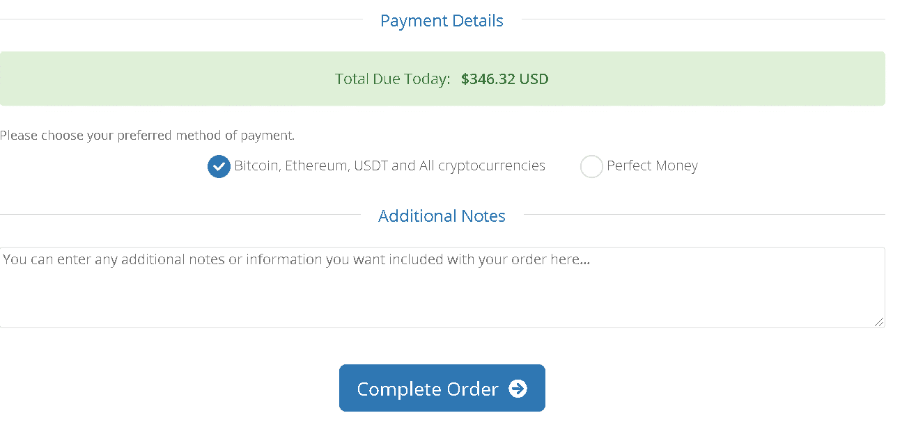

# 免费 RDP，免费获得 34 天试用的远程桌面| Eldernode

> 原文：<https://blog.eldernode.com/free-rdp/>

对于那些寻求免费 RDP(远程桌面)来处理日常事务的人来说，这是个好消息。在 eldernode，我们提供一种称为免费 RDP 的服务，您可以使用它来满足您的需求和交易。

如何获得免费的 RDP 服务器服务？

通过选择 12 个月或 24 个月的计费周期，您将获得 34 天的额外服务。您也可以使用 25%的折扣代码。

注:如果您对 Eldernode 服务不满意，您可以要求退款。10 天退款保证。

订购免费 RDP 服务器的流程是什么？

使用[购买 RDP](https://eldernode.com/buy-rdp/) 页面，选择您需要的每个套餐中的一个，然后点击“立即订购”。

将设置为每年或每两年，然后选择位置和操作系统，然后选择“继续”选项。

折扣代码:免费

在此部分，输入七五折优惠代码，点击

然后选择一种付款方式，完成订购步骤。

付款完成后，服务器详细信息将立即发送到您的电子邮件中。

如果您对订购过程有任何问题，您可以通过在线支持或发送机票联系我们。

If you have any problem with the ordering process, you can contact us via online support or send ticket.