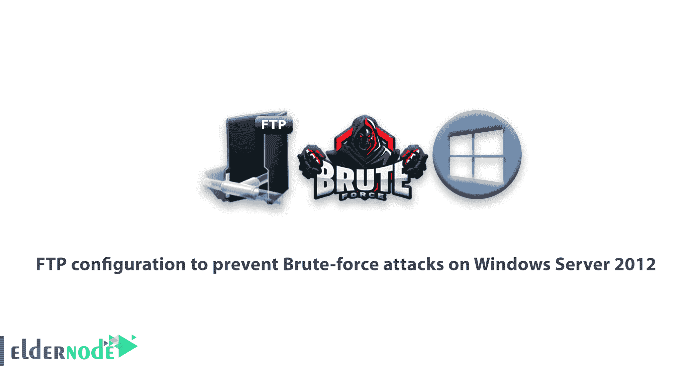
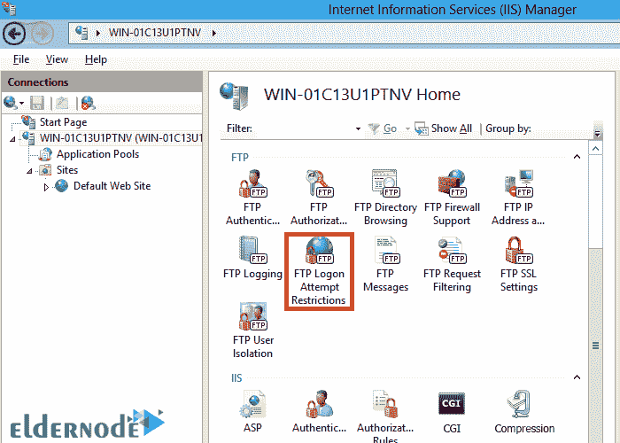
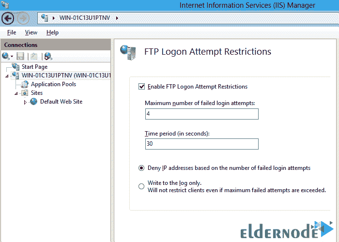

# 防止 Windows Server 2012 上暴力攻击的 FTP 配置- Eldernode

> 原文：<https://blog.eldernode.com/ftp-configuration-to-prevent-brute-force-attacks-on-windows-server-2012/>

在这篇文章中，我们将教你如何 FTP 配置，以防止暴力攻击 Windows Server 2012。我们还将在 **IIS 8.0** 中限制对 FTP 的访问。服务器的漏洞之一是对 **FTP 服务**中密码的[暴力破解](https://en.wikipedia.org/wiki/Brute-force_attack)攻击。由于用于 FTP 的帐户有时是用户在主机操作系统上的物理帐户，当指定了 **FTP 服务器类型**时，理论上可以猜测管理员用户名。

一旦找到帐户名，黑客就可以发动暴力攻击。(**例如**，Windows 的“管理员”，UNIX 操作系统的 root)。

## 防止 Windows Server 2012 遭受暴力攻击的 FTP 配置

在 **IIS 7.5** 中，**扩展性 API** 服务引入的 FTP，允许开发者使用**自定义认证提供者**，允许非 Windows 账户访问 FTP。这大大增加了攻击 FTP 服务的可能性，因为这些 FTP 帐户不是有效的 Windows 帐户。因此，它不能访问 FTP 服务之外的资源。

使用 IIS 7.5 中的 **FTP 身份验证可扩展性**特性，微软通过创建**自定义身份验证提供者**，提供了一种减少非 Windows 帐户暴力攻击的方法。

在 **IIS 8.0 Windows Server 2012** 中，微软增加了一项安全功能，允许创建所有登录，而无需自定义身份验证提供商。**在这个[教程](https://eldernode.com/category/tutorial/)** 中，我们将看看限制登录频率以防止暴力攻击发生所需的步骤。

可以将 FTP 服务配置为根据一段时间内身份验证失败的次数来阻止对 FTP 服务的访问。当我们达到失败日志的数量时，服务器会关闭 FTP 连接，FTP 客户端地址会被阻止一段时间。

### FTP 配置的先决条件

*   安装了 IIS 8.0 和 FTP 服务的 Windows Server 2012。

### 解决 FTP 服务中可能出现的 bug

此功能没有错误。

### 如何配置 FTP 以防止暴力攻击

重复以下步骤来配置 FTP 服务，以防止恶意用户访问 FTP 服务:

**1。**以管理员身份登录 Windows Server 2012。

**2。**打开互联网信息服务(IIS)管理器。

**3。**在**连接**部分，点击**服务器名称**，然后双击 **FTP 登录尝试限制**。

**4。**勾选**启用 FTP 登录尝试限制**。然后指定 FTP 登录失败的次数和阻止访问 FTP 客户端的时间长度。

**5。**点击**应用**。

“**仅写入日志**”选项不会阻止登录尝试。它只记录它拥有的条件。然后，IT 管理员可以测试不同的配置参数，以评估这些设置如何影响他们的用户。

注意 **FTP 登录尝试限制**是服务器级设置。您不能在任何网站上创建这些限制。因为攻击者可以访问您的服务器，而不是站点，所以 FTP 服务会阻止恶意用户访问服务器。

## 结论

本文讨论了防止 Windows Server 2012 上暴力攻击的 FTP 配置。还教授了限制登录次数以防止暴力攻击所需的步骤。如果你愿意，你可以阅读[如何用 PowerShell](https://blog.eldernode.com/install-and-configure-ftp-server/) 安装和配置 FTP 服务器。