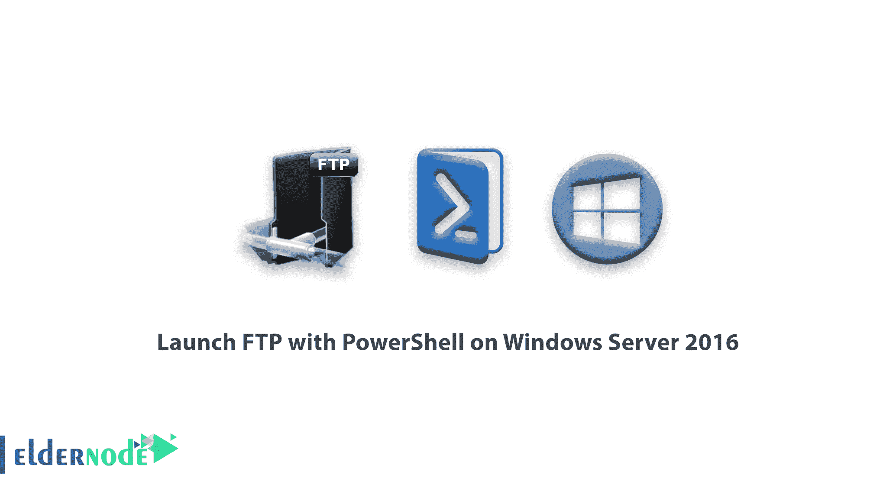

# 教程在 Windows Server 2016 上使用 PowerShell 启动 FTP-elder node

> 原文：<https://blog.eldernode.com/ftp-with-powershell-on-windows-server-2016/>



在本文中，我们要讨论的是[教程](https://eldernode.com/category/tutorial/)在 [Windows Server](https://eldernode.com/tag/windows-server/) 2016 上用 PowerShell 启动 FTP。

## 教程如何在 Windows Server 2016 上使用 PowerShell 启动 FTP

在本教程中，我们想要用 [PowerShell](https://en.wikipedia.org/wiki/PowerShell) 构建和使用一个 FTP 站点。

### 如何使用 PowerShell 启动 FTP:

1)首先，以管理员权限打开您的 PowerShell。

2)首先，如果您尚未在 IIS 上安装 FTP 服务，请使用以下命令安装它。

```
Install-WindowsFeature Web-FTP-Server 
```

3)安装 FTP 服务器后，输入以下命令进入使用 IIS 的模块。

```
Import-Module WebAdministration 
```

4)导入所需模块后，使用以下命令创建一个目录。

```
New-Item c:\ElderFtpDir -Type Directory 
```

5)然后输入以下命令创建一个 FTP 站点，并在其上设置服务器的 IP 端口和地址。

```
New-WebFtpSite -Name "Elderftp" -Port 21 -IPAddress 192.168.1.101 -Force 
```

请确保输入您的服务器的 IP 地址而不是输入的 IP 地址，并输入您的 FTP 名称而不是 Elderftp。

6)然后输入以下命令，将您的 FTP 站点链接到在第四步中创建的目录。

```
cmd /c \windows\system32\inetsrv\appcmd set site "Elderftp" "-virtualdirectorydefaults.physicalpath:c:\ElderFtpDir" 
```

7)在使用 PowerShell 的 FTP 站点的以下配置中，输入以下命令来设置您的站点的身份验证。

```
Set-ItemProperty IIS:\Sites\Elderftp -Name ftpServer.security.authentication.basicAuthentication.enabled -Value $true 
```

8)创建 FTP 站点并将其链接到相关目录后，输入以下命令来设置 SSL。

```
Set-ItemProperty IIS:\Sites\Elderftp -Name ftpServer.security.ssl.controlChannelPolicy -Value 0  Set-ItemProperty IIS:\Sites\Elderftp -Name ftpServer.security.ssl.dataChannelPolicy -Value 0 
```

9)然后输入以下命令来设置您的 FTP 站点的授权设置。

```
Add-WebConfiguration -Filter /system.ftpserver/security/authorization -Value (@{AccessType="Allow"; Users="Administrator"; Permissions="Read,Write"}) -PSPath IIS: -Location Elderftp 
```

10)最后重启你的 FTP 站点，重启后使用。

```
Restart-WebItem "iis:\sites\Elderftp" 
```

我们希望您喜欢本教程在 [Windows Server 2016](https://eldernode.com/tag/windows-server-2016/) 上使用 PowerShell 启动 FTP。