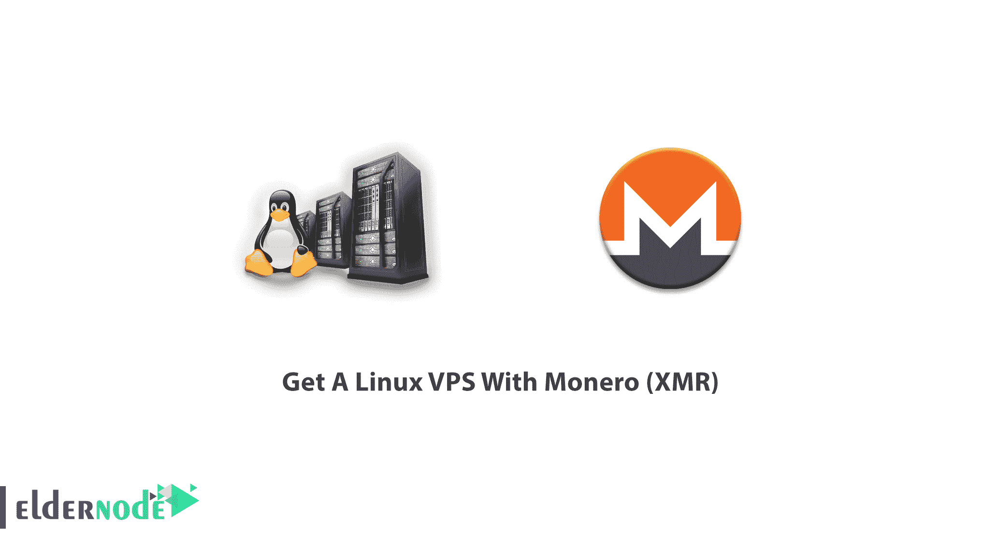
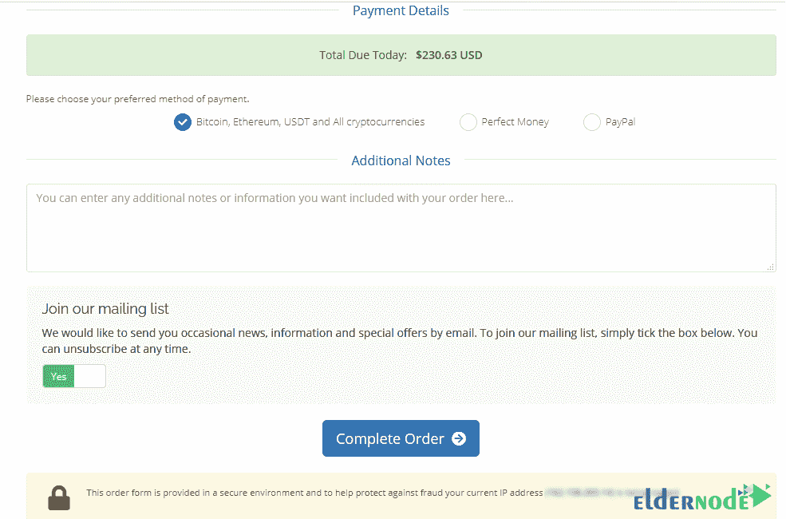

# 获得一个 Linux VPS 与 Monero (XMR) - Eldernode 博客

> 原文：<https://blog.eldernode.com/get-a-linux-vps-with-monero/>

在 IT 界，你几乎找不到不知道托管和使用 VPS 的好处的人。虚拟专用服务器可以做普通服务器做的所有事情。因为它会在网站上产生特殊的服务、设置或配置，并增加流量，所以购买 VPS 是有意义的。您将能够在 VPS 上安装您喜欢的操作系统。Linux VPS 是你可以安装并享受其功能的操作系统之一。这篇文章介绍了用 Monero (XMR) 获得 Linux VPS 的方法。要购买完全托管的 **[Linux VPS](https://eldernode.com/linux-vps/)** ，请访问 [Eldernode](https://eldernode.com/) 的软件包，试试你有没有机会获得折扣。

## **教程用 Monero (XMR)一步步得到一个 Linux VPS**

一旦你选择了你想在 VPS 上安装的操作系统，你就可以使用它的功能。根据你的需要，你可以选择完全管理的 VPS 或者非管理的 VPS。加入我们这篇文章，回顾用 Monero 准备你自己的 CPS 所需的步骤。但首先，我们来看看什么是 Monero？

### **什么是 Monero (XMR)？**

Monero 是一种开源、面向隐私的加密货币，于 2014 年推出。这是一种成为自己银行的体验，你不需要相信网络上的任何人。这种私人数字货币是互联世界的现金。Monero 是快速私密的，安全的，因为其他人永远不会看到你的余额或跟踪你的活动。使用 Monero 可以让您的交易以匿名方式私下进行。Monero 可以隐藏一个人的身份，但通常很容易追踪到付款的原始来源，因为区块链是透明的。因此，在本指南的下面，您将学习如何使用 Monero (XMR)购买您的 Linux VPS，Monero(XMR)旨在通过使用高级加密技术来隐藏发送者和接收者。

## **Monero Linux VPS 在 Eldernode 上的位置**

在 Eldernode 上有几个可用的位置，能够支持其在世界各地的重要客户。建议您根据使用类型和您的客户选择位置。

### **北美**Linux VPS 地点 

在 ElderNode 有 20 多个 VPS 位置。要找到可以为客户提供最佳服务的地方，请查看以下北美国家列表:

芝加哥 Linux VPS，纽约 Linux VPS，洛杉矶 Linux VPS，迈阿密 Linux VPS，西雅图 Linux VPS，达拉斯 Linux VPS，加拿大 Linux VPS。

### **欧洲**Linux VPS 地点 

此外，您可以要求检查您考虑的位置，并提供。为此，请在 Eldernode 上启动在线聊天或票证。但是，以下位置目前是可用的。

法国 Linux VPS，荷兰 Linux VPS，英国 Linux VPS，罗马尼亚 Linux VPS，丹麦 Linux VPS，俄罗斯 Linux VPS，德国 Linux VPS。

### **亚洲**Linux VPS 地点 

最后，这里是亚洲的可用位置。我们已经尝试准备所有流行的 Linux VPS 服务器位置。要订购其中任何一种，你只需发送你的请求。如果您希望在开始前接受咨询，请联系 Eldernode 工作人员。如果你正在阅读这个来自亚洲的指南，下面的地方可能是你需要的。

日本 Linux VPS，新加坡 Linux VPS，香港 Linux VPS，迪拜 Linux VPS，印度 Linux VPS，马来西亚 Linux VPS，韩国 Linux VPS，土耳其 Linux VPS。

## **如何即刻购买 Linux VPS Monero(XMR)**

首先，你需要知道如何找到并[选择最好的 Linux VPS](https://blog.eldernode.com/how-to-choose-the-best-linux-vps-service/) 服务器以及哪些提供商保证最好的价格、[安全性](https://blog.eldernode.com/tag/security/)，以及支持。考虑到不同的付款情况，Eldernode 总是不断进步，以满足客户。此外，不同的计划和条件是提供帮助他们选择确切的一个定制与他们的需求。让我们浏览一下本指南的步骤，准备订购您自己的 [Linux VPS 和 **Monero**](https://blog.eldernode.com/get-a-linux-vps-with-monero/) 。

第一步:

要在注册，打开网站，**注册**。

第二步:

注册完成后，点击主页上的 **Linux VPS 标签**。

第三步:

一旦你点击了 Linux VPS，你就可以看到最好的和最新的 Linux VPS 服务器包。通常，你可以找到一些折扣来订购你的月度或年度计划。要开始购买过程，请立即按**订购。**

第四步:

在此步骤中，您应该转到配置页面查看订单摘要。请注意，您应该输入位置和操作系统信息。完成后按**继续**。请注意，在这里您可以选择拥有**完全管理支持**或**贵宾支持**。

第五步:

当您查看您最近的订单时，输入您可能的**折扣代码**并按下**验证码**。然后，点击**结账**。

***注*** :通过网站上的**在线聊天**联系老年节点专家，了解可享受的折扣以及您可以拥有代码的方式。

第六步:

我们重视你喜欢的付款方式。因此，我们提供了加密货币、完美货币、贝宝等在线支付服务。以便所有用户都可以使用比特币、以太坊、Monero、Dogecoin、Ripple、Dogecoin 和数千种其他加密货币进行支付。输入您的个人详细信息后，您可以选择付款详细信息的第一个选项。当您选择了**比特币**、**以太坊**、 **USDT** 、**所有加密货币**后，点击**完成订单**。

第七步:

现在，向下滚动或搜索以在选择**硬币**部分找到 Monero XMR，并在右栏中单击**完成 Checkou** t。

第八步:

最后，您将收到您的**付款 ID** 来购买您自己的 Linux VPS 并使用 Monero XMR 付款。请随时开始与 Eldernode 专家在线聊天，提出您的问题。

就是这样！从现在起，您有 3 个小时的时间来完成您的退房手续。

结论

在本文中，您了解了如何用 Monero (XMR)获得 Linux VPS。在您订购期间，请查看 Eldernode 的电子邮件，以查看您的发票中的详细信息。所需的步骤将带您购买您首选的 Linux VPS，但如果您需要咨询更多信息或询问任何其他问题，请与我们在线聊天。如果你仍然喜欢用比特币进行转换，这是可以的，我们正在等待收到你的请求。

Step 8:

Finally, you will receive your **payment ID** to buy your own Linux VPS and pay with Monero XMR. Feel free to start an online chat with Eldernode experts to ask your questions.

That’s that! From now, you have 3 hours time to complete your checkout with Eldernode.

## Conclusion

In this article, you learned How To Get A Linux VPS With Monero (XMR). During your order, check the emails of Eldernode to view the details in your invoice. The required steps will take you to buy your preferred Linux VPS, but if you need to consult more or ask any other questions, just start an online chat with us. If you still prefer to do the transition with Bitcoin, it’s ok and we are waiting to receive your request.