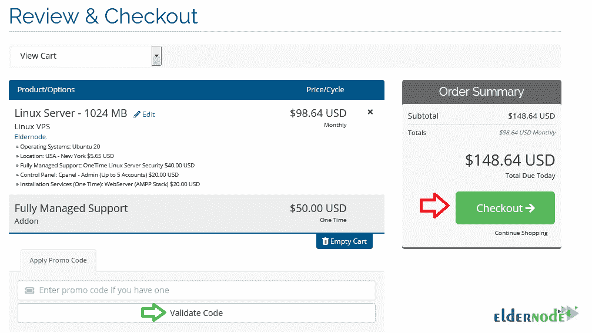

# 如何用数字货币获得美国 VPS-elder node 博客

> 原文：<https://blog.eldernode.com/get-a-usa-vps-with-digital-currency/>

VPS 代表虚拟专用服务器。由于 VPS 是一个私有服务器环境，使用 VPS 有助于您不被限制在一台物理服务器上，并且允许您不与任何人共享服务器资源。你可能在网上购物时用数字货币、电子货币或电子货币支付。如果你打算购买一个虚拟私人服务器，并且更喜欢用你最喜欢的数字货币支付，请和我们一起学习如何**用数字货币**获得美国 VPS。即使这是你的第一次经验，本教程将帮助你进行到这次付款结束。接下来就是根据自己的需求找到最好的 VP。只需在 [Eldernode](https://eldernode.com/) 上选择想要的方案，点自己的**[USA VPS](https://eldernode.com/usa-vps/)**。

## **教程用数字货币获得一个美国 VPS**

作为一名管理员，一旦你开始你的生意并注册了你考虑的域名，你就准备好为你的虚拟主机提供一个空间。VPS 服务器为您提供高质量的快速服务。然而，你已经了解了 [VPS](https://blog.eldernode.com/what-is-vps-complete-guide/) 并且复习了 VPS 的[优缺点。现在，如果你准备购买美国 VPS，让我们回顾一下本指南的以下内容，以了解更多关于](https://blog.eldernode.com/advantages-and-disadvantages-of-vps/)[数字货币](https://en.wikipedia.org/wiki/Digital_currency)的信息，并了解如何使用它购买美国 VPS。

### **什么是数字货币？**

数字货币是在数字计算机系统上管理、存储或交换的任何货币、金钱或类似金钱的资产，尤其是在互联网上。虽然数字货币没有实物形态，但它们表现出与传统货币相似的属性。所以，你可以利用它的好处，但不用支付与发行纸币和硬币相关的费用。要更好地了解数字货币，请查看其功能和优势列表。如果你还没有使用过数字货币，看看它的好处，然后继续学习用数字货币购买美国 VPS:

1-更快的付款

2-更便宜的国际转账

全天候访问

4-支持没有银行账户和银行服务不足的人

5-更有效的政府支付

### **美国可用的 VPS 服务器**

Eldernode 已经为用户提供了 20 多个 VPS 位置以及更好的服务。但是，如果您没有找到您考虑的位置，请让我们知道添加它们。但首先，看看目前可用的北美国家:

芝加哥副总裁、纽约副总裁、洛杉矶副总裁、迈阿密副总裁、西雅图副总裁、达拉斯副总裁和加拿大副总裁。

## **用数字货币一步步获得美国 VPS**

Eldernode 是一家灵活的公司，为不同计划和条件的用户提供所需的最佳服务。因为有了 Eldernode，你可以很快上手，所以我们快速开始这一部分，一步一步地用简单的方法教你获得美国 VPS。

*第一步:*

首先需要[在 Eldernode](https://blog.eldernode.com/register-on-eldernode-and-order-vps/) 上注册。所以，打开你最喜欢的浏览器，访问 Eldernode.com**注册**。

*第二步:*

转到网站页脚，在其他 VPS 中找到 **USA VPS** 并点击它。

*第三步:*

一旦您被重定向到美国 VPS 页面，选择您的完美美国虚拟服务器软件包。此外，你必须选择购买每月或每年的计划。

之前，你已经了解了 Linux VPS 和 Windows VPS 的[区别。所以，你可以选择你喜欢的。在这里，作为一个例子，我们选择](https://blog.eldernode.com/linux-vps-vs-windows-vps/) [Linux VPS](https://eldernode.com/linux-vps/) 继续，并按**现在订购**继续。

*第四步:*

在“配置”页面上，您可以看到您最近订单的摘要。选择您是需要**完全托管支持**还是 **VIP 支持**。输入所需信息，然后点击**继续**按钮。如下图所示，您可以从**位置**部分选择您想要的位置。

*第五步:*

如果有折扣代码，按**确认代码**，然后点击**结账**。

*第六步:*

您可以在 Eldernode 上使用**加密货币**的在线支付服务，如*比特币*、*以太坊*、 *Monero* 、 *Dogecoin* 、 *Ripple* 等等。我们提供了多种支付方式，帮助您通过自己喜欢的方式进行购买。你只需要输入所需的个人信息。然后，选择第一个选项“**比特币，以太坊，USDT，所有加密货币**。

*第七步:*

在这一步中，再次输入您的**个人信息**和**电子邮件地址**，在**选择硬币**框中，选择您认为合适的数字货币，最后点击**完成结账**按钮。

*第八步:*

在最新的步骤中，您将收到您的**支付 ID** 来购买您的美国 VPS，并使用您选择的数字货币进行支付。在以上所有步骤中，你可以开始与老年节点专家进行**在线聊天**，询问你所有可能的问题。聊天将尽快连接。

就是这样！检查您的收件箱并查看从 Eldernode 发送的电子邮件。您有 3 个小时的时间向 Eldernode 完成结账。

结论

在这篇文章中，你学习了如何用数字货币获得美国 VPS。要了解更多关于比特币或 Monero 等可用于在 Eldernode 上购买 VPS 的数字货币的信息，请阅读我们的文章并向您在 [Eldernode 社区](https://community.eldernode.com/)上的朋友发送反馈。

In the latest step, you will receive your **Payment ID** to buy your USA VPS and pay with the digital currency you chose. In all the above steps, you can start an **online chat** with Eldernode experts to ask all your probable questions. The chat will connect as soon as possible.

That’s that! Check your inbox and review the sent emails from Eldernode. you have 3 hours to complete your checkout with Eldernode.

## Conclusion

In this article, you learned How To Get A USA VPS With Digital Currency. To learn more about some digital currencies such as BitCoin or Monero that you can use to purchase your VPS on Eldernode, read our articles and send feedback to your friends on [Eldernode Community](https://community.eldernode.com/).