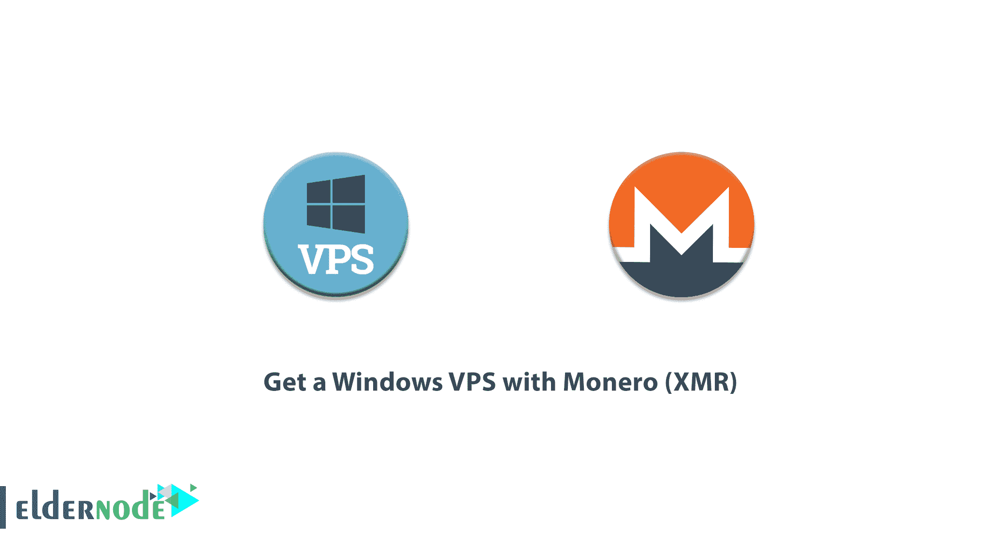
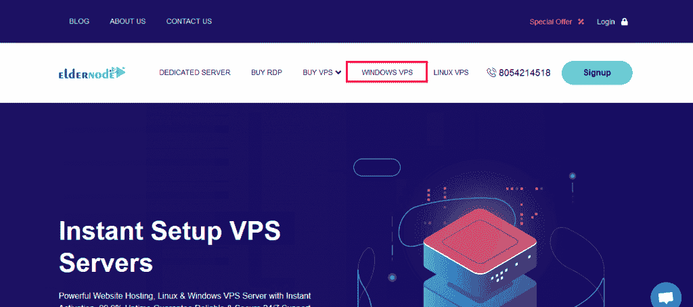
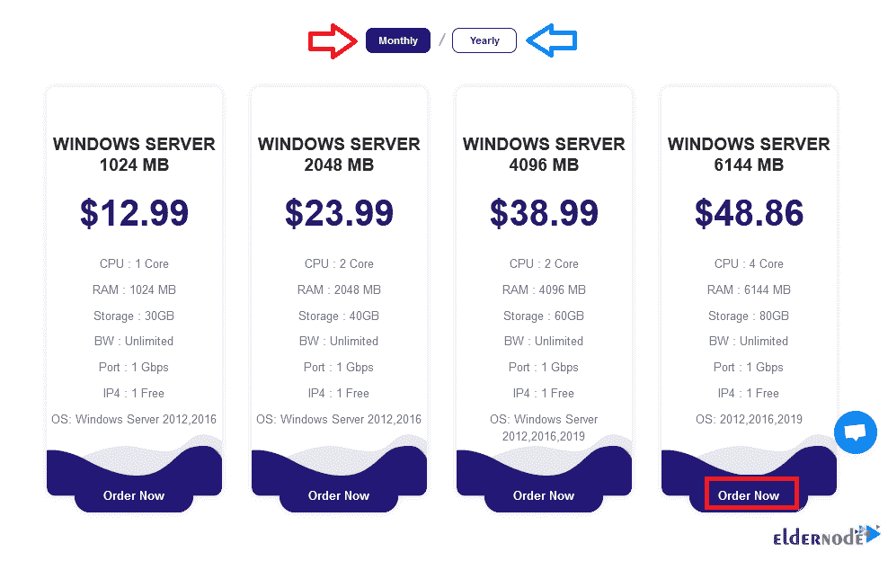
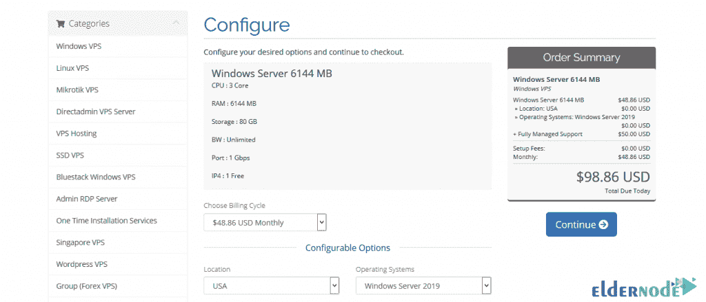
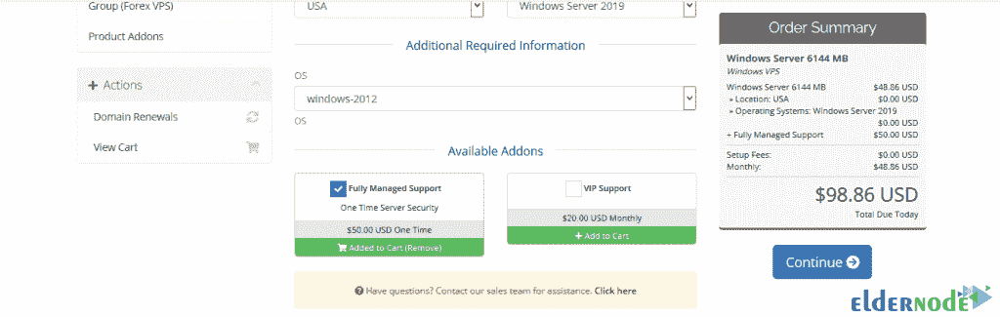
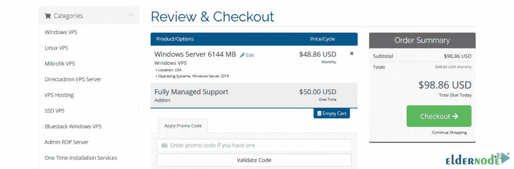
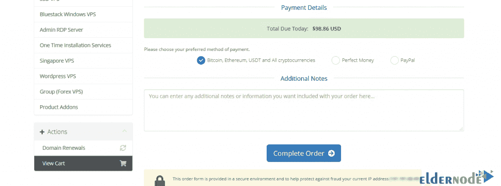
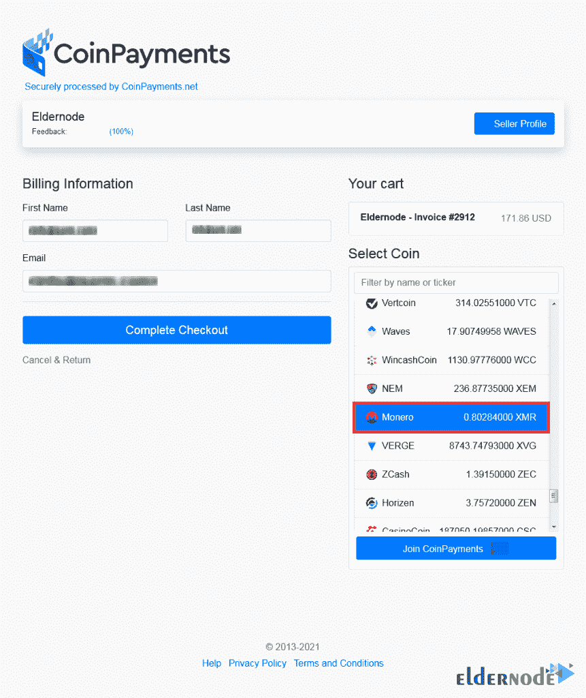
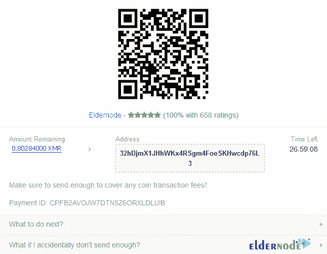

# 获得一个 Windows VPS 与 Monero (XMR) - Eldernode 博客

> 原文：<https://blog.eldernode.com/get-a-windows-vps-with-monero/>

VPS 代表虚拟专用服务器。VPS 服务器是一种服务器，专用物理服务器的部分硬件资源被分配给这种服务器。虚拟服务器拥有完全独立的服务器资源，您可以充分利用这些资源。此外，在虚拟服务器中，您可以完全访问根服务器，并且可以在服务器上应用所有必需的软件、设置和配置。在 VPS 服务器中，你可以有任何种类的操作系统。您还可以根据所需的操作系统进行所需的配置并提供服务。在这篇文章中，我们将教你如何使用 Monero (XMR) 获得一个 Windows VPS。你可以访问 [Eldernode](https://eldernode.com/) 中提供的包来购买一台 [**Windows VPS**](https://eldernode.com/windows-vps/) 服务器。

## **教程用 Monero (XMR)一步步得到一个 Windows VPS**

为了开始你的在线业务，在注册了你想要的域名后，你需要空间来存放你的虚拟主机。如果您需要优质快速的服务， [VPS 服务器](https://eldernode.com/vps/)将是您的最佳选择之一。

现阶段的重点是你要选择最合适的 VPS 服务器，即 [Linux VPS](https://eldernode.com/linux-vps/) 服务器和 Windows VPS 服务器，最适合你的网站和操作系统。如果您使用的是 Windows 操作系统，并且想用它来管理您的站点，Windows VPS 服务器是最佳选择。

### **什么是 Windows VPS？**

**Windows VPS** Server 拥有强大且用户友好的操作系统和微软 Windows Server。通过支付比专用服务器更少的费用，您将拥有一台拥有强大硬件资源和虚拟化的服务器，您可以在其上安装所需服务器的操作系统版本。你可以在这些服务器上做任何事情。通过使用管理员访问权限，您可以连接到服务器并做您想做的事情。

### **介绍莫内罗(XMR)**

**由于其注重隐私的结构，数字货币在数字货币领域非常受欢迎。近年来，各种数字货币进入了市场，其中许多数字货币以增加隐私和匿名性为目的，取得了不同的成功。**

**Monero 是目前世界上最安全的数字货币之一，具有保护隐私的能力，安全性高。Monero 有一个开源结构，这样人们就可以访问它的代码。这种数字货币使用共识证明(PoW)算法。这意味着 Monero 和比特币一样，是一种数字可提取的货币，它利用这一特性来增加网络能力。开采者因网络和采矿作业获得 Monero 数字货币(XMR)奖励。**

**在本文的续篇中，我们会告诉你，你可以用这种数字货币购买一台 Linux VPS 服务器。请加入我们。**

## ****老节点上的 Monero Windows VPS 位置****

**为了尊重客户，Eldernode 从世界各地提供其 **Windows VPS** 服务器。您可以根据您的位置和使用类型选择您想要的位置。请注意，您可以联系我们的技术支持，通过实时聊天或票证请求您想要的位置。在下面的章节中，我们将列出不同大洲的位置。**

### ****美国视窗 VPS 外景****

**美洲的 Windows VPS 服务包括以下位置。如果您要查找的位置不存在，请告诉我们。**

**Windows VPS(芝加哥、纽约、洛杉矶、迈阿密、西雅图、达拉斯、加拿大)。**

### ****欧洲视窗 VPS 地点****

**如果您想使用在欧洲可用的 Windows VPS 服务，您可以查看下面的可用位置。如果您的首选位置不在下面的选项中，请告诉我们，以便我们为您提供。**

**法国视窗 VPS，荷兰视窗 VPS，英国视窗 VPS，罗马尼亚视窗 VPS，丹麦视窗 VPS，俄罗斯视窗 VPS，德国视窗 VPS。**

### ****亚洲的 Windows 服务器地点****

**如果你想从亚洲购买 VPS 服务器，你可以在下面看到。这些服务器来自亚洲最受欢迎的地方。同样，如果您的位置没有列在下面，请联系我们。**

**Windows VPS(日本、新加坡、香港、迪拜、印度、马来西亚、韩国、土耳其)。**

## ****如何购买 Windows VPS Monero (XMR)****

**下面介绍如何用 Monero (XMR)购买 Windows VPS。您可以按照下面的步骤购买和使用您最喜欢的 Windows VPS。第一步，登录 [Eldernode 网站](https://eldernode.com/)。需要注意的是，要使用可用的服务，你必须通过点击**注册**在网站上注册，如下所示。**

*****注:*** 可以参考我们的文章了解[如何报名](https://blog.eldernode.com/register-on-eldernode-and-order-vps/)老年人节点。**

****

**接下来，你需要进入 Eldernode 网站的主页面。然后，您必须点击 **Windows VPS** 选项卡，如下所示。**

****

**点击 Windows VPS 后，将进入下一步。您应该检查可用的软件包，并根据您的需要选择您最喜欢的 Windows VPS 服务器。此时，你可以选择你想要的服务是**月**还是**年**。然后点击**立即订购**即可。**

****

**进入下一步，您将看到您的服务详情。在这个叫做**配置**的步骤中，需要设置**计费周期**、**地点、**和**操作系统**。您应该注意，这些设置将应用于您想要的服务器。您还可以在**完全托管支持**和 **VIP 支持**之间进行选择。最后，点击右栏中的**继续**进入下一步。**

****

*****

****

**接下来，您需要检查您正在购买的可用商品。然后，如果您有折扣代码，输入它并点击**验证码**选项来应用折扣。最后，点击右栏的**结账**。**

****

**现在我们来到选择**付款明细**的阶段。现在我们到了选择支付细节的阶段。您必须从该部分的可用选项中选择**比特币、以太坊、USDT 和所有加密货币**。点击**完成订单**。**

****

**在**选择硬币**区，你应该寻找 **Monero** 。选择 Monero 后，您必须点击**完成结账**才能看到钱包地址。**

****

**通过查看下图，您可以轻松付款。**

****

**激活所需服务后，如果您有任何问题，可以联系我们的专家。**

## **结论**

**Eldernode 公司试图通过从世界上最重要的位置提供 Windows VPS 服务来满足用户。在这篇文章中，我们试图教你如何用 Monero (XMR)购买 Windows VPS。购买了想要的 Windows VPS 服务后，可以参考文章《如何连接到 Windows VPS 服务器》。**