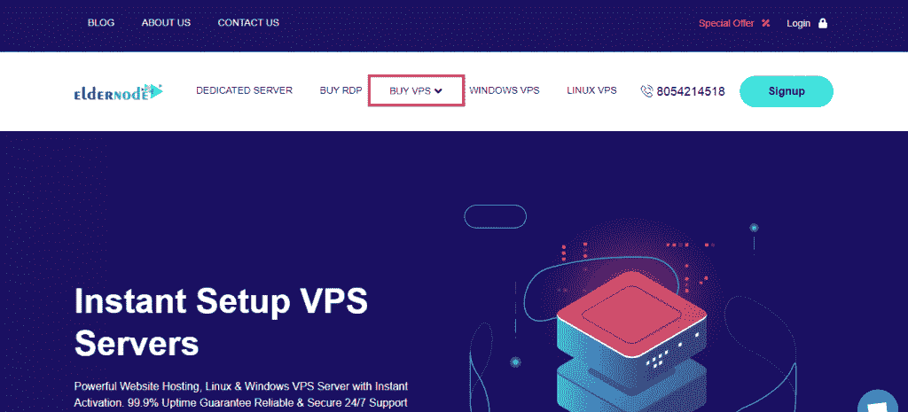

# 如何获得德国虚拟服务器- Eldernode 博客

> 原文：<https://blog.eldernode.com/get-germany-virtual-server/>

通过购买德国虚拟服务器，您可以享受与众不同的功能，例如服务器硬件的卓越质量以及由我们支持团队的专家提供的服务器管理服务。在这篇文章中，我们将教你如何在[elder node](https://eldernode.com/)T3 上获得德国虚拟服务器。请继续关注我们的这篇文章。

## **教程获取德国 VPS 托管**

### **介绍虚拟服务器及其在 Eldernode 上的变种**

虚拟服务器或 VPS 是在托管重要的公司和商店网站时实现高速、[安全、](https://blog.eldernode.com/tag/security/)和稳定性的最佳且最具成本效益的方式。购买 VPS 对于重要的高流量网站来说是合适的和重要的，因为它比购买共享主机提供更多的资源和安全性，并且比购买 T2 专用服务器便宜。除了在托管虚拟服务器中提供更好的服务和速度之外，它还提供了更高的信息安全性和稳定性。

通过为一个或多个重要站点购买 VPS，消除了黑客攻击、攻击服务器以及由附近站点引起的明确或缓慢问题的风险。

Eldernode 为您提供多种 VPS 服务器。这些服务包括:

–[**Windows VPS**](https://eldernode.com/windows-vps/)

–[**RDP 管理**](https://eldernode.com/buy-rdp/)

–[**Linux VPS**](https://eldernode.com/linux-vps/)

-[**微芯片 VPS**](https://eldernode.com/mikrotik-vps-server/)

–[**蓝石 VPS**](https://eldernode.com/Bluestacks-VPS/)

–[**SSD VPS**](https://eldernode.com/ssd-VPS/)

和各种其他服务。因此，建议购买虚拟服务器来托管重要的商业和企业网站。

### **获得虚拟服务器的先决条件**

你不必努力工作来获得德国 VPS 服务器。你所要做的就是 **[在](https://blog.eldernode.com/register-on-eldernode-and-order-vps/)** 网站上注册。在下一步，我们将教你如何一步一步地得到德国虚拟服务器。请继续关注本文的其余部分。

## **在 Eldernode** 上获取德国虚拟服务器

注册后的第一步，必须在主页面点击**购买 VPS** :

在将要打开的页面上，您必须单击您想要的服务之一。这里我们选择 **Linux VPS** 。要选择所需服务，只需点击**查看所有计划**:

稍微向下滚动页面。查看计划后，点击**立即订购**选择您想要的计划。

***注:*** 在这里您可以按**月**或**年**指定您想要的服务。

下一页是**配置**页。您可以在此处查看您的计划信息。您还需要填写必填字段来完成配置。

在**配置服务器**部分，您需要填写与**主机名**、**根密码、**和名称服务器相关的字段。

最重要的部分是**可配置选项**。在**操作系统**字段的这一部分，您必须为服务器指定您建议的操作系统。

然后从**位置**部分选择**德**。

从**完全托管支持**字段，您可以选择您需要的支持。

从**控制面板**中选择 [Cpanel](https://blog.eldernode.com/tag/cpanel/) 。最后，从**安装服务(一次)**字段中选择一个选项。选择以上选项后，点击右栏的**继续**。

在下一页，即**审核&结账**，审核信息并从右栏确认后，点击**结账**。

***注意:*** 您可以在**应用促销代码**部分输入您的促销代码，然后点击**验证码**。

现在，您可以选择一种可用的方法来存入服务费。这些方法包括:

1)比特币、以太坊、USDT 和所有加密货币

2)完美的金钱

3)贝宝

选择所需的支付方式后，点击**完成订单**:

## 结论

虚拟服务器有许多用途。这些应用程序包括托管高使用率的网站，将它们用于邮件服务器和数据库服务器等 web 服务，控制或提高系统性能，等等。在这篇文章中，我们试图教你如何在 Eldernode 上获得德国虚拟服务器。