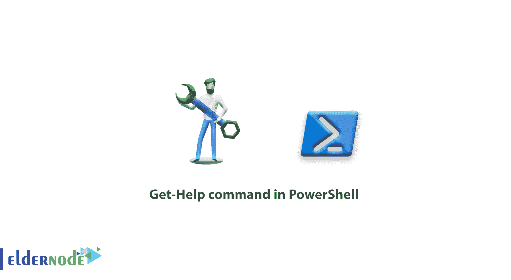
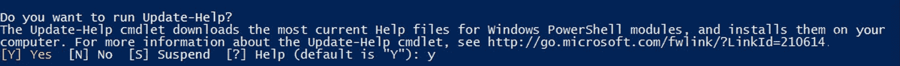

# PowerShell - Eldernode 中的 Get-Help 命令

> 原文：<https://blog.eldernode.com/get-help-command-in-powershell/>



学习在 PowerShell 中使用 Get-Help 命令。在这篇[文章](https://eldernode.com/category/tutorial/)中，我们将教你如何在 PowerShell 中使用 Get-Help 命令，这样你就可以在需要阅读帮助命令时使用它。

Get-Help 命令是 [PowerShell](https://eldernode.com/tag/powershell-commands/) 命令之一，它将帮助您完全理解命令及其结构，并在无需搜索互联网的情况下使用它们。

以下是[微软](https://docs.microsoft.com/en-us/powershell/module/microsoft.powershell.core/get-help)给这个命令添加的一些有趣的功能。

*   显示完整的命令结构
*   显示命令的所有参数和开关
*   用于一个命令的众多盟友
*   展示了执行该命令的示例

## 了解如何在 PowerShell 中使用 Get-help 命令

第一次使用该命令时，您必须单独输入该命令一次。通过输入 Get-help 命令，PowerShell 将在线下载资源和帮助命令，并从现在开始向您提供它们。所以只需输入 Get-Help 命令来更新这个命令的源代码。

在 PowerShell 中输入该命令后，将显示以下文本，提示您必须键入 **Y** 并按 Enter 键才能开始下载资源。



现在，要从 Get-Help 命令中获得帮助，请按如下步骤进行。

### 使用 Get-Help 命令的结构

```
Get-Help Command 
```

**例如** :

```
Get-Help Restart-Service 
```

在上面的示例中，Get-Help 命令将为您提供与 Restart-Service 命令相关的所有信息。

> 为了显示和完全理解命令，您可以请求 Get-Help 向您展示命令的示例。

```
Get-Help Restart-Service -Examples 
```

您可以使用完整或详细参数从命令中获得全面的帮助。

```
Get-Help Restart-Service -Full 
```

```
Get-Help Restart-Service -Detailed 
```

这样，您可以通过 Get-Help 命令运行 PowerShell 命令来获得所需的所有帮助，而不必搜索互联网。

**尊敬的用户**，我们希望您能喜欢这个[教程](https://eldernode.com/category/tutorial/)，您可以在评论区提出关于本次培训的问题，或者解决[老年人节点培训](https://eldernode.com/blog/)领域的其他问题，请参考[提问页面](https://eldernode.com/ask)部分，并尽快提出您的问题。腾出时间给其他用户和专家来回答你的问题。

好运。