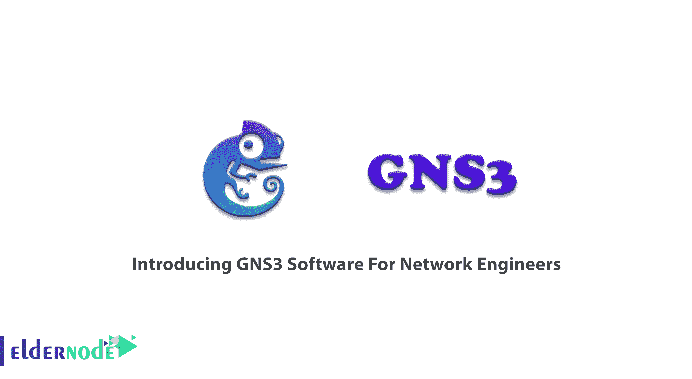
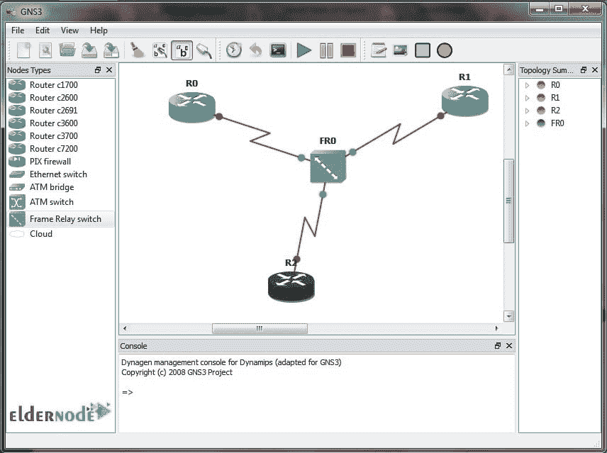
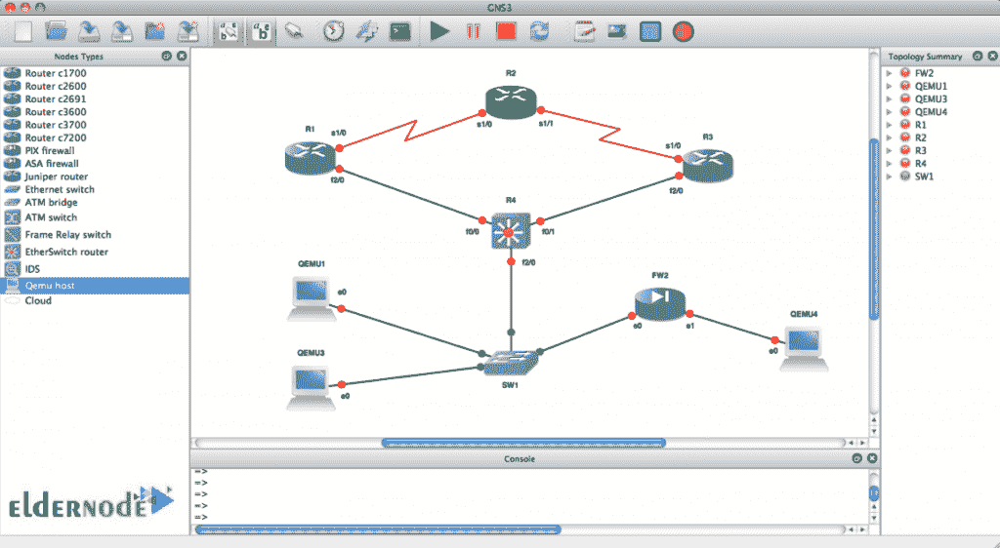
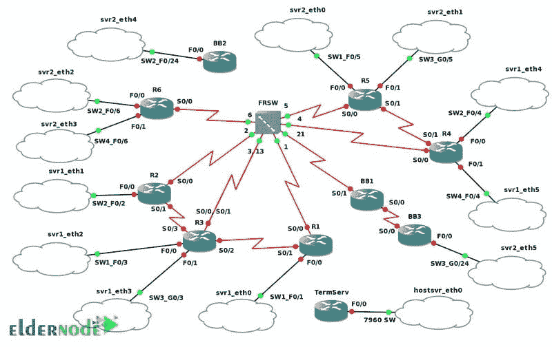
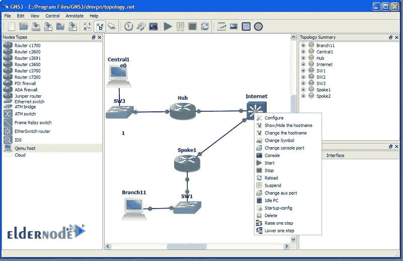
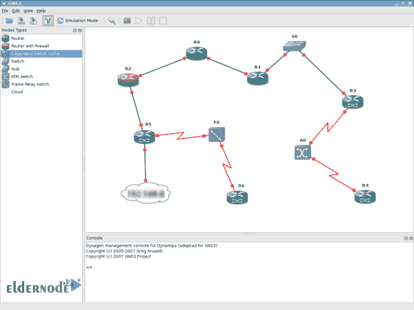

# 为网络工程师介绍 GNS3 软件- Eldernode 博客

> 原文：<https://blog.eldernode.com/gns3-software-for-network-engineers/>

作为一名网络工程师，您需要能够对虚拟和真实网络进行仿真、配置、测试和故障排除的软件。所有你需要的是图形网络模拟器-3。此外，GNS3 适用于您提供了托管在多个服务器上或托管在云中的许多设备的情况，因为它可以在您的系统上运行包括一些设备的小型拓扑。这个网络软件模拟器于 2008 年发布，被许多大公司使用，如 NASA、美国电话电报公司、埃克森和沃尔玛。这有助于理解为什么 GNS3 被下载了 1100 万次。在本文中，您将了解到**为网络工程师**介绍 GNS3 软件。在 [Eldernode](https://eldernode.com/) 上选择您喜欢的套餐，购买您自己的 [VPS](https://eldernode.com/vps/) 。

## 面向网络工程师的 GNS3 软件(Linux、Windows)

## **关于 GNS3 软件的一切**

GNS3 是 GNU 通用公共许可证 3.0 版下的自由开源软件。GNS3 用于学习和教学，因此学生和网络工程师是其最大的用户，以准备供应商认证考试，如思科 CCNA 考试。当您准备设计和构建任何规模的网络，并且不希望使用任何硬件时，您可以选择 GNS3 在无风险的虚拟环境中安全地构建、设计和测试您的网络。它允许你访问最大的网络社区。在这 12 年中，它得到了发展。网络工程师不仅可以虚拟化真实的硬件设备，还可以使用新的支持选项。GNS3 支持思科虚拟交换机、思科 asa、Brocade vRoutrs、Cumulus Linux 交换机、 [Docker](https://blog.eldernode.com/run-docker-containers-on-windows-server-2019/) 实例以及许多其他设备。

查看专用于拓扑的窗口、管理控制台、可用设备列表以及当前拓扑中所有元素的摘要。我们可以称之为 GNS 3’GUI 的心脏。

### GNS3 架构

GNS3 的组件是以下两个:

**1-**GNS 3 多功能一体软件(GUI)。

**2-** (推荐)GNS3 虚拟机(VM)。

接口:正如我们提到的，GNS3 可以运行小型拓扑。这是 GNS3 的客户端部分。当您在本地 PC 上安装一体化软件(如 Windows、MAC 和 Linux)时，您可以创建自己的拓扑。

***注*** :注:GNS3 一体机软件安装在哪里，决定了 GNS3 在什么 **PC** 上本地运行。**例如**，当您需要使用 GNS3 虚拟机时，您可以使用一些虚拟化软件，如 VMware Workstation、Virtualbox 或 Hyper-V，在您的个人计算机上本地运行 GNS3 虚拟机。如果您要在服务器上远程运行它，您需要使用 VMware ESXi 甚至在云上。

当您使用 GNS3 和 GUI 客户端创建拓扑时，这意味着您创建的设备不需要由服务器进程托管和运行。软件的服务器部分有几个**选项**，如**本地 GNS3 服务器**、**本地 GNS3 虚拟机**和**远程 GNS3** 。

### 支持的操作系统

GNS3 支持 Windows 7、8 和 10。 [Windows Server](https://blog.eldernode.com/tag/windows/) 2012，2016。Mac OS X Mavericks 版本 1.9 及更高版本。和 Linux。还有其他平台可以运行 GNS3 VM，如 ESXi 和裸机云提供商，如 packet.net。但是，建议 Windows 或 Mac OS 使用 GNS3 VM。这意味着您可以在 Windows 和 Mac OS 上使用 GNS3 VM，并且在 Linux 中本地运行 GNS3 时不是必需的。(可选)。

当您在 Windows 或 Mac OS 上创建**复杂**拓扑时，建议您使用 GNS3 VM。但是当创建**简单的** GNS3 拓扑时，请随意使用本地 GNS3 安装。

这是一个可以使用 GNS3 创建的复杂拓扑的示例。

通过右键单击设备，可以对这些元素执行许多不同的操作。

### 支持模拟装置

GNS3 支持**仿真**和**仿真**设备。虽然 GNS3 支持多个仿真器，但您可以在 GNS3 项目中使用多种选择来构建拓扑。

**仿真**:正如您之前读到的，GNS3 可以仿真设备的硬件，让您在虚拟设备上运行映像。GNS3 模拟 VIRL(思科强大的网络模拟平台)镜像运行所需的硬件。

**模拟**:当你运行像思科 IOS 这样的操作系统时，你确实是在运行一个由 GNS3 开发的模拟设备，而不是一个真实的设备。

### GNS3 特性

让我们看看我们在这里提到的 GNS3 的其他优势。

**1-** 支持的设备数量没有限制，只是 CPU 和内存(硬件)有限制。

**2-** GNS3 支持多种交换选项，如 NM-ESW16 以太网交换机模块、IOU/IOL 第 2 层映像、VIRAL IOSVL2。

**3-** GNS3 支持所有病毒镜像如(IOSv，IOSvL2，IOS-XRv，CSR1000v，NX- OSv，ASAv)。

**4-** 支持多供应商环境。

**5-** GNS3 可以在有或没有虚拟机管理程序的情况下运行。

**6-**GNS 3 支持一些免费和付费的虚拟机管理程序，如 Virtualbox、VMware workstation、VMware player、ESXi 和 fusion。

**7-** 可免费下载的预配置优化设备可简化部署。

**8-** 本机支持 [Linux](https://blog.eldernode.com/tag/linux/) ，无需额外的虚拟化软件。

**9-** 多家供应商免费提供的软件。

**10-** GNs3 致力于建立一个庞大而活跃的社区，拥有超过 800，000 名成员。

### GNS3 缺点

另外，看看 GNS3 的缺点列表。

**1-** 思科镜像需要由用户提供。他们可以从 cisco.com 下载，或者购买病毒许可证，或者从物理设备上复制。

**2-** 虽然它不是一个独立的软件包，但是它需要本地安装软件。

**3-** 当您有一些本地安装时，如防火墙和安全设置、公司笔记本电脑政策等。因此，您电脑的设置和限制会影响 GNs3。

**4-** 不支持 ASA 8。

### GNS3 备选方案

GNS3 有十大备选方案。如果你有兴趣阅读更多关于这个主题的内容，以下是为你准备的:

**1-** 虚拟电脑模拟器

**2-** 思科 Packet Tracer

**3-** 网络

**4-** 动力

**5-** 现场雷藏

**6-** 思科系统。股份有限公司

**7-** 创世纪神经模拟器

**8-** 剂。图像使用者界面

**9-** 免费 SNMP 代理模拟器

**10-** 路由器配置生成器

## 向 Linux 和 Windows 网络工程师介绍 GNS3 软件

### IOS 映像在哪里

现在，你可能会问，在哪里可以得到 IOS 映像？事实上，由于一些法律原因和要求，您需要提供自己的图像才能在 GNS3 中使用它们。那么，有哪些获取思科镜像的建议方式呢？您可以直接从思科网站下载，或者如果您与思科没有服务合同，请购买 VIRIL 许可证。最后，如果您有自己的物理路由器，请从路由器复制映像并将其导入 GNS3。

这是一个包含路由器、以太网交换机、帧中继和 ATM 交换机的网络拓扑示例。装饰节点允许添加定制元素。

装饰节点的管理窗口如下所示:

您可以在强大的项目管理系统中保存路由器的所有 NVRAMs。

## 结论

在本文中，您学习了面向网络工程师的 GNS3 软件简介。由于 GNS3 用于网络专业认证考试，如思科 CCNA 和 CCNP，它有助于你做同样的事情，而无需支付昂贵的硬件。请继续关注即将发布的 GNS3 在各种操作系统上的安装教程。