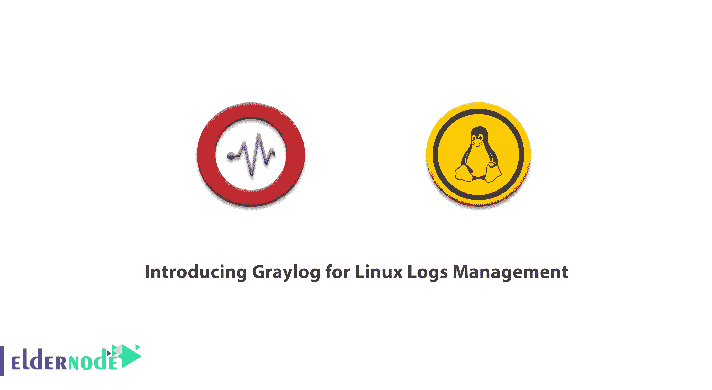
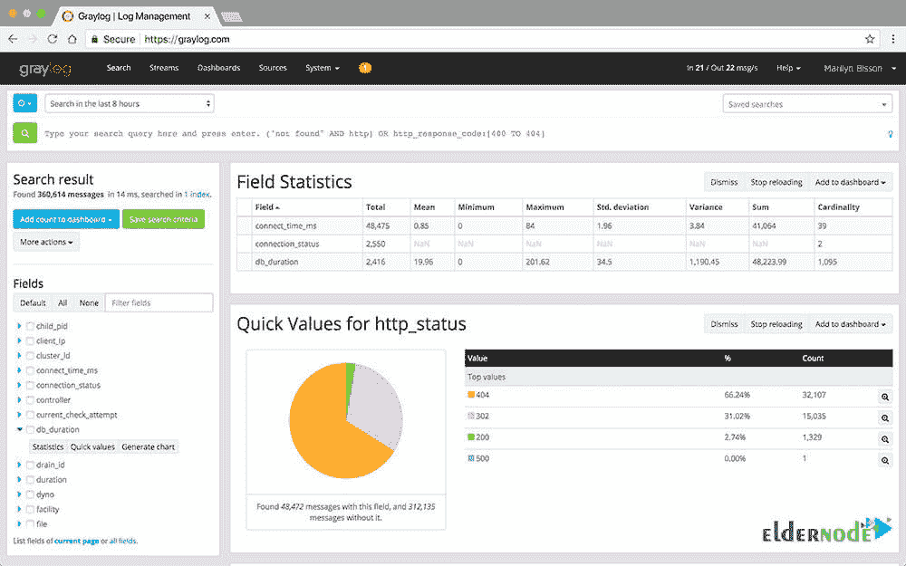
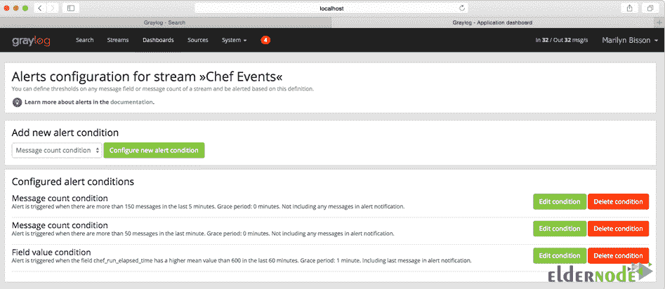
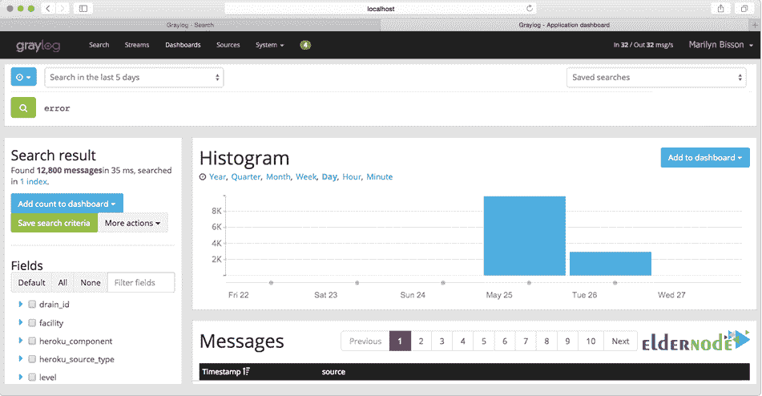
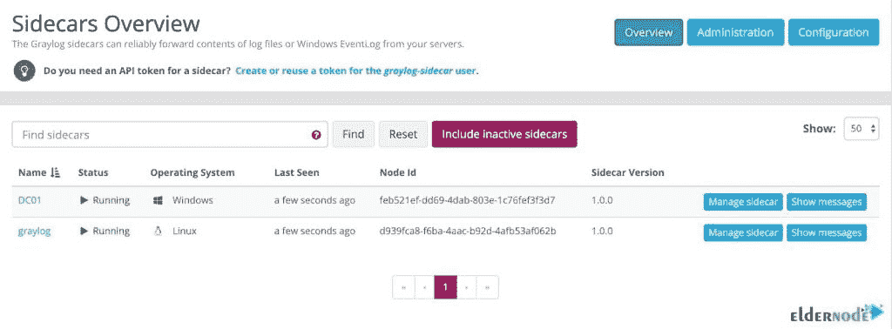

# 介绍用于 Linux 日志管理的 gray log-elder node 博客

> 原文：<https://blog.eldernode.com/graylog-for-linux-logs-management/>



Graylog 是一个开源的免费日志管理工具，用于从一个集中的位置收集、索引和分析任何服务器日志。它基于 Java、Elasticsearch 和 MongoDB。使用 Graylog 允许您监控 SSH 登录和异常活动，以便调试应用程序。换句话说，当您在大型环境中工作时，您会面临大量的数据。因此，您需要一个强大的工具来帮助您监控、搜索和分析数据，并将其转换成简单的格式，以便轻松阅读和消化。这篇文章是**介绍用于 Linux 日志管理的 Graylog】。要购买您自己的 [Linux VPS](https://eldernode.com/linux-vps/) 或找到合适的 [VPS](https://eldernode.com/vps/) 包，请访问 Eldernode 并忘记其他的。**

## **如何在 Linux(Centos，Ubuntu，Debian)上用 Graylog 服务器管理日志**

Graylog 服务器接收和处理来自各种输入的消息，并提供一个用于分析和监控的 web 界面。Graylog 服务器可用于 Linux 发行版，如 [Debian Linux](https://blog.eldernode.com/tag/debian/) 、 [Ubuntu Linux](https://blog.eldernode.com/tag/ubuntu/) 或 [CentOS](https://blog.eldernode.com/tag/centos/) 。为了安全日志管理，Graylog 收集、存储和关联网络数据，这些数据将详细描述您的系统和网络中的所有活动。这些活动包括由操作系统、应用程序、设备和用户产生的记录。在下文中，您将了解更多关于 Graylog 及其在 [Linux](https://blog.eldernode.com/tag/linux/) 上的工作方式。

### **什么是 Graylog，它是如何工作的？**

Graylog 目前有三种许可类型，分别是开源、免费企业版和商业版。正如我们提到的，Graylog 基于 Java、Elasticsearch 和 [MongoDB](https://blog.eldernode.com/install-mongodb-ubuntu-20/) 。Elasticsearch 存储所有收到的消息，并提供搜索功能。MongoDB 用于数据库，存储配置和元信息。要在一个地方组合、丰富、关联、查询和可视化您的所有日志数据，您只需开始使用 Graylog，并准备好您团队的[安全](https://blog.eldernode.com/tag/security/)、应用程序和 IT 基础架构问题的答案。

全屏仪表板可以在一个屏幕上显示您的笔记本电脑、计算机和/或显示器上的所有周围元素。



实时分析每个传入的日志消息是 Graylog 的优势之一。因此，可以将消息分配给所谓的流。使用预定义的标准，检查哪个消息被分配给哪个流。



这样，如果某些值超出了定义的参数，您将会收到警报。警报选项包括从调用 HTTP 回调到通过电子邮件向定义的地址发送消息。您还可以通过监控 Nagios 之类的解决方案来检查流的状态。这意味着 Graylog 可以集成到现有的监控环境中。



### **灰木边车**

为了帮助您更容易地从所有计算机系统收集日志，您可以使用 Graylog 的 Sidecar。Graylog Sidecar 允许使用任何日志收集代理进行集中和可堆叠的配置。此外，它还可以控制您环境中的代理，同时通过标记系统在主机之间保持一致的配置。



### **Graylog 特性(为 Linux 日志介绍 gray log)**

当您使用 Graylog 工具时，您会接触到许多好处和功能。这里列出了 Graylog 的一些亮点。

*   解决安全性、合规性、运营和开发运维方面的问题。
*   探索数据
*   实时分析
*   降低运营成本
*   授权给非技术用户
*   交互式仪表盘
*   警报和触发器
*   图形日志分析
*   用于管理的简单日志用户界面
*   可扩展的日志收集
*   Rest API
*   计划报告
*   团队管理
*   友好的 GUI 和支持
*   身份验证和用户权限
*   强大的搜索语法
*   轻松连接 Python 应用程序

### **灰色缺点**

在使用 Graylog 时，你可能会面临一些不利因素。让我们看看那些是什么。因为 Graylog 不能从 Syslog 文件中读取，所以您必须将您的消息直接发送到 Graylog。报告称，它在仪表板前端不够友好，报告功能也很差，不令人满意。

### **Linux 使用 Graylog 管理日志**

要在 Linux 上设置 Graylog，您需要考虑一些先决条件。你必须准备好 [Elasticsearch](https://www.elastic.co/downloads/elasticsearch) 6.8 及以上、 [MongoDB](https://docs.mongodb.com/manual/administration/install-on-linux/) 3.6 及以上、Oracle Java SE 8(或 OpenJDK 8)。 [Java](https://blog.eldernode.com/install-java-apt-debian-10/) 要装。运行 OpenJDK 完全没问题，应该可以在所有平台上使用。所以，按照下面的路径来学习 Linux 上 Graylog 的**手动设置**。

*第一步:*

首先，您应该[下载](https://www.graylog.org/downloads-2)tar 归档文件，并将其解压缩到您的系统上。

```
tar xvfz graylog-VERSION.tgz
```

```
cd graylog-VERSION
```

*第二步:*

复制以下示例配置文件:

```
cp graylog.conf.example /etc/graylog/server/server.conf
```

*第三步:*

因此，您可以按如下方式启动服务器:

```
cd bin/
```

```
./graylogctl start
```

这样，服务器尝试将一个 ***node_id*** 写入***gray log-server-node-if***文件。如果由于缺少权限等原因而无法写入，服务器将不会启动。

*第四步:*

然后，您必须在调试输出灰色日志中查看成功连接到 Elasticsearch 集群的一行。可能如下所示:

```
2013-10-01 12:13:22,382 DEBUG: org.elasticsearch.transport.netty - [graylog-server] connected to node [[Unuscione, Angelo][thN_gIBkQDm2ab7k-2Zaaw][inet[/10.37.160.227:9300]]]
```

Graylog 的日志位于 *logs/* 上。

***注意*** :因为所有运行 Graylog 的系统必须有同步的系统时间，所以尽量在你的 Graylog 基础设施的所有机器上使用 [NTP](https://blog.eldernode.com/install-ntp-debian/) 或者类似的机制。

## 结论

在本文中，您回顾了用于 Linux 日志管理的 Graylog 简介。为了满足您的运营、安全性和合规性需求，Graylog 每天都会接收许多 TB 的日志消息，并对其进行处理和存储。作为一个很好的日志管理工具，Graylog 拥有高效全面的事件日志收集和存储。要根据需要发送其他类型的日志，您可以自定义 Graylog。