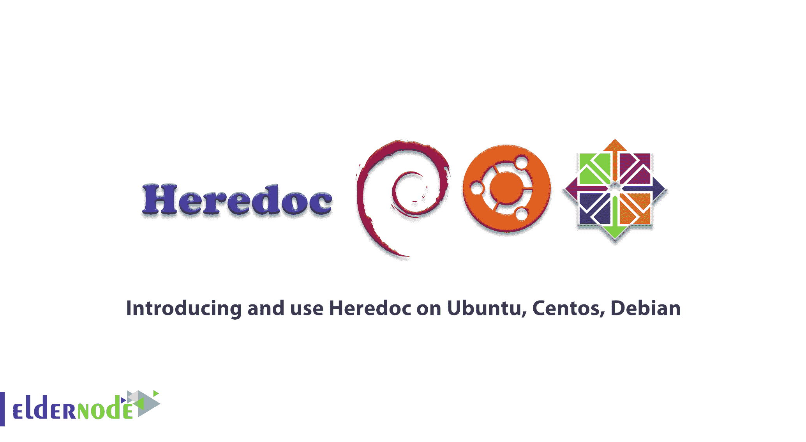

# 在 Ubuntu，Centos，Debian - Eldernode 上介绍和使用 Heredoc

> 原文：<https://blog.eldernode.com/heredoc-on-ubuntu-centos-debian/>



Heredoc 或 here document 通常在计算机科学中用于命令行解释程序的规范。Heredoc 也被设计用来定义文本的各个部分。一些命令行解释器如 bach、Windows PowerShell 和 Bourne Shell 是由 Hereduc 和编程语言如 Perl、PHP、Python 和 ruby 指定的。作为文件文字或输入流文字，Hereduc 是源代码文件的一部分。通过**在 Ubuntu、Centos、Debian** 上介绍和使用 Heredoc 来加入我们的这篇文章。要提供您自己的 [Linux VPS](https://eldernode.com/linux-vps/) 并使用 2021 优惠，请访问 [Eldernode](https://eldernode.com/) 并购买一个包。

## **Linux 上的 Heredoc 介绍 Ubuntu，Centos，Debian**

## **Heredoc 简介**

Heredoc 用于为像 Bourne shell 和 zsh 这样的 Unix shells 指定命令行命令的输入值。例如，在 Bash 和其他 shells(如 Zsh)中，Heredoc 是一种重定向类型，允许您向一个命令传递多行输入。这将是不同的，因为你使用的是什么编程语言，但是，将是<猫命令。此外，通过 [SSH](https://blog.eldernode.com/most-used-commands-in-ssh-and-linux/) 在远程系统上执行多个命令，Heredoc 是一种非常简单的方法。

### **如何安装 Heredoc**

您需要一个终端来启动 heredoc。可以在 [Bash](https://blog.eldernode.com/what-is-bashrc/) 、tsch 和 Korn shell 中使用语法风险。

查看下面的命令:

```
$ cat << EOF >> example.txt
```

当您在循环期间在终端中键入时，通过管道将输入到目标文件中。中间的线可以停止循环。

您可以使用 cat 命令打开一个 heredoc 会话。如上所述，带有重定向的 cat 命令首先指向带有终止字符串的 cat。当您终止关键字时，您将把输出重定向到一个目标文件。然后，您可以使用最常见的 shell 键盘快捷键来浏览您的工作，并直接输入到您的终端。通过在一行中键入您指定的终止字符串，您将结束会话。请看下面的语法:

```
$ cat << EOF >> example.txt  > Everything you type here will be placed into example.txt when I type EOF on a line by itself. Until then, you can type...  >  > whatever...  >  > you want to type.  >  > EOF  $
```

当您的终端等待 EOF 时，您输入的所有内容将被放入目的地。EOF 不是文件本身的一部分，提示字符被省略。

```
Everything you type here will be placed into example.txt when I type EOF on a line by itself. Until then, you can type...    whatever...    you want to type.
```

我知道，你不会用 heredoc 语法来代替你最喜欢的文本编辑器。因为输入多行代码是一个很好的快速技巧，所以超过 10 行左右就会影响它的有用性。因此，您需要触发您的 shell 的 history 函数来编辑前面的行。然而，由于您的 shell 和它的配置，您可以使用 *Ctrl+B* 向上、向下调用您的文本，并通过文本向后移动。

### **Heredoc VS echo**

在处理 shell 脚本时，灵活性是不可或缺的。因此，从这个角度来看，heredoc 比 echo 更好。我们来研究一个例子。当您编写安装程序脚本来自动安装一组自定义应用程序时。如果其中一个应用程序不与. desktop 文件一起分发，您将无法在应用程序菜单中查看它。因此，您将在安装时生成一个. desktop 文件作为解决方案。您可以在安装脚本中使用 heredoc，而不是编写一个. desktop 文件，并将其作为安装脚本的外部依赖项。注意下面的语法:

```
#!/bin/sh
```

```
VERSION=${VERSION:-x.y.z}  PKGNAM=${VERSION:-example}  PKG="${PKGNAM}"-"${VERSION}"-`arch`.tgz
```

```
# download package  wget "${PKG}"  tar txvf "${PKG}"
```

```
# use here doc to create missing .desktop file  cat << EOF >> $HOME/.local/share/applications/example.desktop  [Desktop Entry]  Version=1.0  Type=Application  Name="${PKGNAM}"  Comment="${PKGNAM}"  Exec="${PKGNAM}" %F  EOF
```

```
# insert the rest of an install script...
```

这样，虽然不涉及文本编辑器，但您已经自动将文本输入到文件中。结果会怎样。桌面文件看起来像什么？如下图所示:

```
[Desktop Entry]  Version=1.0  Type=Application  Name=example  Comment=example  Exec=example %F
```

根据以上信息，当变量被正确求解时，您将能够在 heredoc 中使用它们。因为 EOF 只表示 heredoc 的结束，所以它不会出现在文件中。

## **结论**

在本文中，我们向您介绍了 heredoc，并且您了解了如何在 Ubuntu、CentOS 和 Debian 中使用 Heredoc。对于快速注释和 shell 脚本，可以使用 heredoc。