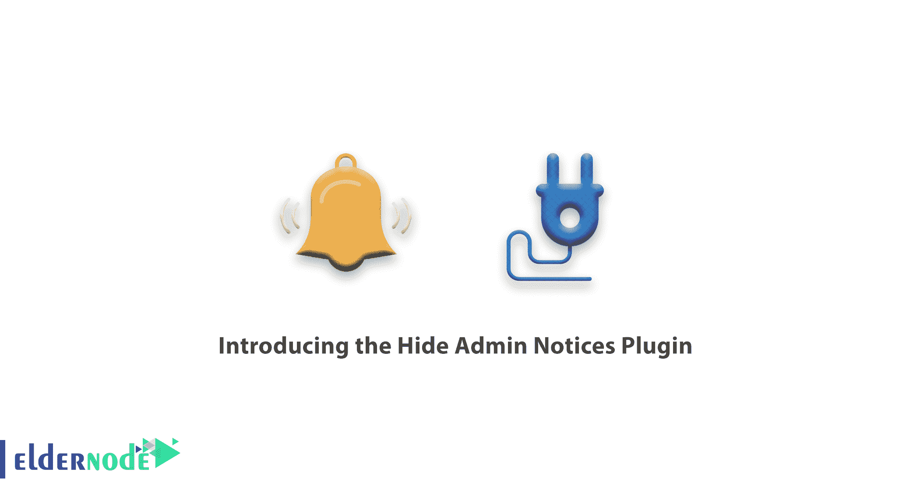
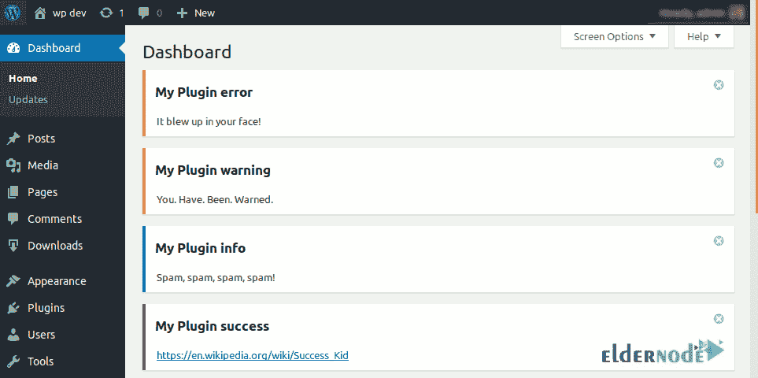
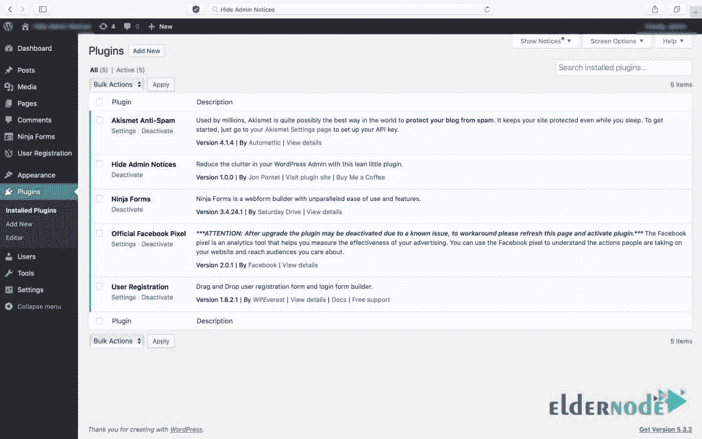
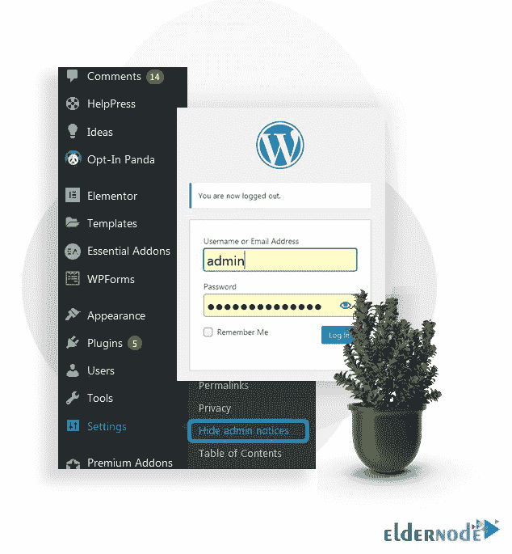
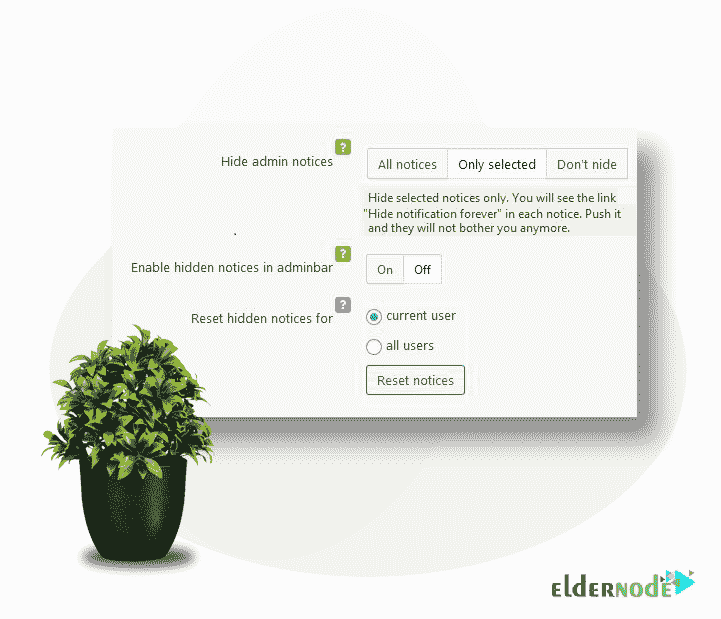

# 介绍隐藏管理通知插件- Eldernode 博客

> 原文：<https://blog.eldernode.com/hide-admin-notices-plugin/>

[更新]管理通知可以引导您完成需要完成的任务。当你登录你的 WordPress 仪表盘时，你可能会在屏幕上方看到一些信息。这些 WordPress 管理通知用于提醒用户关键信息，如更新、警告或错误。如果你知道如何有效地管理它们，你会发现这些消息很有用，尽管有些用户可能认为它们很烦人。使用管理通知可以帮助您更新插件，处理错误和错误，并修复可能的技术和用户问题。这篇文章介绍了隐藏管理通知插件。如果你需要一个全面管理的 **[WordPress VPS](https://eldernode.com/wordpress-vps/)** ，依靠我们的技术团队并在 [Eldernode](https://eldernode.com/) 上注册你的订单。

## **什么是隐藏管理通知插件？**

管理通知无疑是 WordPress 的核心部分。管理通知宣布 WordPress 的更新，或者确认后草稿的保存，或者安装第三方 WordPress 插件和主题。WordPress admin 通知四种问题，如**成功通知**、**警告通知**、**信息通知**、**错误通知**。所有这些通知都以带有不同颜色边框的白色块显示，以帮助您一眼识别每种类型的通知，从而立即采取相应的措施。

### **管理通知有哪些类型？**

让我们看看上面提到的每个管理通知的定义是什么。

**成功通知:**一旦您在网站上成功地更改了某项内容或发布了一篇新帖子，您将看到带有绿色边框的成功通知。

**警告通知**:如果您需要就某件事情发出警告，并且警告通知显示为黄色边框，您将会看到此警告。例如，如果一个组件或插件安装但不能正常工作。

**信息通知**:您可以通过蓝色边框看到这种通知。它传达了一些简单的信息，比如星期几。

**错误通知**:正如你所猜测的，这种错误通知显示有红色边框。当你的网站有问题的时候就会出现。

### **获取管理通知的弊端**

你安装的新插件或主题越多，你就会收到越多出现在每个页面顶部的通知。由于 WordPress 插件目录中有超过 58，000 个插件和超过 8，000 个主题，而且网上还有数以千计的其他主题和插件，你可能是一个不渴望得到管理通知的人。尽管知道它的所有好处，比如交流关于技术更新的重要信息，用户还是喜欢隐藏它们。在下文中，我们将讨论获得管理通知的不利方面。查看下面的列表找到你的理由，如果你不这么认为，请在 [Eldernode Community](https://community.eldernode.com/) 上告诉我们和你的朋友。

–用于营销目的的通知

–次要问题的通知

–重复通知

–跟踪数据通知

## **如何隐藏管理通知插件**

尽管管理通知在提供插件的关键信息和定期反馈以及处理客户请求方面是有益的，但是许多 WordPress 用户对它们并不满意。他们中的一些人报告说，恼火的原因是当多个用户访问他们博客的仪表板时，会收到任何成功更改的通知。由于 WordPress plugin，插件也以可发布的方式向公众发布，这些插件通常也是基于持续集成和交付(CI/CD)原则发布的。忽略管理员通知的用户决定仔细查看消息类型，以处理发送无用通知的插件，不要错过重要的通知。

### **禁用 WordPress 管理通知**

你只需要通过三个简单的步骤来禁用 WordPress 管理通知。所以，我们走吧。

1- **登录**到 WordPress 仪表盘。

2-将鼠标悬停在设置上，点击**隐藏管理通知插件**。

3-隐藏管理通知标签页有三个选项:**所有通知**、**仅选中**、**不隐藏**。

如果您选择所有通知，您可以选择**启用或禁用管理栏中的隐藏通知**。

通过选择唯一选定的，您可以选择**启用隐藏或禁用隐藏通知**，以及为所有用户或当前用户重置隐藏通知。

最后，选择不隐藏将关闭插件。所以，它不会在 WordPress 仪表盘中显示“**永远隐藏通知**”。

## 结论

在本文中，向您介绍了管理通知插件，您学习了如何隐藏管理通知插件。作为一个建议，你也可以管理你的 WordPress 管理通知，而不是隐藏和禁用它们。