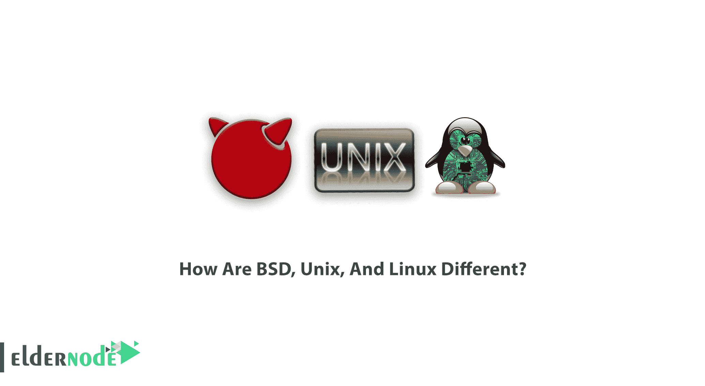

# BSD、Unix 和 Linux 有什么不同？- Eldernode 博客

> 原文：<https://blog.eldernode.com/how-are-bsd-unix-and-linux-different/>

您可能听说过并看到过 Unix、Linux 和 BSD 的名字。看起来他们可能彼此相似，但是他们之间有一些不同。虽然 Linux 是一个内核，而不是操作系统，但 BSD 是一个“类 Unix”的完整操作系统，有自己的内核和用户区。在本文中，您将了解到 BSD、Unix 和 Linux 的不同之处。在 [Eldernode](https://eldernode.com/) 上选择自己喜欢的 Linux 虚拟私有服务器包，购买自己的 [VPS](https://eldernode.com/vps/) 主机。

## **BSD、Unix 和 Linux 的区别**

Linux 及其家族是开源社区的代表。Berkeley Software Distribution(BSD)可能不太为人所知，但却是开源社区中的主要品牌之一。在回顾区别之前，让我们先简要地看一下 BSD、Unix 和 Linux 的**历史**和**特性**。

### **什么是 BSD？**

伯克利标准发行版是在加州大学伯克利分校开发的 UNIX 的实现，也称为免费、开源和 BSDI，它在其内核中包括来自原始系统 V 的源代码。Berkeley 的 Unix 是第一个包含支持互联网协议栈的库的 Unix:Berkeley sockets。

IP 的前身 ARPAnet 的 NCP 的 Unix 实现，带有 FTP 和 Telnet 客户机，已于 1975 年在伊利诺伊大学生产出来，并可在伯克利使用。然而，PDP-11 上的内存不足导致了复杂的设计和性能问题。一些基于 BSD 的操作系统有 FreeBSD、OpenBSD、NetBSD、MidnightBSD、GhostBSD、Darwin 和 DragonFly BSD。

### **公众不愿 BSD 的原因**

重要的问题是，如果 BSD Net/2 是第一个开源的操作系统，那么 GNU/Linux 为什么能有机会在大众视线中大放异彩？其原因可归纳如下:

**法律问题** : AT & T 的源代码许可模式允许其他公司以专有品牌建立自己的基于 UNIX 的操作系统(包括后来卖给 SCO 的微软 Xenix 和后来成为 Solaris、IBM 和惠普-UX 基础的 SunOS)。

在 20 世纪 90 年代初，UNIX 系统实验室，简称 USL，是贝尔实验室的一个子公司，与公司的另一个部门 UNIX 软件运营部合并，以开发和许可 Unix。该公司后来成为美国电话电报公司的独立子公司。

### **什么是 Linux？**

[Linux](https://blog.eldernode.com/tag/linux/) 是一个操作系统。像大多数类 Unix 操作系统一样，Linux 由几个组件组成。操作系统是一种管理与您的台式机或笔记本电脑相关的所有硬件资源的软件。简单地说，操作系统管理你的软件和硬件之间的通信。虽然 Linux 类似于其他操作系统如 Windows、macOS(原 OS X)或 iOS，但从重要的方面来看是不同的。除了是开源软件之外，用于创建 Linux 的代码是免费的，公众可以查看、编辑，并且——对于具有适当技能的用户——可以做出贡献。

以下是一些更好的 Linux 发行版:

1- [Ubuntu](https://blog.eldernode.com/tag/ubuntu/)

2- SuSE

### **什么是 Unix？**

Unix 也是一个操作系统，支持多任务和多用户功能。Unix 系统的特点是模块化设计，有时被称为“Unix 哲学”。根据这一理念，操作系统应该提供一组简单的工具，每个工具执行有限的、定义明确的功能。您会发现 Unix 被广泛应用于各种形式的计算系统，如台式机、笔记本电脑和服务器。在 Unix 上，有一个类似于 windows 的图形用户界面，支持简单的导航和支持性环境。

## **BSD、Unix、Linux 有何不同？**

至此，您已经熟悉了 BSD、Unix 和 Linux。请和我们一起研究它们之间的差异。首先我们从 Unix 和 Linux 的比较开始。

### **Unix VS Linux**

Unix 操作系统非常古老，可以认为是其他操作系统之父。这种操作系统的操作理念是与大量的计算机一起工作。由于使用这种类型的操作系统很困难，通常，对它有可接受的控制权的人很少，并且你必须支付很高的价格来使用它。另一方面，Linux 是由一个名叫 Linus Torvalds 的人创建的，与 Unix 不同，它完全可以免费使用，学习使用它比 Unix 容易得多。

在 Unix 操作系统中，用户界面已经为繁重的处理能力所牺牲，这就是 Unix 用户界面如此困难的原因。Unix 操作系统是为服务器设计的，而 Linux 操作系统是为服务器和客户机设计的，因此它们同时具有 GUI 和 shell 命令行界面。在 Linux 操作系统中，为了提高处理能力，可以将图形环境或 GUI 转换为 shell 环境。

如果使用 Linux 操作系统是完全免费的，你需要付费才能使用 Unix 操作系统。

Linux 是一个开源的操作系统，不像 Unix，它是一种闭源，不可能改变它的核心。这两种类型的操作系统之间的主要区别可以总结如下:Unix 是一个旧的操作系统，而 Linux 是从这个操作系统中派生出来的。Unix 没有图形界面，但是 Linux 有图形界面。如果使用 Linux 是免费的，那么使用 Unix 也是免费的。

### **Linux VS BSD**

此时，我们将检查 Linux 和 BSD 之间的**十大差异**:

#### **1-牌照**

Linux 是在 GPL 下发布的，BSD 使用的许可证是‌ BSD 许可证。这两个操作系统在许可级别上的主要区别在于，GPL 许可保证这里的软件是 Linux，永远免费，任何人以相同的方式和相同的许可使用或修改它，而不用关闭一些代码以将其重新发布给下一个人。

一般来说，GPL 保证软件将永远免费。
另一方面，SDBSD 许可证在保持软件自由方面并没有 GPL 形式的严格规定，使用这种软件的源代码并对其进行更改的人不必再分发它或以相同的许可证发布它，甚至拥有使用该软件的许可证。给软件一个和下一个人的封闭源码。

#### **2-项目控制**

如何在 Linux 中管理项目控制是由一个人做最后的决定，Linus Torvalds，我已经描述过他如何开发和管理 Linux 内核。但是 BSD 的开发方式和 Linux 不一样。在 BSD 项目中，最终决策由管理委员会做出，没有特定的人将他们的个人意见应用到项目中。

#### **3-操作系统完整性**

Linux 只是一个内核，是操作系统的核心，而真正加入 GNU 项目和这两个项目之外的其他几个工具，会形成一个操作系统，以 Debian、Fedora、Ubuntu 等发行版的形式发布。等等。另一方面，BSD 除了拥有自己的核心和内核之外，还拥有自己的应用工具，这些工具共同创建了一个集成的操作系统，即单个项目的产品。BSD 中有一个来自 GNU 项目的工具被使用，但是缺少这个工具并不会导致操作系统缺乏完整性。

#### **-4-被准 Unix**

Unix 一如既往地成为 Linux 和 BSD 操作系统的一个特性。在 20 世纪 90 年代，这两个项目受到了 Unix 操作系统的启发，都致力于创建一个类似 Unix 的操作系统。20 年来，Linux 试图成为一个更现代的操作系统，它稍微偏离了 Unix 的基础，这是它在其他操作系统中成功的关键。但另一方面，BSD 试图让自己更像 Unix，它在这一点上成功了，迄今为止最准 Unix 的操作系统可以称为同一个 BSD。

#### **5-系统的基础**

第五种情况可能有点难以理解，但和第三种情况有些联系。说到基础系统，首先想到的是 OS 的核心。因为 Linux 由两个项目组成，Linux 内核和 GNU 项目，所以可以说基础系统是 Linux 内核，内核本身没有这个用途，必须放在其他工具旁边。但是在 BSD 中，这有一点不同。说到操作系统的基础，是 BSD 内核和内核坐在一些其他工具旁边，创建了基础系统，如果系统没有为我们提供应用程序，但至少可以在实践中使用。

#### **6-被源化**

这对于 Arch Linux 和 Gentoo 用户来说是可以理解的，因为他们每天都在处理这个问题。BSD 的优势之一是它对端口收集的依赖。如果要在 Linux 中给出一个等价的，那就不得不参考 Arch Linux 中的 ABS 系统和 Gentoo 中的 Portage，它们实现了完全相同的系统。使用该端口，您将能够从源代码编译和安装 software٫库，而不需要通过一个命令就能找到先决条件。与 Linux 中的 BSD 不同，软件包是从同一发行版的软件仓库中下载和安装的，事实上，为了方便用户，其他人已经创建了软件二进制软件包。不言而喻，BSD 也使用二进制包。

#### **7-系统升级**

Linux 的优势之一是它总是使用内置的包管理器。就像 Ubuntu 和 Debian 中的 apt 或者 Fedora 和 Red Hat 中的 yum 或者 Arch Linux 中的 Pacman 或者…软件包由软件包管理器管理和更新，系统升级操作无缝执行。这样的特性可以在 BSD 中找到，但是没有 Linux 包管理器的能力。如果用户想用端口集合安装包，升级可能会有点困难。

#### **8-系统稳定性**

BSD 系列可以被归类为 IT 世界中最稳定的操作系统。SDBSD 用户可能遇到过这样一句话“如果它没坏，就不要修复它，”！如果东西没有破坏性，不要碰它！这是一个著名的句子，叙述了 BSD 的力量和稳定性。也许这句话可以这样理解，没有什么事情是你想解决的。另一方面，Linux 不是这样的。

您可能需要重新安装系统，而不必通过更改操作系统的另一部分来做任何事情。(像一些基于不稳定的其他发行库的发行版。当然对于新手和普通用户来说。然而，这是一个现实，任何好奇的用户遇到的操作系统。

#### **9-硬件支持**

BSD 的问题之一是缺乏对硬件和技术以及其他操作系统的及时支持。如果您购买了一台带有最新硬件的笔记本电脑，您不应该期望 BSD 能很好地与它配合工作。这就是为什么你在桌面系统和普通用户上看不到 Linux 这样的 BSD。但另一方面，在 Linux 中，这又有点不同。对新硬件技术的支持在 Linux 上可能比在 Windows 上更早出现。

#### **10-用户友好**

也许最后一个案例可以认为是前 9 个案例的总结，那就是它的用户友好性。回顾前面的 9 个案例，你会发现 BSD 可能不太适合一般用户和桌面。尽管有些人很简朴并且愿意学习新的东西，但是也可以在桌面上使用 BSD。但是，你会发现 Linux 可以远比 BSD 更加用户友好，虽然 Linux 要有一个理想的桌面还有改进的空间。

## 结论

在本文中，您了解了 BSD、Unix 和 Linux，以及它们之间的区别。因为有很多人支持 Linux 而不是 BSD，所以 Linux 在机器上更容易看到。每一个的历史和这三者之间的差异都有详细的解释。然而，很难指出三者中的哪一个是最好的，因为他们都有自己的优缺点，当然还有粉丝。