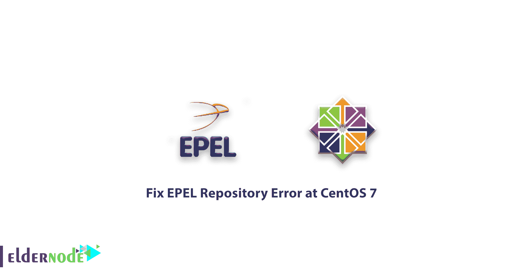

# 如何修复 CentOS 7 的 EPEL 存储库错误- epel repo 问题

> 原文：<https://blog.eldernode.com/how-fix-epel-repository-error-centos-7/>



在本文中，您将了解如何修复 CentOS 7 中的 EPEL 库错误。

#### 什么是 EPEL 知识库？

EPEL 库或“Enterprise Linux 的额外包”是一个开源库，最初是基于 Fedora 创建的，后来开发用于排名以及 [CentOS](https://eldernode.com/tag/centos/) 。该存储库具有高级软件包和各种工具，这些通常在默认的 CentOS 7 操作系统存储库中是不可用的，用户必须安装它才能使用。在安装这个包并使用它安装其他库或其他软件后，他们可能会有问题并遇到错误。

## 如何修复 CentOS 7 中的 EPEL 库错误。

要修复 EPEL 系统信息库错误，可以通过以下两种方式安装此软件包。

**第一种方式:**

```
yum install -y EPEL
```

**第二种方式:**

```
wget http://download.fedoraproject.org/pub/epel/6/x86_64/epel-release-6-8.noarch.rpm   rpm -ivh epel-release-6-8.noarch.rpm
```

安装后，您可以输入以下命令来刷新您的两个存储库并查看它们的列表。

```
yum list
```

### 在 EPEL 事件中，你会面临怎样的陈述

现在，如果 EPEL 存储库中出现问题，您将会遇到类似以下语句的错误。

```
Output  Loaded plugins: fastestmirror-    Determining fastest mirrors-    Error: Cannot retrieve metalink for repository: epel
```

这个错误通常是针对各种存储库的证书，包括 EPEL，您必须更新相关的 SSL 来修复它。

### 如何更新安全证书

要更新 EPEL 存储库的安全证书，请输入以下命令来解决问题。

```
yum upgrade ca-certificates --disablerepo = epel
```

在上面的命令中，发送了安全证书升级的请求，最后提到在执行该命令时 EPEL 存储库将被停用。
输入上述命令后，如果存在 SSL 问题，存储库的问题和错误将得到解决，您可以使用它们。

**注意:** 如果您输入上述指令后仍未解决问题，请检查您的 CentOS Linux 时区。

我们希望你喜欢在 [CentOS 7](https://www.centos.org/download/) 的关于如何修复 EPEL 库错误的教程。

此外，如果您需要购买虚拟服务器，您可以按照以下链接进行操作。

[**购买 Linux VPS**](https://eldernode.com/linux-vps/)

亲爱的用户，您可以在评论区提出关于本次培训的问题，在这里您可以得到您的答案，或者要解决其他关于老年节点培训的问题，请参考 [**提问页面**](https://eldernode.com/ask/) 部分，并尽快提出您的问题。腾出时间给其他用户和专家来回答你的问题。