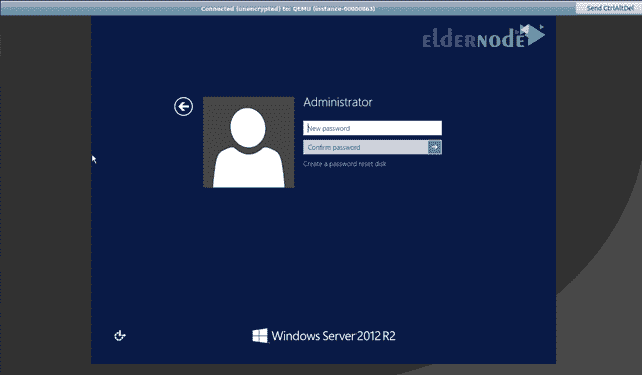
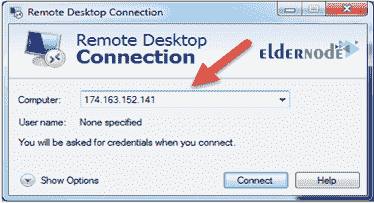

# 如何从 Windows - Eldernode 博客访问 Linux VPS

> 原文：<https://blog.eldernode.com/how-to-access-linux-vps-from-windows/>

远程访问虚拟服务器是使用虚拟服务器的要求之一，没有远程访问，控制和管理虚拟服务器将会很困难。因此，根据您使用的操作系统以及目标虚拟服务器的操作系统，有几种方法可以远程连接到您的虚拟服务器。本文教你如何从 windows 访问 [Linux VPS](https://eldernode.com/linux-vps/) ，以及如何使用 RDP 从 [Windows](https://blog.eldernode.com/tag/windows/) 连接到 [Windows VPS](https://eldernode.com/windows-vps/) 服务器。

## 如何从 windows 访问 Linux VPS

对应于相关协议的软件用于通信。这些工具允许您远程管理您的 vps 服务器，传输文件，并执行任何您可以远程物理执行的操作。本文教你如何使用 **Putty** 和 **RDP** 与 Linux vps 服务器通信。

### 从 windows 访问 Linux VPS 的先决条件

在开始与 vps 服务器进行远程通信之前，您需要满足一些基本要求:

**1。**VPS 服务器必须打开，并连接到互联网。

**2。**需要的软件必须安装在源计算机上(下面会介绍需要的软件)。

**3。** IP 地址(您的 vps 服务器)必须可用。

**4。**防火墙设置应该能够访问所需的端口。

### 如何使用 PuTTY 从 Windows 连接到 Linux vps 服务器

如果您运行的是基于 Windows 的操作系统，您将需要安装诸如用户端 SSH 之类的软件来连接到 VPS 服务器。在本教程中，我们将使用 PuTTY 软件。

PuTTY 是一个开源终端，我们用它来访问 vps 服务器。腻子有几个组成部分。但是我们要处理的两种成分是 PuTTY 和 PuTTYGen。我们使用 PuTTY 访问 vps 服务器，使用 PuttyGen 创建 SSH 密钥。用 PuTTY 制作 SSH 密钥的步骤如下:

#### 1。下载并安装 Putty

进入 [PuTTY 网站](https://www.chiark.greenend.org.uk/~sgtatham/putty/latest.html)，在页面顶部的 Package files 部分，下载 **msi 文件**并安装在你的系统上。

然后，安装程序后，您将能够通过开始菜单或 Windows 键运行 **PuTTYgen** 程序，并键入单词 PuTTYgen。

创建密钥的程序类似于下图:

#### 2。创建公钥

您可以根据自己的喜好更改所需的参数。默认设置通常被认为是最佳的。

应用更改后，点击**生成**选项。

您可能会被要求通过将鼠标移动到空白区域来生成一个随机密钥。

公钥现在将对您可见。您可以将其复制到您的服务器或主帐户。

#### 3。创建私钥

现在，点击保存私钥选项，并选择一个安全的空间来存储它。需要注意的是，您可以根据自己的喜好更改密钥的名称。ppk 插件也会自动添加。现在，您可以使用内置私钥在 PuTTY 应用程序中连接到 vps 服务器。

如果您在构建虚拟机时在主面板中创建了公钥，则不再需要使用 PuTTY 程序创建公钥。仅加载下载的带有后缀的公钥。pem 输入 PuTTYGen，然后单击保存私钥。这将保存您的私钥。ppk 扩展。

***注:*** 油灰不认了。pem 分机。

#### 4。使用 PuTTY 格式的公钥

您现在拥有登录 vps 服务器的密钥。您也可以单击保存公钥。注意，PuTTYGen 格式与保存公钥时用于在 OpenSSH Linux 服务器上认证 SSH 密钥的 **authorized_keys** 文件不兼容。

保存私钥后，如果您想以正确的格式查看公钥，请单击 Load 选项。然后导航到私钥并打开它。完成这些步骤后，将再次显示公钥。

### 使用 PuTTY 连接到 Linux vps 服务器的步骤

要连接到 vps 服务器，您必须首先将 vps 服务器的私钥引入 PuTTY 软件。为此，打开 PuTTY 软件后:

**–**前往**连接** → **SSH** → **Auth** 。

**–**点击认证参数/私钥文件下的**浏览…** 键进行认证。

**最后**，找到你的**私钥**文件，点击**打开**键。

然后执行以下操作连接到 vps 服务器:

在(会话→主机名或 IP 地址)字段中，输入虚拟服务器的用户名和 IP 地址，如 **[【电子邮件保护】](/cdn-cgi/l/email-protection) _public_ip** 。(例如[【邮件保护】](/cdn-cgi/l/email-protection))

默认端口是端口号 22，您可以根据需要更改。

确保连接类型设置为 SSH。

**最后**，按下 Open 键连接 vps 服务器。

### 如何使用 RDP 从 Windows 连接到 Windows VPS 服务器

RDP，即远程桌面协议，是由微软公司设计和开发的一种协议，用于远程连接、控制和管理基于 Windows 的机器。

与 SSH 协议不同，RDP 用户端软件提供了一个图形用户界面。因此，使用远程桌面服务允许用户和服务器管理员更容易地访问和管理目标计算机。相比之下，这个协议相对于 SSH 协议的一个缺点是缺乏加密，这降低了它的安全性。因为相关端口在互联网上是公开可用的。

有自动脚本不断地监控全球公共 IP 的各种端口，寻找热点。因此，使用防火墙和选择强而合适的密码对该协议的安全性有很大的影响。

### 《RDP 议定书》是如何运作的？

像 ssh 一样，这个协议使用用户/服务器架构。默认情况下，此协议的服务器(在您的虚拟服务器上是活动的)使用端口 3389，并在此端口上等待请求的响应。当您想要连接到 Windows 服务器时，您需要该服务器的用户名和公共 IP 地址。一旦您可以访问服务器，您就可以管理它，在两台计算机之间传输文件，并远程执行所有操作。

无论您使用的是什么版本的 Windows，您都可以使用默认安装在其上的 RDP 客户端软件来连接到您的 Windows VPS 服务器。

此外，如果您想第一次连接到您的 Windows vps 服务器，您需要在其中设置 vps 服务器密码。为此目的:

**–**在面板中创建一个 vps 服务器后，点击它打开它的管理页面。

**–**在**控制台**部分，点击**在新标签**中打开控制台。

**–**在屏幕的右上角，点击**发送 CtrlAltDel** 键。

**–**点击**管理员**用户名。

**–**会出现提示更改该用户名密码的信息，点击**确定**继续。

**–**在两个框中准确输入新密码。

**–**输入的密码已设置。

### 如何使用远程桌面连接软件

使用远程桌面客户端软件并不复杂，不需要任何设置。

***第一步:运行远程桌面连接软件***

有几种方法可以在您的系统上运行该软件:

从**开始菜单**，输入远程桌面连接并点击它。

*

同时按下 **Windows Logo + R** 组合键打开运行窗口。然后在“打开”框中键入 mstsc，并按 Enter 键。

***第二步:输入 vps 服务器**的公有 IP 地址*

远程桌面连接软件运行后，将会打开一个窗口，允许您输入 vps 服务器的域地址或公共 IP。

在计算机字段中，输入 vps 服务器的 IP 地址，然后单击连接。

***注意:*** 如果您已经连接到服务器并更改了协议的默认端口，您必须在此部分输入相关端口作为 IP: Port。

**比如:** 174。163.152.141: 6200

***第三步:输入您的用户名和密码，完成登录过程***

在上一步中单击连接后，将显示如下的另一个窗口，输入相应的用户名和密码。

如前所述，默认情况下，在这个阶段将使用通过用户面板中的控制台设置的管理员用户名和密码。

输入这些信息后，点击**确定**，最后点击**是**。

请注意，您可以在任何时候只使用一个用户的用户名和密码连接到 vps 服务器，如果另一个用户使用相同的信息进行连接，以前的连接将被断开。

## 结论

我们试图全面了解如何使用 Putty 从 Windows 连接到 Linux vps 服务器，以及如何使用 RDP 从 Windows 连接到 Windows vps 服务器。