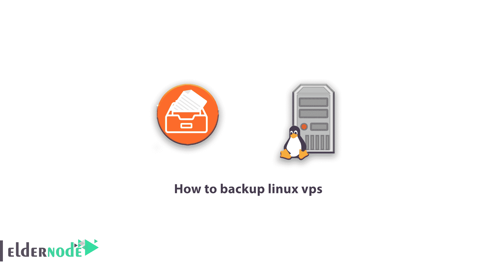

# 如何备份 linux vps - Eldernode

> 原文：<https://blog.eldernode.com/how-to-backup-linux-vps/>



在您设置了自己的虚拟服务器(VPS)或专用 Linux 服务器并打算在服务器上存储重要信息后，您可能会遇到或担心您的数据会因技术问题而丢失。

由于虚拟服务器的性质和信息安全的重要性，大多数虚拟服务器提供商在默认情况下不会备份您的服务器。您也可以从声称您的信息没有任何问题的供应商那里获得您的服务器，因为他们的服务器上有 Raid 0 或 Raid10，最糟糕的是 Raid5。但事实是，硬盘和 Raid 控制器也有可能出现故障，在这种情况下，数据将会丢失。在此期间唯一会损失的是用户，因为全世界的服务提供商都不对你的信息负责(服务的性质确实不允许对任何人做这样的保证)。这就是为什么我们决定在本文中教你如何备份 [Linux vps](https://eldernode.com/linux-vps/) 服务器。

## 如何备份 linux vps

信息对每个人都有一定的重要性。因此，首先你需要对你的信息进行分类，并确定它对你有多重要。想一想组织或公司花了多少钱来制作或收集信息，然后在图表中输入每条数据的重要性，这样你就可以制定最佳政策。信息可以包括图像、文本、项目代码和文件、数据库以及其他信息。

我们强调，如果您的 VPS 中有敏感且非常重要的信息，请务必尝试自己备份这些数据。虽然您将需要另一个 VPS 或 FTP 备份空间来进行备份，并且成本会更高，但您将会放心地保护可能是您多年活动的结果的有价值的信息。

### 为什么要做备份？

服务器上的信息可能会因为各种原因而被删除。这种信息的丢失比你想象的要容易得多。考虑以下场景:

**–**随机执行 rm -rf 命令

**–**在锁定状态下使服务器崩溃

**–**硬盘服务器的软硬件问题

**–**未经授权进入服务器(服务器黑客和勒索病毒感染或黑客删除信息)

**–**需要重新安装操作系统才能清除的病毒

#### 您认为不需要备份的原因

在我们开始之前，让我们指出您可能认为不需要备份的三个要点:

***1。我没有足够的时间做备份！***

事实是，我们都很忙，但由于不同的备份系统，它可以是一个自动化和定时的过程，可以在几分钟内设置和安装。选择几分钟安装一个备份系统或几个小时的压力和损失你的努力成果？

***2。我的信息受到 RAID10 的保护！***

RAID 不是备份系统。这是一个问题，不幸的是，由于一些服务公司的错误广告，将对用户造成不可挽回的损失。RAID 阵列也可能作为单个磁盘出现故障。Raid 是为了增加容错能力，而不是备份，所以还是那句话，RAID 不是备份。

***3。我没有地方保存我的数据备份！***

如今，您可以获得廉价的虚拟服务器进行备份。这些服务有大量的磁盘空间，也是由 Eldernode 作为虚拟备份服务器提供的，可以成为存储备份的好选择。

我希望你确信你确实需要做一个备份。在这篇文章中，提到了使用脚本或使用控制面板功能在虚拟服务器上备份信息的各种方法。在这篇文章中，我们试图根据不同的需求提出不同的方法。

### 如何用 CDP 脚本备份 Linux VPS

CDP 是一个脚本，它通过 SSH 连接到您的服务器，并备份您指定的文件夹或数据。

CDP 代表连续数据保护，是 PHP 编写的脚本，不需要特殊的数据库。CDP 使用 Json 存储信息，使用的资源最少。(mysql 作为数据库服务器将需要更多的资源来运行)。安装该脚本非常简单，并具有以下功能和优势:

***1。**网络管理面板*

**–**添加服务器

**–**添加备份任务

**–**查看备份

**–**下载备份

**–**恢复备份

**–**清除备份

***2。** Json 平面数据存储(无需 mysql)*

***3。**通过 Cron 执行备份(每小时-每天-每周-每月以及您为备份间隔指定的任何其他类型)*

***4。**通过密码或 SSH 密钥连接到所需的服务器*

***5。**通过电子邮件发送通知*

***6。**从 cPanel 托管账户获得升级*

***7。**能够备份 MySQL 数据库*

***8。**加密备份*

***9。**备份 OpenVz 节点*

### 如何在 Linux 上安装 CDP 脚本

CentOS / Debian / Ubuntu Linux 支持 CDP 脚本。

要安装 cdp 脚本，您需要从其他 Linux 服务器连接到您为备份提供的 vps，并按顺序输入以下命令:

```
yum install wget nano && wget cdp.me/install.sh && chmod +x install.sh && ./install.sh
```

通过执行上述命令，只需在您的服务器上安装 cdp，并参考以下地址进入管理面板:

```
http://1.2.3.4/index.php
```

输入备份服务器的 IP 地址，而不是 1.2.3.4。

默认用户名和密码是 admin，password:

**用户名:**管理员

**密码:**密码

您还必须使用以下命令编辑 config.php 文件，以更改其他设置并指定时间和电子邮件设置:

```
nano /var/www/config.php
```

***注意:*** 我们强烈建议您从 CDP UI 的用户部分更改默认密码。

## 结论

本教程详细解释了备份 Linux 虚拟服务器的原因。然后介绍了如何在 Linux 上安装 CDP 脚本，最后介绍了如何使用 CDP 脚本备份 linux vps。