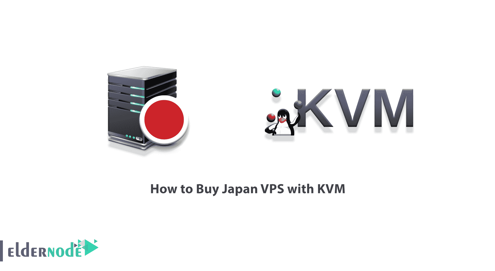
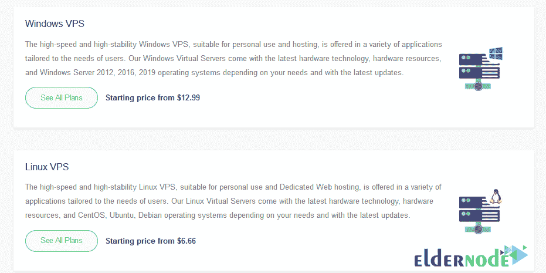
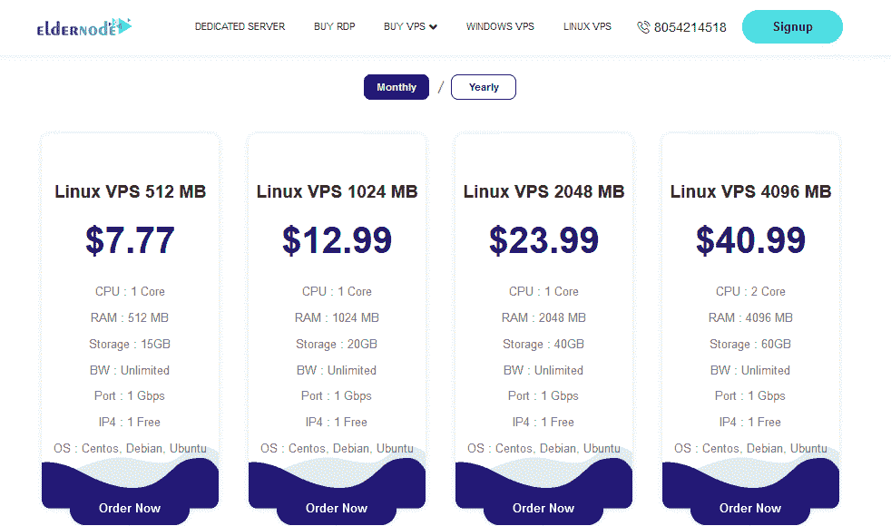
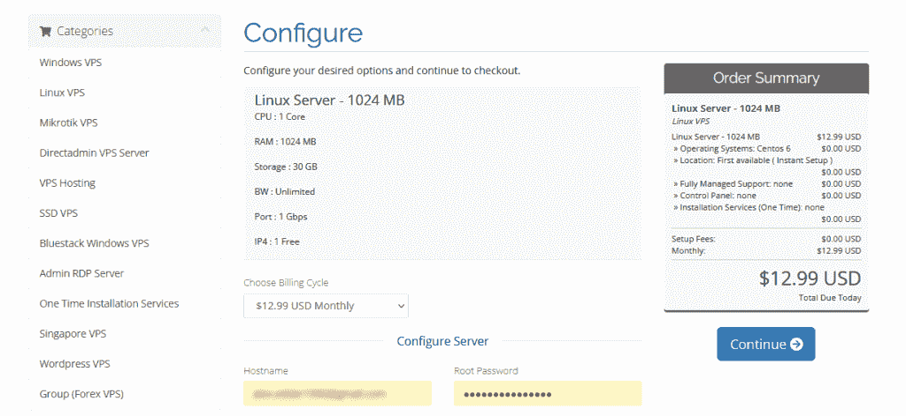
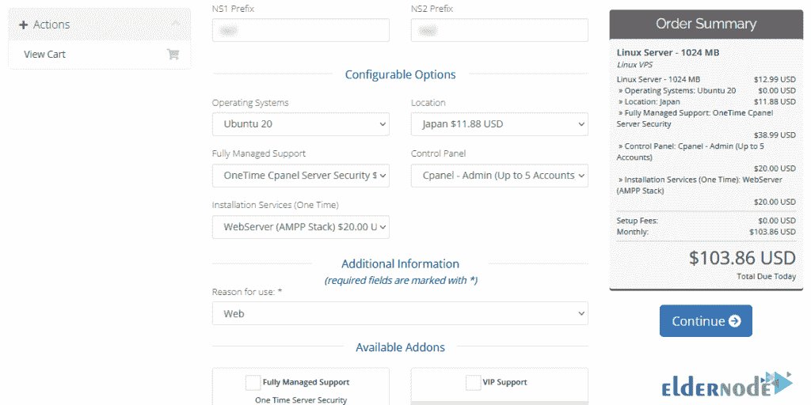
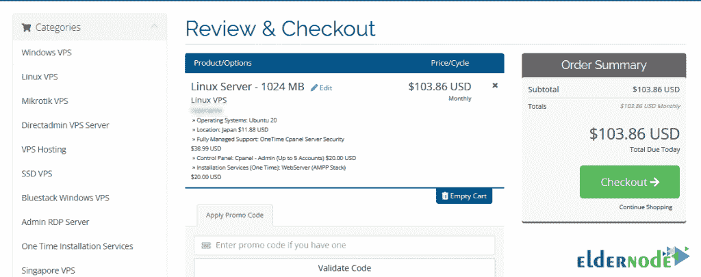
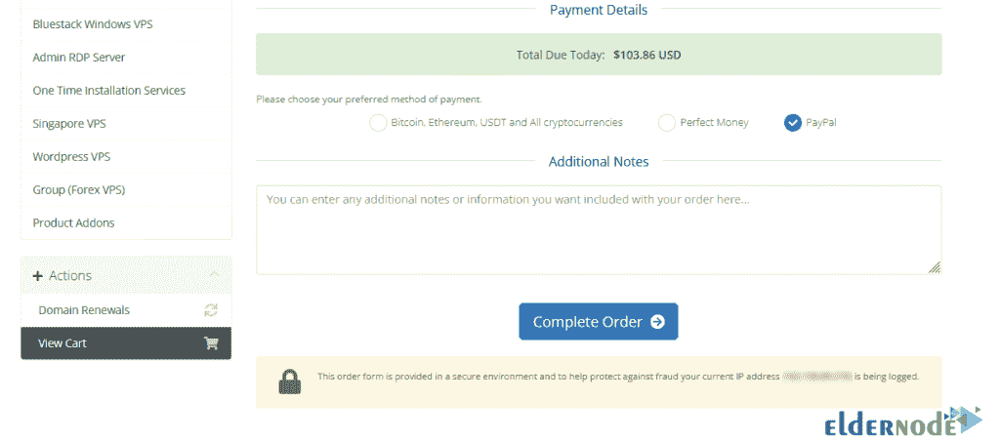
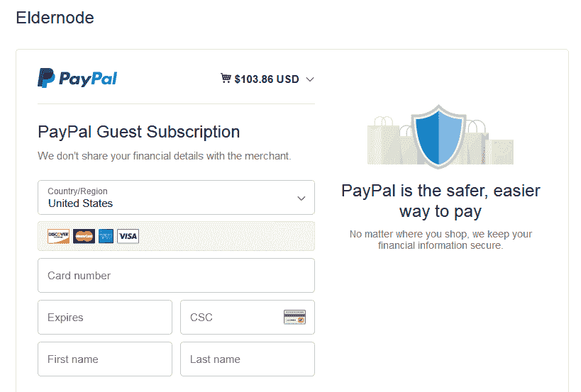

# 如何用 KVM - Eldernode 博客购买日本 VPS

> 原文：<https://blog.eldernode.com/how-to-buy-japan-vps-with-kvm/>

使用 KVM 虚拟化技术，可以创建具有完全独立的硬件和软件资源的 VPS 服务器。这些服务器可以轻松运行 Linux 或 Windows 操作系统，并利用独立的硬件资源。这些服务器适合在不同时间使用不同操作系统的人。在这篇文章中，我们将教你如何在 [Eldernode](https://eldernode.com/) 上购买带有 KVM 的日本 VPS。请加入我们。

## **教程用 KVM 买日本 VPS**

### **VPS 及其特点介绍**

在这一部分，我们将和你谈谈 VPS 的使用。但在此之前，我们将为不熟悉虚拟服务器概念的观众做一个介绍。

虚拟服务器或 VPS 是一个专用服务器，它使用虚拟化技术划分成几个虚拟服务器。这些部件在硬件使用方面是相同的。有趣的是，VPS 服务器的价格比其他服务器便宜。

VPS 服务器相对于共享主机(shared hosting)的优势在于:

1.独立管理操作系统和安装所需软件

2.能够关闭、打开和重启服务器

3.完全独立的来源

4.更高的本质安全性

如果我们想告诉您 VPS 服务器的功能，我们必须提到以下几点:

1.专用 CPU 资源、主内存和数据存储空间

2.专用远程管理的可能性

3.安装定制软件的能力

4.能够在最短的时间内升级资源

5.如果资源充足，能够无限制地托管大量网站

6.拥有专用 IP

7.相比于[专用服务器](https://eldernode.com/dedicated-server/)

8.能够管理服务器，例如通过访问服务器控制面板来打开或关闭服务器

9.能够根据用户需要在服务器上安装 Windows 操作系统( [Windows VPS](https://eldernode.com/windows-vps/) 服务器)或 Linux

10.能够快速排除故障并将信息传输到另一个虚拟机

### **什么是 KVM？**

KVM 代表基于内核的虚拟机，这是一种 Linux 开源虚拟化技术，允许将 Linux 内核用作管理程序。KVM 允许您将一个物理服务器分成多个虚拟服务器和虚拟机。这个虚拟机是 [Linux](https://blog.eldernode.com/tag/linux/) 的一部分，而 Linux 是 KVM 的一部分。应该注意的是，KVM 拥有让 Linux 流行的一切。

KVM 功能包括:

**1。安全性:** KVM 使用 SELinux 和安全虚拟化(sVirt)的组合来增强 VM 中的安全性和隔离性。

**2。存储:** KVM 能够使用任何 Linux 支持的内存，包括一些本地磁盘和网络存储(NAS)。

多路径 I/O 可用于改善存储和提供冗余。

KVM 还支持共享文件系统，以便不同的主机可以使用 VM 镜像。

**3。多种硬件支持:** KVM 可以使用多种 Linux 支持的正版硬件。因为世界顶级硬件供应商定期参与 Linux 内核的开发，所以最新的硬件特性通常会很快在 Linux 内核中被采用。

### **长辈节点上的 KVM VPS 服务器**

采用 KVM 技术构建的 VPS 服务器拥有专用的内核和硬件资源。需要注意的是，这个平台不存在超售的可能。

在 Eldernode，我们基于 KVM 提供以下服务:

**1。Linux VPS**

**2。Windows VPS**

**3。RDP 管理**

在下一节中，我们将教您如何在 ELdernode 上购买带 KVM 的日本 VPS。请加入我们。

## **用 KVM** 买日本 VPS 

在使用 KVM 购买 Buy Japan VPS 之前，您需要首先在 Eldernode 网站 上注册 [**。既然您已经在 Eldernode 成功注册，我们现在转向 VPS。点击主页面上的**](https://blog.eldernode.com/register-on-eldernode-and-order-vps/) **[**购买 VPS**](https://eldernode.com/vps/) 。**

***注:*** 由于 **Linux VPS** 、 **Windows VPS** 和 **RDP Admin** 使用 KVM 服务，可以直接从主菜单中点击它们。

在打开的页面上，点击**查看所有计划**选择 **Linux VPS** :

根据您是想购买每月**的套餐**还是每年**的套餐**，指定滑块。查看计划后，选择其中一个并点击**立即订购**按钮:

在下一部分中，您必须配置所需的服务。这一部分非常重要。在这个部分，你要设置**名称服务器**、**操作系统**、**位置、**等东西。请注意，要购买**日本 VPS** 服务器，您必须从**位置**字段中选择**日本**。然后点击**继续**:

通过进入**查看&结账**页面，您可以看到您定制服务的服务详情。如果您有一个**折扣代码**，将其放入所需字段并点击**验证代码**以申请折扣。然后点击**结账**:

下一步是确定**付款细节**。您可以决定使用三种方式中的哪一种来支付服务费用。所以选择其中一种支付方式后，点击**完成订单**:

最后，通过填写与支付网关相关的字段，您可以成功注册您想要的订单:

## 结论

具有自己独特功能的 VPS 服务器将是克服共享服务局限性的好选择。通过快速设置和通过控制面板管理服务器的能力，您可以在专用服务平台上快速加载您的网站。在本文中，我们在介绍了 VPS 及其特性之后，试图向您展示如何在 Eldernode 上购买带有 KVM 的日本 VPS。