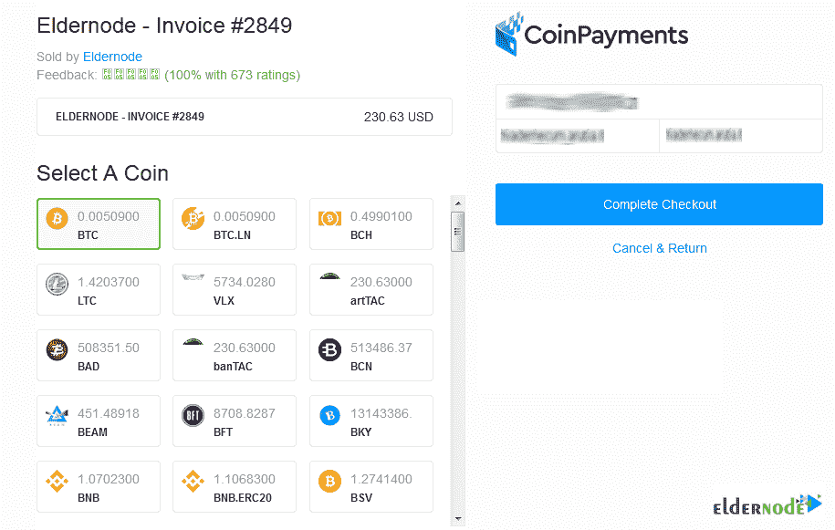

# 如何用比特币购买 Linux VPS(BTC)-elder node 博客

> 原文：<https://blog.eldernode.com/how-to-buy-linux-vps-bitcoin/>

**Linux VPS** 运行在 Linux 系统上，是主机上的服务器。主机可以运行其他几个虚拟服务器。如果您购买了 Linux 虚拟服务器，您将能够使用 Linux 操作系统来管理您的网站。在这篇文章中，你将学习**如何用比特币** (BTC)购买 Linux VPS。VPS 解决方案通常提供一个以上的托管计划，根据您的需求购买计划，请访问 [Eldernode](https://eldernode.com/) 并购买您自己的 [Linux VPS](https://eldernode.com/linux-vps/) 。

## **教程用比特币购买 Linux VPS(BTC)循序渐进**

### **什么时候需要自己买 VPS？**

如果您的网站已经超出了使用共享虚拟主机服务的限制，但是花费成本购买专用服务器是没有意义的。以及站点是否需要特殊服务、设置或配置。即使你不是这方面的专家，你也可以购买一个 Linux VPS。托管公司负责管理您的服务，并且很可能您需要在服务器上运行的一切都将在您的 VPS Linux 上安装和配置。如果你正在为一家公司创建和开发网站，你也可以从中获益。基本上，如果你希望你的网站成长并增加流量，Linux VPS 绝对适合你。

### **Linux VPS 特性**

使用 Linux VPS 有很多好处，包括**易用性**、**增强的安全性**、**提高的可靠性**和**低成本**。然而，对于大多数网站管理员、程序员、设计师和 web 开发人员来说， [Linux](https://blog.eldernode.com/tag/linux/) 虚拟服务器的主要优势在于其**灵活性**。每个虚拟服务器都有自己的**独立环境**，这意味着您可以轻松安全地安装操作系统，并且可以随时轻松添加或删除软件和应用程序。您还可以更改虚拟服务器环境，以满足您的性能需求，并改善用户或网站访问者的体验。这种灵活性可以成为你想要区别于竞争对手的优势。

## **Linux VPS 在 Eldernode** 的位置

您可以根据使用类型和您的客户选择位置。考虑你的服务在哪个地理区域有最多的用户，或者你打算使用什么服务。让我们看看当 Eldernode 是您的 VPS 提供商时，您可以选择哪些可用的 VPS 位置。但是，要获得更多关于如何选择位置的信息，请通过在线聊天或购票免费联系我们的顾问，向您介绍最佳位置。

#### **北美可用的 Linux VPS 位置:**

下图显示了北美的国家。在 ElderNode 有 20 多个 VPS 位置。找到能为顾客提供最佳服务的地方。

芝加哥 Linux VPS，纽约 Linux VPS，洛杉矶，迈阿密 Linux VPS，西雅图 Linux VPS，达拉斯 Linux VPS，加拿大。

#### **欧洲可用的 Linux VPS 位置**

法国 Linux VPS，荷兰 Linux VPS，英国 Linux VPS，罗马尼亚 Linux VPS，丹麦 Linux VPS，俄罗斯 Linux VPS，德国。

此外，如果可能的话，您可以通过在线聊天或票证请求它，以便可以在任何位置向您提供它。

#### **亚洲可用的 Linux VPS 位置**

大多数流行的 Linux VPS 服务器位置都是可用的。但是，如果您需要下图中没有的其他位置，您可以通过票务或在线聊天请求，在检查后添加您想要的位置。

日本 Linux VPS，新加坡 Linux VPS，香港 Linux VPS，迪拜 Linux VPS，印度 Linux VPS，马来西亚 Linux VPS，韩国 Linux VPS，土耳其 Linux VPS。

## **开始购买 Linux VPS 比特币**

购买 Linux VPS 的第一步是找到畅销书。最好的价格，24/7 支持，各种主机包，并提供广泛的主机选项是你必须检查的参数。

**ElderNode** 是一家灵活的公司，为不同计划和条件的用户提供所需的最佳服务。灵活的服务、全面的监控和支持，以及快速、轻松的起步是 Eldernode 为其有价值的客户提供的服务。

在接下来的指南中，我们将回顾一下使用比特币购买 Linux VPS 需要通过的步骤。

第一步:

前往[Eldernode.com](https://eldernode.com/)，点击**注册**进行注册。

第二步:

注册完成后，返回主页并点击 **Linux VPS** 选项卡。

第三步:

在 Linux VPS 页面上，你可以选择你的完美的 **Linux 虚拟私有服务器**包。根据您的需求选择每月或每年，然后按**立即订购**。

第四步:

当您按下**立即订购**时，您将被引导至配置页面，您将看到您的订单摘要。需要位置和操作系统信息。当所有选项卡都被填满时，按下**继续**。

第五步:

现在，你看到你选择了什么，如果有什么地方是错误的，按下编辑并再次审查。在页面的最后，一个空白标签会要求你输入你的折扣代码，然后按下**验证码**。最后，点击**结账**。

***注*** :通过网站上的在线聊天联系老年人代码专家，了解可用的折扣和您可以拥有代码的方式。

第六步:

你的情况很重要。Eldernode 提供了加密货币、完美货币、PayPal 等在线支付服务。以便所有用户都可以使用比特币、以太坊、Monero、Dogecoin、Ripple、Dogecoin 和数千种其他加密货币进行支付。

因此，在下一页输入您的个人详细信息和账单信息后，选择第一个选项“付款详细信息”。当您选择了**比特币、以太坊、USDT 和所有加密货币**时，按**完成订单**。

第七步:

在此步骤中，点击**选择硬币**部分的 **BTC** 。然后点击右栏中的**完成结账**。

第八步:

最后，你会收到你的支付 ID 来购买你自己的 Linux VPS，并用比特币支付。请随时开始与 Eldernode 专家在线聊天，提出您的问题。

结论

在本文中，您学习了如何用比特币(BTC)购买 Linux VPS。所需的步骤将带您购买您首选的 Linux VPS，但如果您需要咨询更多信息或询问任何其他问题，请与我们在线聊天。

Step 8:

Finally, you will receive your payment ID to buy your own Linux VPS and pay with Bitcoin. Feel free to start an online chat with Eldernode experts to ask your questions.

## Conclusion

In this article, you learned How To Buy Linux VPS With Bitcoin (BTC). The required steps will take you to buy your preferred Linux VPS, but if you need to consult more or ask any other questions, just start an online chat with us.