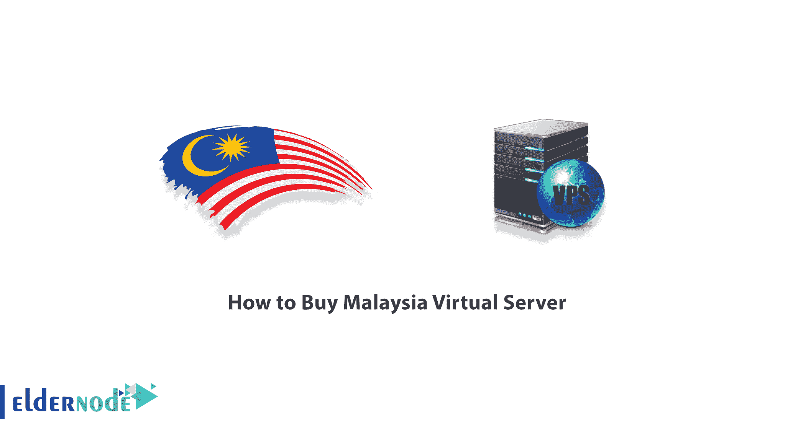

# 如何购买马来西亚虚拟服务器- Eldernode 博客

> 原文：<https://blog.eldernode.com/how-to-buy-malaysia-virtual-server/>

开始提供马来西亚虚拟服务器服务。

通过购买马来西亚 VPS 主机，您将获得 IP 服务和 100%真实的位置。当您在马来西亚 VPS 浏览器中打开页面时，您将以马来西亚公民的身份打开该页面。

付款方式:

可以用[比特币](https://eldernode.com/bitcoin-vps/)(BTC)[以太坊](https://blog.eldernode.com/introducing-ethereum-and-get-a-vps-with-it/) (ETH)、莱特币(LTC)等数字货币的形式购买和支付马国虚拟服务器。，或者完美金钱或者 PayPal。

### 马来西亚虚拟服务器功能:

*   专用 IP
*   专用资源
*   1-6 小时交货
*   99%的正常运行时间
*   100%真实位置
*   硬件防火墙
*   升级到更高计划的能力

点击订购 **[Linux VPS](https://eldernode.com/linux-vps/)** 服务器。

Linux VPS 优惠码: **lin13off**

点击订购 **[Windows VPS](https://eldernode.com/windows-vps/)** 服务器。

Windows VPS 折扣代码: **win15off**