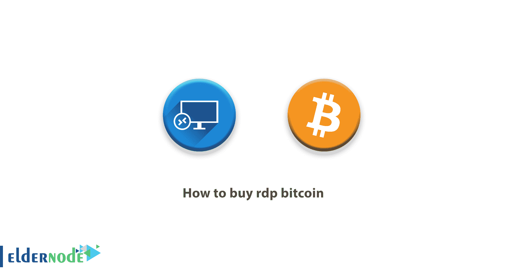

# 如何购买 rdp 比特币-如何用比特币购买| Eldernode

> 原文：<https://blog.eldernode.com/how-to-buy-rdp-bitcoin/>

**如何购买 rdp 比特币，**比特币是支付方式 [Eldernode](https://eldernode.com/) 接受。

什么是 RDP？

“RDP”代表远程桌面协议，表示对系统的远程访问协议 。 桌面远程协议由[微软](https://www.microsoft.com/)打造，允许两个系统之间的连接。 简单来说，你可以使用 rdp 图形化连接到另一个 [Windows](https://blog.eldernode.com/tag/windows/) 系统。 远程桌面的默认端口是 3389。

比特币是什么？

比特币是一种数字货币，你可以购买、在线订购或将其视为一种投资形式。

RDP 地点:

新加坡 RDP、罗马尼亚 RDP、美国 RDP、中国 RDP、英国 RDP、荷兰 RDP、澳大利亚 RDP、德国 RDP、日本 RDP、法国 RDP 等等。

如何用比特币购买 RDP

### 您可以从以下地址订购 RDP 管理软件:

[**买 RDP**](https://eldernode.com/buy-rdp/)

[**管理 RDP 服务器**](https://eldernode.com/admin-rdp-server/)

[**澳洲 RDP 管理**](https://eldernode.com/australia-rdp-admin/)

比特币的好处:

这里面没有支付诈骗。

*   没有身份盗窃的风险。
*   交易是不可逆的
*   直接交换，不需要中介。
*   高流动性
*   国际交易
*   比特币无法被屏蔽。
*   安全性和唯一性。
*   支付订单有不同的方式。
*   区块链
    由于在比特币网络中使用了区块链，欺骗和操纵它是不可能的。
*   [**买 RDP**](https://eldernode.com/buy-rdp/)

[**管理 RDP 服务器**](https://eldernode.com/admin-rdp-server/)

[**Admin RDP Server**](https://eldernode.com/admin-rdp-server/)