# 如何购买 SSD NVMe VPS 与即时设置- Eldernode 博客

> 原文：<https://blog.eldernode.com/how-to-buy-ssd-nvme-vps-with-instant-setup/>

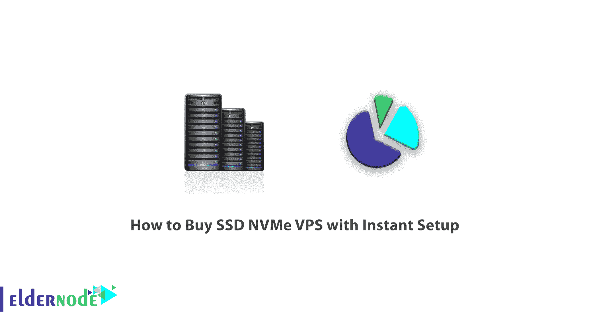

当你在寻找实施你的项目和网络应用的解决方案并购买 VPS 时，你可能会遇到一个叫做 NVMe 虚拟服务器或 NVMe VPS 服务器的选择。虽然这是一项新技术，但许多人仍然不熟悉，他们不知道使用它的好处。这篇文章将教你如何购买 SSD NVMe VPS 的即时设置。

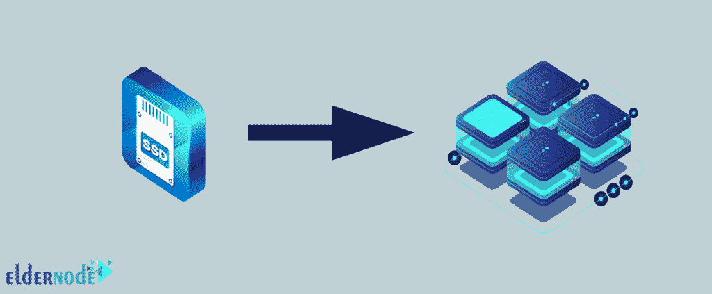

## **什么是 SSD NVMe？**

NVMe 或非易失性存储器 Express 是一项新技术，有助于消除一些限制。这是一种旨在使用高速媒体存储的协议。这个虚拟服务器不仅刺激硬件存储，还刺激 CPU、RAM 等其他资源。NVMe 存储还使用一组简单的指令来提高数据分析的使用和效率。

## **什么是 VPS？**

VPS 通常是位于物理服务器上的虚拟环境。物理服务器主要运行多个 VPS，这些 VPS 拥有自己的专用资源。此外，开发，配置和安装虚拟服务器很容易，因为用户可以选择操作和更多。值得注意的是，VPS 为昂贵的专用服务器和有限的托管账户(如共享托管)提供了替代方案。但应该注意的是，服务器托管提供的服务不同于网络托管。

## **VPS 是用来做什么的？**

*   虚拟主机
*   备份数据
*   游戏服务器
*   托管 VPN
*   托管服务器
*   开发和测试代码

## **SSD NVMe VPS 功能**

*   提高读写速度
*   重负荷控制
*   传递更好的用户体验
*   做标准的 NVMe
*   拥有强大的缓存系统
*   优化对大型数据库的访问

## **教程买 SSD NVMe VPS 带即时设置**

在了解了 [SSD](https://blog.eldernode.com/what-is-ssd-hard/) NVMe VPS 的特性和应用后，现在你可以通过即时设置来购买 SSD NVMe VPS。为此，你必须首先在 [Eldernode](https://eldernode.com/) 网站上**注册。首先点击**注册**并完成注册步骤:**

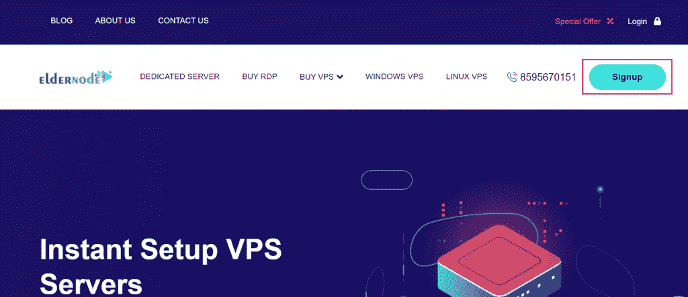

**Eldernode** 为 VPS 服务器提供不同的位置:

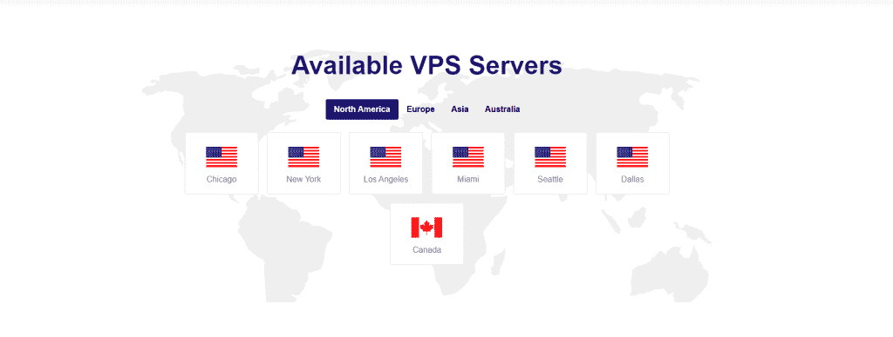

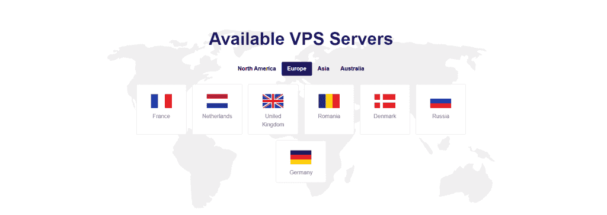

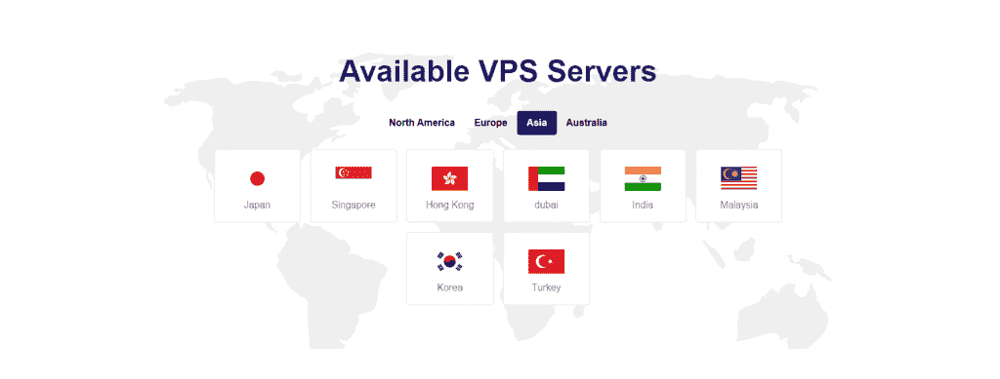

然后点击**购买 VPS** 选择你喜欢的方案:

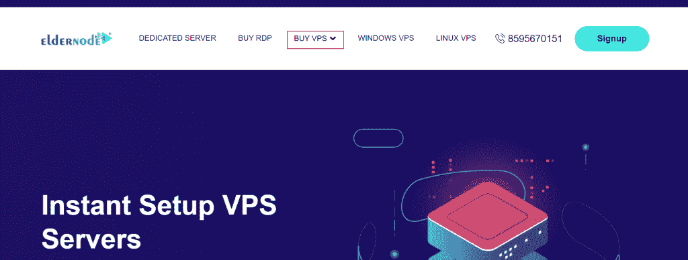

在这里您可以看到这些计划，选择其中一个并点击**查看所有计划**进行订购:

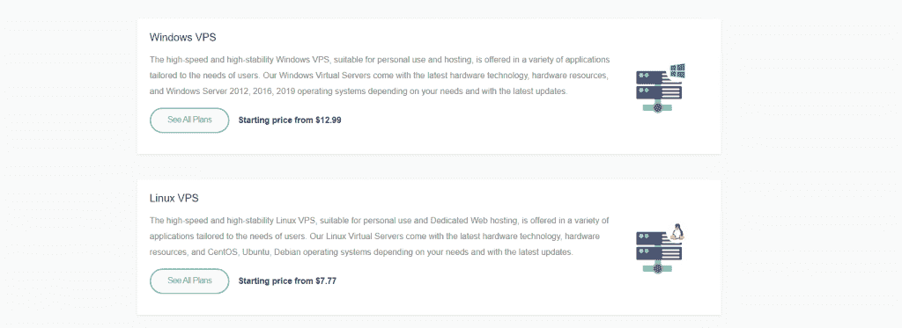

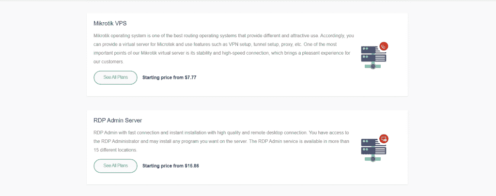

现在，您应该选择您想要的月度或年度计划，并点击**立即订购**:

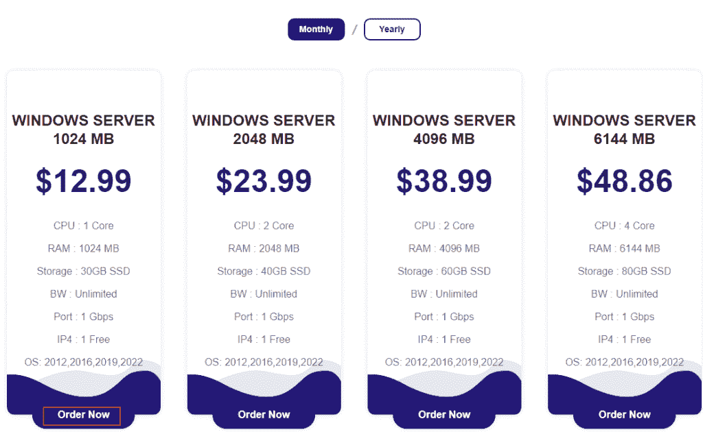

现在您处于配置阶段，完成这些阶段并按**继续**:

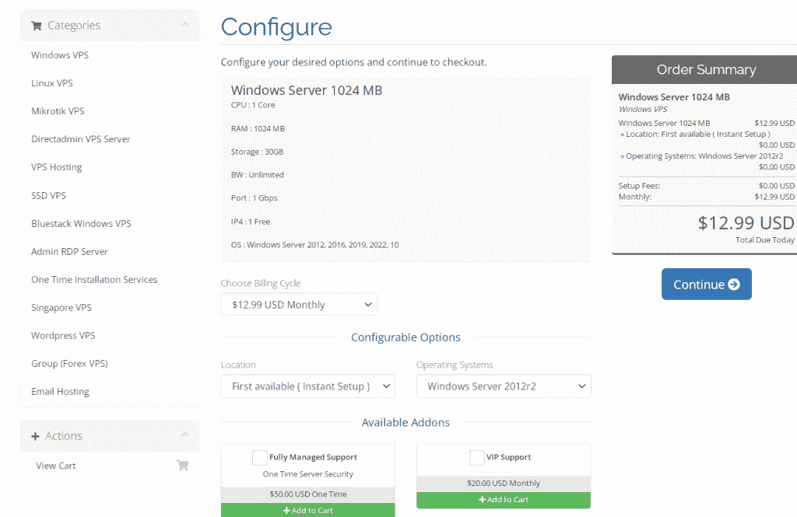

在**查看&结账**阶段，您可以点击**编辑**并更改您想要的任何内容，然后按**结账**:

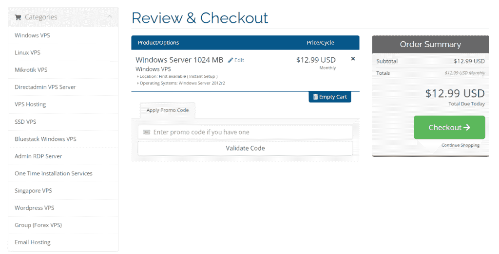

在这一阶段，填空，然后选择付款细节。然后**完成订单**:

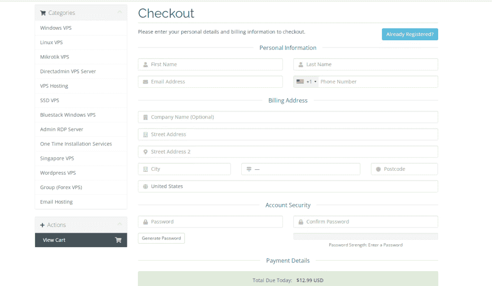

## 结论

在这篇文章中，我们教你如何在 Eldernode 网站注册，以及如何购买 SSD NVMe VPS 的即时设置。你可以在评论里联系我们。