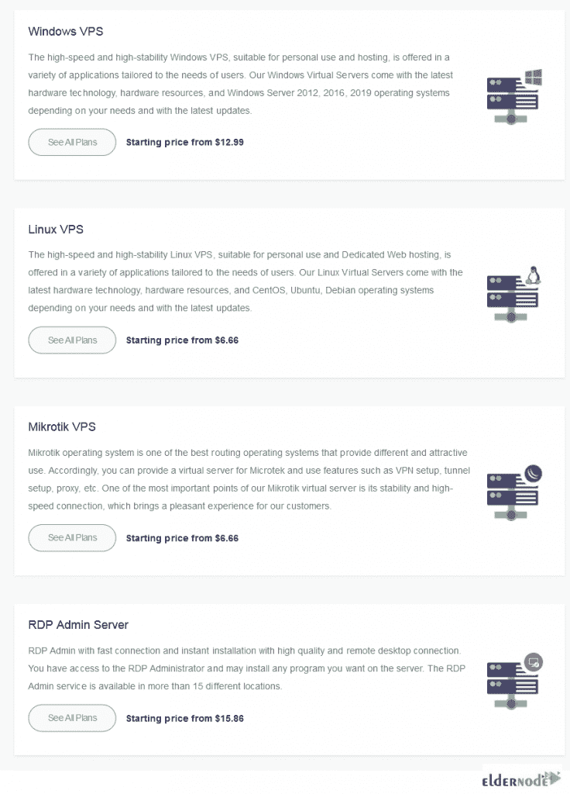
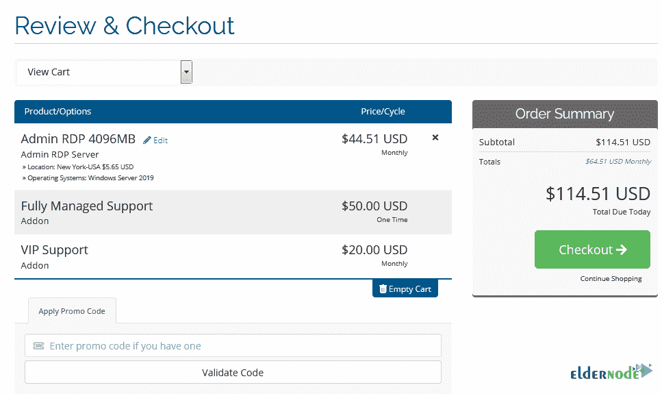
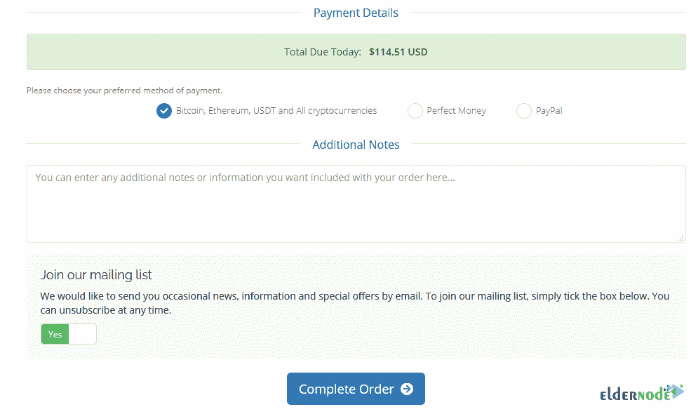

# 如何用 Monero (XMR) - Eldernode 博客购买 VPS

> 原文：<https://blog.eldernode.com/how-to-buy-vps-with-monero/>

虚拟服务器是运行自己的操作系统副本的虚拟机。因此，您可以让它安装在该操作系统上运行的几乎所有软件。使用 VPS 的各种重要特性说服用户在虚拟专用服务器上工作，并收到真正令人满意的结果。控制、定制和提高性能的安全性是 VPS 服务器流行的主要原因。如果你需要发展你的业务，购买 VPS 是你的第一个决定，我们建议你和我们在一起，阅读本指南。在这篇文章中，你将学习如何用 Monero (XMR) 购买 VPS。此外，您还可以访问 [Eldernode](https://eldernode.com/) 来选择您首选的 **[VPS 服务器](https://eldernode.com/vps/)** 并享受其带来的好处。

## **教程用 Monero 买 VPS(XMR)**

### **介绍 Monero，用 Monero 买 VP**

为了体验共享物理空间的经济性和使用它的灵活性、可伸缩性，甚至比共享主机更安全，用户决定购买 VPS。另一方面，人们更渴望使用数字货币进行买卖。根据它令人印象深刻的特点，我们增加了用 Monero 付款的可能性。如你所知，使用比特币和以太坊使得交易可以被世界上任何人公开验证和追踪。此外，这些交易的发送和接收地址可能潜在地与一个人的真实身份相关联。但是，使用 **Monero** 允许你有一个发送和接收地址的屏蔽，以及交易金额。接下来，你将学习**用 Monero** 购买 VPS 的必要步骤。

### **用 Monero** 购买 VP 的前提条件

来自世界各地的你正在阅读这份指南，有可能用 Monero 买到你喜欢的 VPS。事实上，我们努力为我们的重要客户提供最好的服务。因此，**我们考虑了 20 多个 VPS 位置**来帮助您根据自己的需求进行检查和选择。看看 Eldernode 的可用位置。

### **北美** 的老年人节点 VPS 位置

Eldernode 在您身边，帮助您在特定位置提供服务，以便您的客户获得最佳质量。如果您在下面的列表中没有找到您考虑的位置，您可以通过在线聊天或票务请求所需的位置，以便在可能的情况下提供给您。让我们看看北美的可用位置。

如图所示，芝加哥副总裁、纽约副总裁、洛杉矶副总裁、迈阿密副总裁、西雅图副总裁、达拉斯副总裁和加拿大副总裁现已可用。

### **欧洲** 老年人节点 VPS 位置

此外，您可以在下面找到欧洲的可用位置。订购您自己的 VPS，开始接触强大的基础架构和直接完全访问。如下图所示，这些位置适用于欧洲客户:

法国 VPS，荷兰 VPS，英国 VPS，罗马尼亚 VPS，丹麦 VPS，俄罗斯 VPS，德国 VPS。

### **亚洲** 老年人节点 VP 位置

如果您生活在亚洲，并且您打算购买 VPS，或者由于任何原因您更愿意选择这个目的地，我们准备在以下地点提供最好的服务:

日本 VPS，新加坡 VPS，香港 VPS，迪拜 VPS，印度 VPS，马来西亚 VPS，韩国 VPS，土耳其 VPS。

## **用 Monero (XMR)一步步买 VPS**

购买 VPS 可以让你完全安装你考虑的软件和操作系统。此外，您还可以托管您的文件和网站，运行应用程序等等。Eldernode 上有各种各样的 VPS，如 [Linux VPS](https://eldernode.com/linux-vps/) 、 [Windows VPS](https://eldernode.com/windows-vps/) 、 [Mikrotik VPS](https://eldernode.com/mikrotik-vps-server/) 和 [RDP Admin](https://eldernode.com/buy-rdp/) VPS，这些 VPS 将被立即设置。请和我们一起浏览本部分的步骤，了解如何使用 Monero 购买 VP。

第一步:

首先，您应该[在 Eldernode](https://blog.eldernode.com/register-on-eldernode-and-order-vps/) 上注册，加入我们的客户，使用我们的支持和服务。为此，打开网站和**注册**。

第二步:

登录后，选择主页上的**购买 VPS** 选项卡并继续。

第三步:

在那里，你可以选择你需要购买的操作系统。点击**查看所有计划**继续。

第四步:

在此步骤中，我们继续选择 RDP 管理服务器。正如我们提到的，你可以选择你认为合适的副总裁。因此，当您选择了您的首选计划时，请点击**立即订购**。

第五步:

在此步骤中，您可以查看订单摘要。在页面的最后，您可以选择拥有**完全管理支持**或 **VIP 支持** VPS。其他选项，如位置和操作系统也是可配置的。当您勾选了想要的选项后，点击**继续**。

第六步:

现在，检查上一步选择的选项，如果你想改变什么，按**编辑**。然后，如果有的话，输入你的**促销代码**，点击**结账**。

***注*** :通过网站上的在线聊天联系老年人代码专家，了解可用的折扣和您可以拥有代码的方式。

第七步:

一旦您输入了您的个人信息和帐单地址，您应该选择付款细节。点击**比特币、以太坊、USDT 和所有加密货币**，点击**完成订单**。

第八步:

在选择硬币框中搜索或滚动找到 **Monero** ，点击**完成结账**。

第九步:

最后，您的付款 ID 将会显示，您可以使用 Monero XMR 购买您认为合适的 VPS。请随时开始与 Eldernode 专家在线聊天，提出您的问题。

就是这样！从现在起，您有 3 个小时的时间来完成您的退房手续。

结论

在本文中，您了解了如何使用 Monero (XMR)购买 VPS。随着快速启动，Eldernode 上还有更多的服务，如外汇 VPS、币安 VPS 和 BlueStack VPS。然而，一旦您开始了与 Eldernode 的旅程，全面的监控和支持将是您的旅伴。要体验 99.9%的正常运行时间保证可靠和安全的 24/7 支持，请联系我们。

That’s that! From now, you have 3 hours time to complete your checkout with Eldernode.

## Conclusion

In this article, you learned How To Buy VPS With Monero (XMR). There are more services such as forex VPS, Binance VPS, and BlueStack VPS available on Eldernode with the quick start-up. However, once you start your journey with Eldernode, full monitoring and support will be your fellow traveler. To experience 99.9% uptime guarantee reliable and secure 24/7 support contact us.