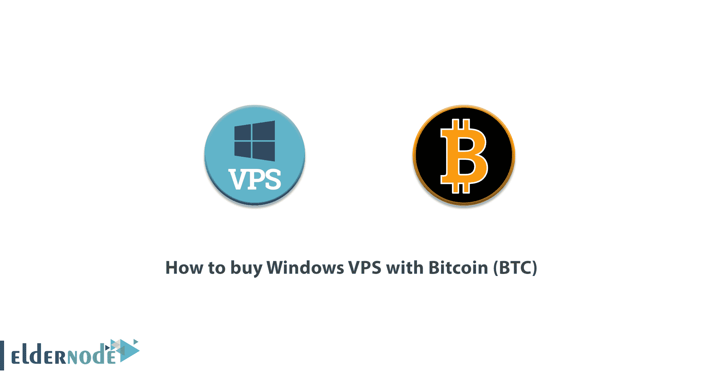
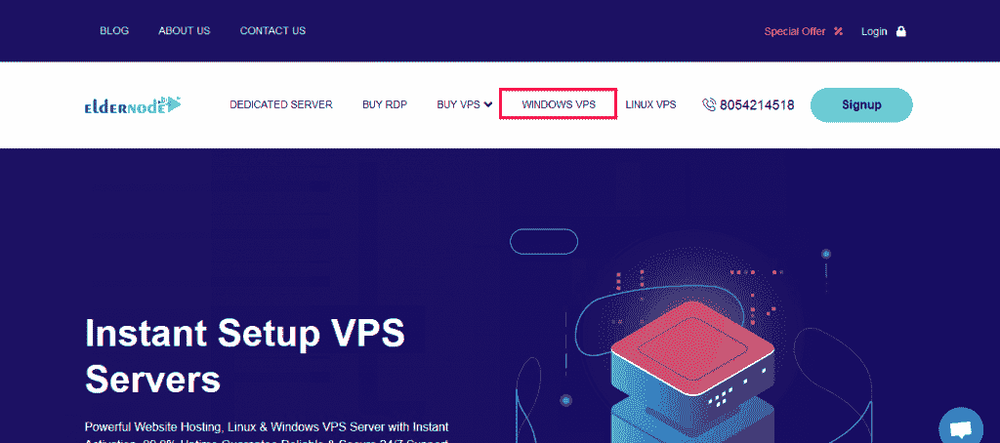
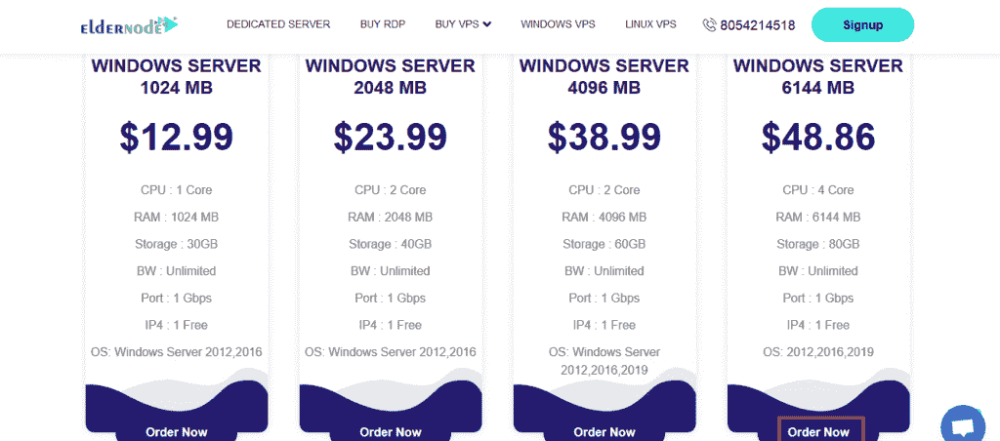
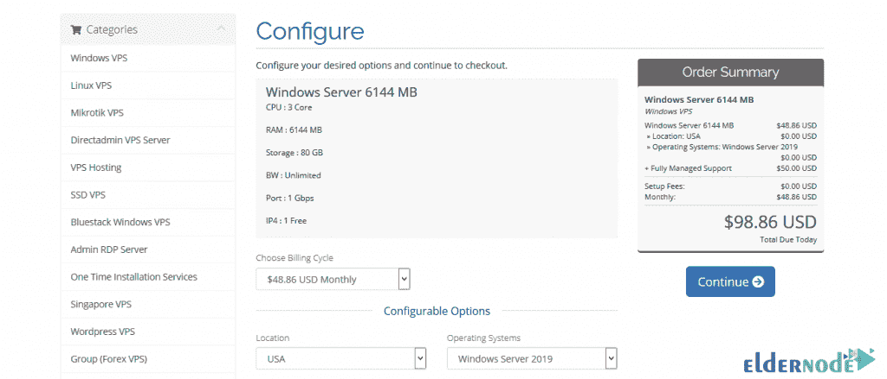
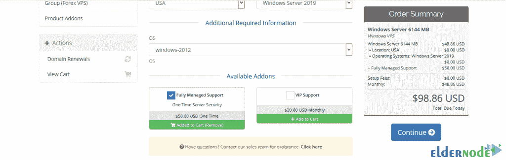
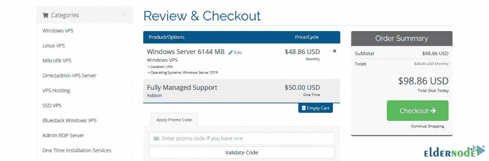
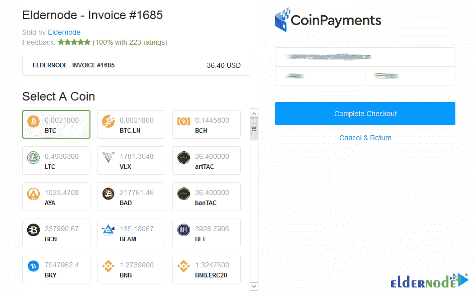
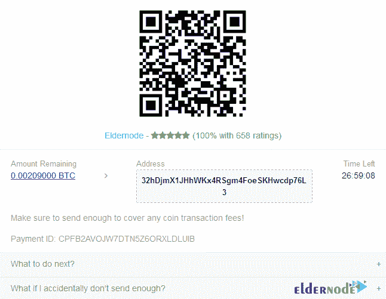

# 如何用比特币购买 Windows VPS(BTC)-elder node 博客

> 原文：<https://blog.eldernode.com/how-to-buy-windows-vps-with-bitcoin/>

VPS 服务器实际上是一台非常强大的计算机，它总是开着，并且有非常高速的互联网。VPS 服务器上可以安装多种操作系统。可以安装在 VPS 服务器上的操作系统之一是 Windows 操作系统。Windows Server 不同于 Windows Home 桌面。这些窗口是为虚拟服务器设计的，比安装在虚拟服务器上的常规窗口拥有更多的功能。使用这些窗口与您自己的笔记本电脑窗口非常相似。这些窗口被命名为 Windows Server 2003、2008、2012、2016 和 Windows Server 2019。在本文中，我们要一步一步地向您介绍**如何用比特币(BTC)** 购买 Windows VPS。可以按照这篇文章在 [Eldernode](https://eldernode.com/) 购买一台 **[Windows VPS](https://eldernode.com/windows-vps/)** 服务器。

## **教程用比特币购买 windows VPS(BTC)**

通过选择 Windows 服务器，您可以更好地控制设置。Windows VPS Server 是一个虚拟服务器，具有强大的 Microsoft [Windows](https://blog.eldernode.com/tag/windows/) Server 操作系统，提供在这些服务器上应用任何内容的完全访问权限。这样，用不到一台[专用服务器](https://blog.eldernode.com/buy-dedicated-server-with-bitcoin/)，你就会拥有一台拥有强大虚拟化和硬件资源的服务器。您可以在上面安装服务器的操作系统版本，并以管理员权限连接到服务器，不受限制地管理您的项目。

### **Windows VPS 服务器特性:**

在本节中，我们将提到 Windows VPS 服务器索引的一些功能:

**1-高速互联网**

VPS 服务器和专用服务器都有很高的端口，所以下载和上传速度都很快。

**2-一天 24 小时开机**

VPS 服务器是永久打开的，根本不会关闭。这有助于做很多事情，你不能用你的笔记本电脑和个人电脑。

**3-强大的硬件资源**

一个 [VPS 服务器](https://eldernode.com/vps/)，尤其是一个专用的 Windows 服务器，可以拥有非常强大的内存和处理器。由于这个特性，您将能够使用这些服务器进行非常繁重的处理。

**4-可用性**

Windows VPS 服务器，因为它有 24 小时的互联网，您可以很容易地访问和使用虚拟服务器与您的 Windows 操作系统，有互联网在任何地方。

下一节，我们将教你如何用比特币 (BTC)购买 **[Windows VPS。](https://eldernode.com/windows-vps/)**

### Windows VPS 位置:

新加坡视窗 VPS，俄罗斯视窗 VPS，美国视窗 VPS，香港视窗 VPS，英国视窗 VPS，荷兰视窗 VPS，土耳其视窗 VPS，德国视窗 VPS，日本视窗 VPS，法国视窗 VPS，加拿大视窗 VPS 等等。

### **用比特币购买 Windows VPS(BTC)**

要从 Eldernode 购买 Windows VPS 服务器，只需按照以下步骤操作:

第一步是访问 [Eldernode 网站](https://eldernode.com/)。

然后你得**在网站上注册**。为此，点击**注册**。

在网站上成功注册后，请返回主页。现在你需要点击 **Windows VPS** 标签。

在打开的页面上，如果你向下滚动一点，你会在页面中间看到适用于 **Windows VPS** 的软件包。查看完这些套餐后，您可以通过点击**立即订购**来选择您想要的选项。

***注:*** 需要注意的是，您可以按月或按年购买本部分的套餐。

在下一页，你会看到你想要的包装规格。请注意，在此页面上，您必须选择关于**位置**和**操作系统的信息。**您也可以在**可用插件**部分选择您想要的选项。然后点击页面右侧的**继续**。

*

在下一页，如果您有折扣代码，您可以输入它，然后点击**验证码**进行确认。最后，点击**结账**。

进入下一页后，在**支付详情**区选择**比特币、以太坊、USDT、所有加密货币**。然后点击**完成订单**。

下一步，在**选择硬币**部分点击 **BTC** 。然后点击右栏中的**完成结账**。

*

最后，您将被带到一个页面，在那里您将看到钱包的详细信息。如果您有任何问题，可以通过**实时聊天**部分联系我们的专家。

## 结论

在这篇文章中，我们试图教你如何用比特币(BTC)购买 Windows VPS。您也可以参考文章[如何连接到 Windows VPS 服务器](https://blog.eldernode.com/connect-to-windows-vps-server/)了解更多信息。