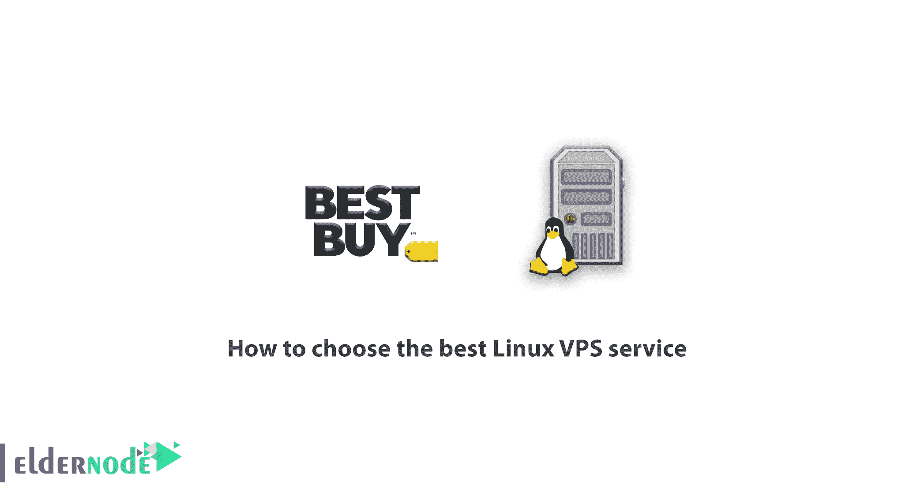
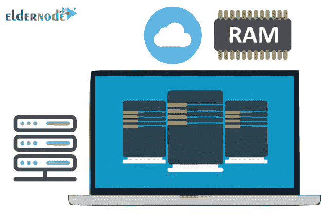
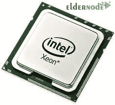
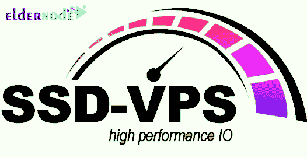
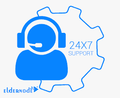

# 如何用 8 种方法选择最好的 Linux VPS 服务- Eldernode

> 原文：<https://blog.eldernode.com/how-to-choose-the-best-linux-vps-service/>

教程如何用 8 种方法选择最好的 Linux VPS 服务？选择正确的 VPS 服务器一直是网站管理员关心的问题之一。在本文中，我们试图解决如何选择合适的 [Linux VPS](https://eldernode.com/linux-vps/) 服务器的关键点，并提供解决方案来帮助您做出正确的选择，让[购买 VPS](https://eldernode.com/vps/) 服务器成为最适合您业务增长的选择。

## 如何选择最好的 Linux VPS 服务

在选择合适的虚拟服务器时，首先出现的问题是如何自己管理虚拟服务器，还是由托管公司管理？这个问题的答案其实还是要看个人需求。

简而言之，大多数开发人员倾向于接管他们自己的虚拟服务器的管理。这种选择为开发人员提供了更大的灵活性和自由度来升级、保护他们的服务器，并最大限度地减少突然中断和意外事件。开发者通常不需要托管公司完全管理的 VPS，因为他们没有理由花费额外的钱来管理虚拟服务器。

如果您的技术团队不是虚拟服务器管理的专业人员，将虚拟服务器管理的重任委托给托管公司是一个更好的选择。这里有一个购买虚拟服务器的完整指南，这样你就可以做出正确的购买。

## 教程选择最好的 Linux VPS 服务

### 1。使用合适的 RAM

你有几个网站和项目在运行吗？你需要适量的内存来保持工作。高效的 vps 服务器至少需要 4 GB 的 RAM，这是高数据量项目的最低建议值。您可以将整个 RAM 空间用于存储数据。如果没有一个高效的 CPU 进行处理，你将无法使用所有的内存能力。

### 2。使用强大的 CPU

选择多核处理器和 14 纳米架构的 vps 服务器是选择合适的 vps 服务器的好选择。例如，采用 Broadwell 或 Haswell 架构的至强服务器中的英特尔 E5 和 E7 处理器，以及在高峰时段使用多核处理器和资源分配，可以优化服务器性能。

### 3。使用存储器

如果作为传统硬盘提供，存储空间几乎总是更大、更便宜。但为了优化，需要 SSD 或固态存储空间来托管 VPS。想想你第一次使用固态硬盘时，固态硬盘的功能自然是引导和快速加载、流畅的性能和快速传输操作的结合。当在 VPS 中使用固态硬盘时，速度并不是它们唯一的优势，因为除此之外，它们对故障和断电的抵抗力使它们成为网站托管的好选择。按比例使用 RAM 和 CPU，最好是更大的功率，这是明智之举。但是，如果没有快速存储工具来响应这些请求，这项技术将无法充分发挥其潜力。通过选择具有下一代架构和大量 RAM 和 SSD‌存储空间的 CPU，您将确保 vps 服务器的高效率。

### 4。根访问

基于 Linux 的 VPS 的根访问是可以协商的。这是你需要知道的。您需要能够根据您的情况随时不受限制地运行脚本、SSH 或完整的命令和自动化控制。因此，您需要一个控制面板来管理这些项目。最新版本的 Plesk Onyx 是一个很好的选择，它能够有效地管理应用程序的性能，并轻松地添加域名、站点、数据库等。

### 5。全天候支持服务

您的客户希望您的站点在任何时候都可以运行和访问。相应地，您的客户也希望根据请求为他们的服务器提供专门的支持。重要的是让客户知道，在紧急情况下，有一个真实的人可以提供循序渐进的咨询。

[Eldernode](https://eldernode.com/) 技术团队一定会提供这种每小时一次的支持。除了快速和 24/7 支持之外，我们还向您保证，您在 vps 服务器管理的每一步都会得到您所需要的。

### 6。VPS 服务器的可扩展性和保证资源

你的企业或组织总是在成长。这个过程也适用于你的副总裁。一个好的 vps 服务器应该具有这种可伸缩性。毕竟，IT 开发不会等待任何人，所以您的客户(和公司)希望立即得到解决方案。您可能忽略的另一项业务需求是保护客户的数据。

在选择合适的 vps 服务器时，“越大越强越好”的心态永远是最简单的解决方案，但也要注意预算限制。选择的时候，考虑自己现在和未来的需求。

### 7 .。vps 服务器的地理位置

无论你是想为你的用户提供更愉快的体验，还是想改进你的网站以提高你的搜索引擎优化(SEO)，在一个拥有更多受众的国家对你的虚拟主机服务进行地理定位是一个更有效的策略。使用网络分析工具识别你的用户，更好、更准确地评估你的受众，让你的 VPS 更贴近受众最关注的地方。另外，如果不同地方的用户密度很高，您可以增加 vps 服务器的数量。但是如果需要在不同的服务器之间进行通信，那么在交换数据和响应的时候也要考虑服务器之间的距离。

### 8。向 vps 服务器添加额外的 IP 地址

在不同的情况下，您可能需要将 IP 添加到您的 VPS，例如:

**–**安装 SSL 证书

**–**分配并连接一个专用的 IP 地址到您的服务器上的任何网站(否则会导致网站自动连接到 IP 服务器)。

**–**针对不同的渠道(如网络、移动应用等)使用不同的 IP。).

**–**将不同的 IP 分配给不同的服务(如 CMS、数据库等。).

**–**将多个 IP 分配给一个网站。这对于多语言网站尤其有用，允许任何域(如 co.uk、mysite.es、mysite.it、mysite.ca 等。)位于有关语言的国家或地区。提高你的国际搜索引擎优化绩效的有效策略。

## 结论

请不要担心，我们 Eldernode 深知您的需求会随着时间的推移而变化，因此我们会努力长期支持您的项目。您当前的 RAM 需求不一定是您明天需要的，磁盘和其他资源也是如此。这就是为什么我们的 vps 服务器是可扩展的，可以快速更新。您还可以随时只需点击几下鼠标，将 vps 服务器升级到更强大的型号或系列。

本文介绍了选择合适的 vps 服务器的 8 种基本方法。