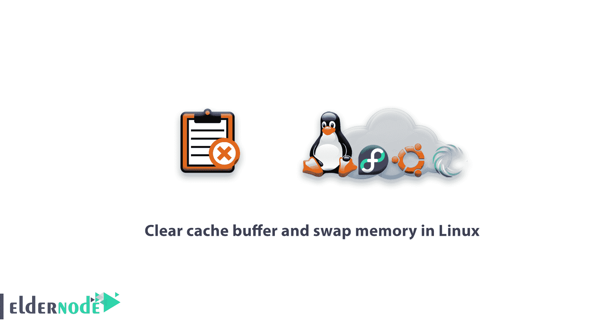

# 如何在 Linux - Eldernode 中清除缓存缓冲区和交换内存

> 原文：<https://blog.eldernode.com/how-to-clear-cash-buffer-and-swap-memory-in-linux/>



在这篇文章中，我们将教你在 Linux 中清除缓存缓冲区和交换内存的指令，这样你就可以在需要时使用它们，或者如果 RAM 已满而系统运行缓慢，这样你就可以在 RAM 上有更多的空间。

## 教程如何在 Linux 中清除缓存缓冲区和交换内存

**缓存和缓冲区基本上是什么？**

众所周知，每个操作系统都使用缓存、缓冲区等。以运行其进程并提高操作系统的运行速度。相应地，为了管理和清除 [Linux](https://en.wikipedia.org/wiki/Linux) 中的缓存、缓冲区和交换内存，它为用户提供了一种在必要时删除它们的方法。Linux 也不例外，即使它使用了比其他操作系统好得多的操作系统。

### **Linux 中如何释放 RAM 缓冲区和交换空间**

有三种方法可以删除缓存、缓冲区等。，它们是:

1-只删除页面缓存，因此可以输入以下命令:

```
sync; echo 1 > /proc/sys/vm/drop_caches
```

2-如果需要删除已创建的条目和信息节点，必须输入以下命令:

```
sync; echo 2 > /proc/sys/vm/drop_caches
```

3-最后，如果您想要删除所有页面缓存、Dentries 和 Inodes，您必须以这种方式输入命令:

```
sync; echo 3 > /proc/sys/vm/drop_caches
```

从现在开始，您已经熟悉了 Sync 命令的功能，您可以使用它来清除缓存。

#### **该做和不该做的**

请注意，仅在特定时间以及 Linux 服务器长时间未重启时使用此命令。

重复使用该命令可能会中断 Linux 的性能并运行内核进程，因此要避免频繁使用它。

此外，您可以在 Cron 中使用这个命令，在服务器承受 24 或 48 小时的高压后自动执行清理。

亲爱的用户，我们希望您喜欢本教程，您可以在评论区提出关于本次培训的问题，或者解决 [Eldernode](https://eldernode.com/) 培训领域的其他问题，请参考[提问页面](https://eldernode.com/ask)部分，并尽快提出您的问题。腾出时间给其他用户和专家来回答你的问题。