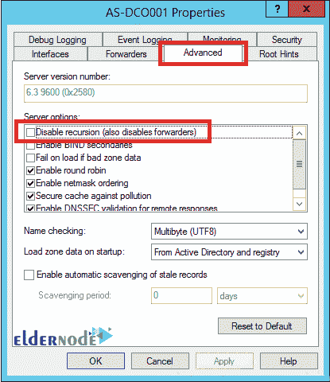

# 如何在 Windows Server 2012 R2 版中配置 DNS 转发- Eldernode

> 原文：<https://blog.eldernode.com/how-to-configure-dns-forwarding-in-windows-server-2012-r2-version/>


本文是关于如何在 Windows Server 2012 R2 版中配置 DNS 转发的分步指南。在本教程的后续部分，我们将教您如何使用 DNS 管理器和 PowerShell 创建 DNS 转发器。

简单来说， **DNS 转发**就是求助找地址。默认的方法是 DNS 服务器向互联网上的一系列 **DNS 服务器**发送无法回答的查询，这些服务器被称为根提示。
但是如果配置了 DNS 转发，它会向目的地发送查询，我们称之为**转发器**。

## 如何在 Windows Server 2012 R2 版中配置 DNS 转发

在 **DNS 管理器** 或 **PowerShell** 的帮助下完成 [Windows 服务器](https://eldernode.com/category/tutorial/)上的 DNS 服务器安装。

### 如何使用 DNS 管理器创建 DNS 转发器

在安装了 DNS server roll 的服务器中，打开**服务器管理器**然后到**工具** > **DNS** 进入 **DNS 管理器**。


右键点击 **DNS 服务器**名称，点击**属性**。


进入**货代**页签，点击**编辑**。


输入另一台 DNS 服务器(转发器)的 IP 地址，然后按 Enter 键。如果 **IP 地址**有效，将显示一个**绿色勾号**。为每个其他转发器服务器执行此操作。


点击**确定**保存设置。

### 如何使用 PowerShell 创建 DNS 转发器

正如我们所说的，您也可以使用 [PowerShell](https://en.wikipedia.org/wiki/PowerShell) 来做到这一点。为此，请输入以下命令:

```
Add-DnsServerForwarder –IPAddress < IP Address >
```

以下命令用于相同的目的:

```
Set-DnsServerForwarder –IPAddress < IP Address >
```

只需输入相关的 IP 地址即可正确执行命令。您可以在一个命令中添加多个转发器，方法是使用逗号(，)分隔它们的 IP 地址。请注意，以上两个命令是有区别的。 **Add 命令**将指定的转发器添加到转发器列表中，但是 Set 命令用指定的 IP 地址替换现有的转发器。

在下图中，您可以看到一个将 IP 地址放入 forwarder 命令的示例。


### 如何在 Windows DNS 服务器上使用 DNS 转发

在配置 DNS 转发之前，您需要确保递归没有被禁用。DNS 转发需要递归来向客户端的转发器请求信息。

默认情况下，递归是启用的，但在某些情况下，它可能被禁用。要对此进行检查，您需要输入 DNS 服务器设置，然后转到高级选项卡。然后在**服务器选项**部分，确保禁用递归选项没有被选中。



## 结论

本文介绍如何使用 DNS 管理器和 PowerShell 在 Windows Server 2012 R2 版中配置 DNS 转发。然后用图片解释了创建 DNS 转发器的步骤。如果对 MikroTik 感兴趣，可以参考 MikroTik 中的 [DNS 配置教程。](https://blog.eldernode.com/dns-configuration-tutorial-in-mikrotik/)