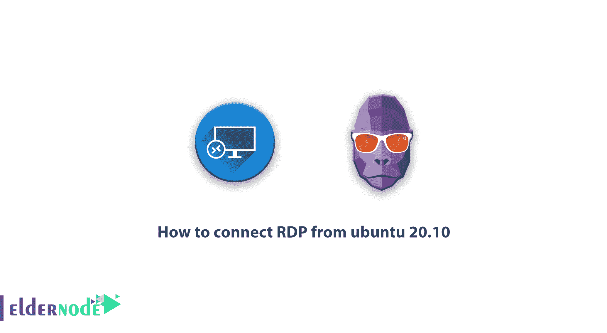
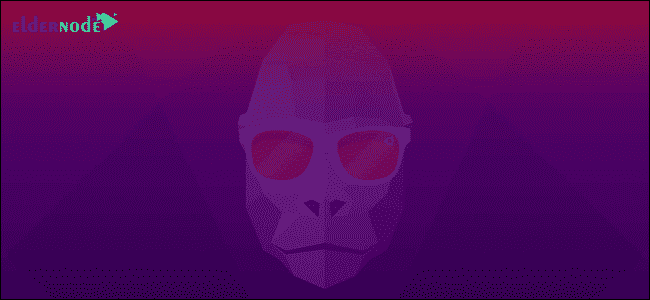
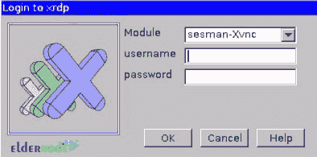

# 如何从 Ubuntu 20.10[完整] - Eldernode 连接 RDP

> 原文：<https://blog.eldernode.com/how-to-connect-rdp-from-ubuntu-20-10/>



Xrdp 是一项用于远程控制你的 [Linux](https://blog.eldernode.com/tag/linux/) 的服务。默认情况下，与 ssh Linux 服务器通信的唯一方式是在这方面使用 putty 软件。使用 xrdp 服务或类似的服务，您将能够远程服务，您可以通过远程桌面连接(如 Windows 服务器)连接到您的 Linux 服务器，并使用其 UI 环境。在本文中，我们将解释如何在 Ubuntu 上安装 xrdp，以便从 ubuntu 20.10 连接 rdp。你可以访问 [Eldernode](https://eldernode.com/) 到 [Linux VPS](https://eldernode.com/linux-vps/) 服务器中可用的包。

## Ubuntu 20.10 及其特性概述

终于，经过几个月的等待， **Ubuntu 20.10** 发布了，现在可以在[下载](https://releases.ubuntu.com/20.10/)。



***下面是 Ubuntu 20.10 的一些亮点:***

**–**Linux 内核 5.8

**–**安装程序中的活动目录支持

**–**带有新图标集的 LibreOffice 7.0.2

**–**Firefox 中的高精度滚动

**–**可重新排列的应用网格

**–**分页的应用文件夹

**–**通过二维码分享 Wi-Fi 火锅

**–**当麦克风正在使用但静音时，指示灯发出警报

日历小工具下方显示的**–**日历事件

**-**选项，使**在顶栏显示电池百分比**

**–**状态菜单中可见的**重启**选项

**–**新壁纸

## 如何从 ubuntu 20.10 连接 RDP

第一步是通过 **ssh** 连接到您的服务器。您必须对此拥有根访问权限。

在第一步中，您必须输入以下两个命令:

```
sudo apt-get update
```

```
sudo apt-get install xrdp
```

***注意:*** 输入 sudo，会要求你输入必须输入的 root 密码。

然后输入以下命令:

```
sudo apt-get install xfce4
```

在下一步中，以下两个命令是不必要的，您可以安装。以下命令可用于 **xterm 终端**及其图标:

```
sudo apt-get install xfce4-terminal
```

```
sudo apt-get install gnome-icon-theme-full tango-icon-theme
```

然后你需要创建**。xfce4 配置的 xsession** 文件。为此，请输入以下命令:

```
echo xfce4-session >~/.xsession
```

在下一步中，您需要输入以下命令:

```
nano /etc/xrdp/startwm.sh
```

文件的内容应该是这样的:(*注意最后一行*)

```
#!/bin/sh  if [ -r /etc/default/locale ]; then  . /etc/default/locale  export LANG LANGUAGE  fi  startxfce4
```

此时你需要**重启 xRDP** 。为此输入以下代码:

```
sudo service xrdp restart
```

至此，xRDP 服务已经安装完毕。在 Windows 中可以使用**远程桌面**与服务器远程通信，在 Mac OS 中也可以使用**线缆**。



结论

## 在某些情况下，您可能希望使用现有协议通过 Ubuntu 连接到 RDP。Xrdp 是一个远程桌面协议(rdp)的开源程序，可以让你以图形方式远程控制计算机。要通过 Windows 远程桌面连接，您需要在 Ubuntu 操作系统上安装必要的软件包和适当的 GUI。现在这样做非常容易，只需安装几个包，并准备好连接。在这篇文章中，我们试图教如何连接 RDP 从 ubuntu 20.10，这是最新的 ubuntu 发行版。

In some cases, you may want to connect to the RDP via Ubuntu using existing protocols. Xrdp is an open source program for Remote Desktop Protocol (RDP) that lets you control computers remotely graphically. To connect via Windows remote desktop, you need to install the necessary packages and the appropriate GUI on the Ubuntu operating system. Now it is very easy to do this, simply install a few packages and be ready to connect. In this article we tried to teach How to connect RDP from ubuntu 20.10 which is the latest Ubuntu distribution.