# 如何在 Windows 10 上连接 Teamviewer 远程桌面

> 原文：<https://blog.eldernode.com/how-to-connect-teamviewer-remote-desktop-on-windows-10/>

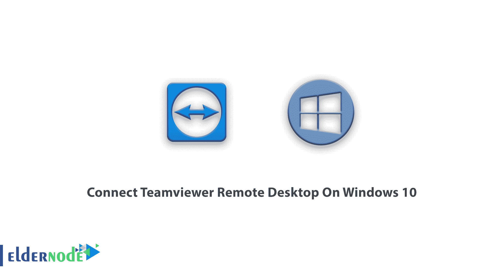

如何在 Windows 10 上连接 Teamviewer 远程桌面(rdp)。Team Viewer 是一款专业软件，您可以轻松地使用它通过互联网远程连接到朋友、同事或任何需要此功能的人的计算机。如果我们要用简单全面的语言来描述，我们必须说，你可以使用 Team Viewer 软件使用你的计算机轻松地远程控制和访问另一个人的桌面。前提是对方也在自己的系统中安装了本软件，并允许你访问。

在本文中，我们将教您如何在 Windows 10 上连接 teamviewer 远程桌面。还可以在 [Eldernode](https://eldernode.com/) 中访问各种套餐[购买 windows vps](https://eldernode.com/windows-vps/) 服务器。

强大的远程 teamviewer 软件可用于 Windows、Mac、 [Linux](https://blog.eldernode.com/tag/linux/) ，以及运行 Android、iPhone 和 Windows Mobile 的智能手机和平板电脑。你可以根据需要使用它们。

团队查看器软件有哪些功能？

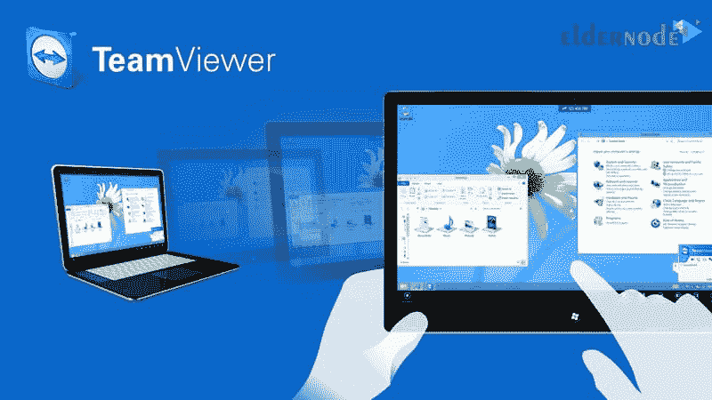

**–**根本不需要 IP 有效。

**–**响应各种网速

**–**能够同时将几个人连接到目标系统(一个系统)

**–**能够在连接的系统之间接收和发送文件

**–**可用于手机、平板电脑等移动设备

**–**能够记录所有活动并以视频呈现

**–**能够在两个相连的系统之间聊天

**–**能够调整图像质量

**–**能够便携使用软件(即无需安装)

**–**具有访问级别能力

**–**能够使用剪贴板内存

**–**极高的性能速度和更少的带宽使用

**–**非常专业

**–**完全免费

## 教程如何在 Windows 10 上连接 teamviewer[RDP](https://eldernode.com/admin-rdp-server/)

首先**从[官方 TeamViewer 网站](https://www.teamviewer.com/en/download/windows/)下载**。

好了，亲爱的用户，下载软件**后运行**吧。你会看到它会问你是想安装还是只是运行。在我们看来，没有必要安装，点击**运行**选项就可以运行了，这叫可移植执行。如下图所示:

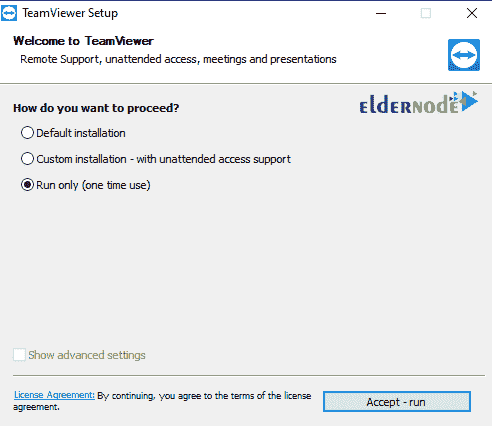

如上图所示，你必须勾选**运行**选项，然后点击**接受-运行**进入下一步，如下图所示:

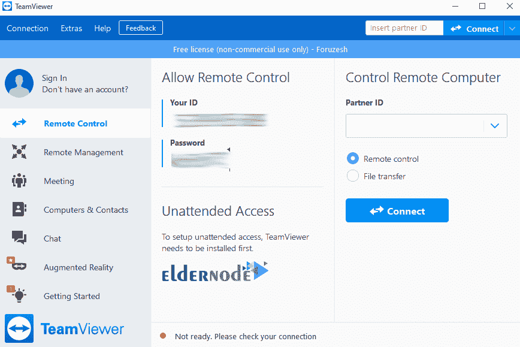

正如你在上面的图片中看到的，中间有两个字段，标题分别是 **ID** 和**密码**。该 id 与软件为您生成的 **IP Valid** 相同，如果您将此 ID 和密码交给想要连接的对方，就可以连接到您的电脑。

***注:*** 你也可以用对方的 ID 和密码访问系统及其桌面。

### 如何连接和访问对方系统

为此，您必须首先获取另一方的 ID 和密码，并在右侧的**合作伙伴 ID** 字段中输入 ID。您还必须检查**遥控**选项，如下图所示:

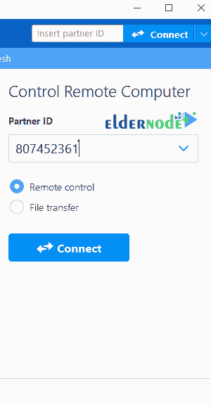

好了，应用以上项目后，点击**连接到伙伴**选项。您将看到在您面前打开的另一个页面，在该页面上要求您输入密码。这是你之前从他那里收到的对方的同一个密码。输入**密码**后，点击**登录**选项建立连接。

***注:*** 如果对方当时在软件里，这个连接就有可能。此外，此密码在每次运行软件时都会更改，您可以从 Team Viewer 软件设置中自定义此密码，这样它就不会在每次运行时更改。

就是这样。从现在开始，你连接对方的系统，控制他的桌面。

### 学习专业的 TeamViewer 设置

你可以定制这个专业软件。为此，您必须点击软件屏幕顶部的 **Extras** 选项并选择选项。如下图所示:

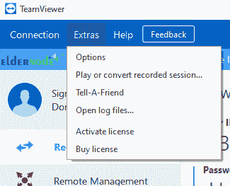

#### *1。一般章节*

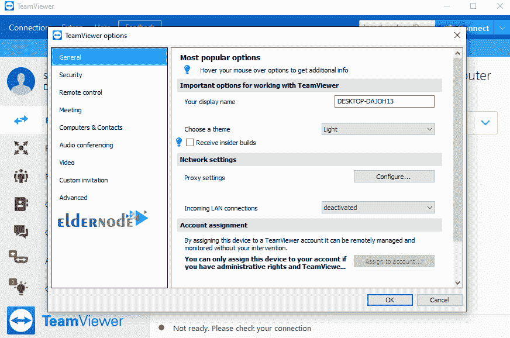

**您显示名称:**在此部分，您可以根据自己的喜好指定要显示的名称。

**代理设置:**如果需要，您可以应用此部分的代理设置。

**输入局域网连接:**请注意，如果系统(计算机)在本地网络上，请启用此选项。

#### *2。*安全科

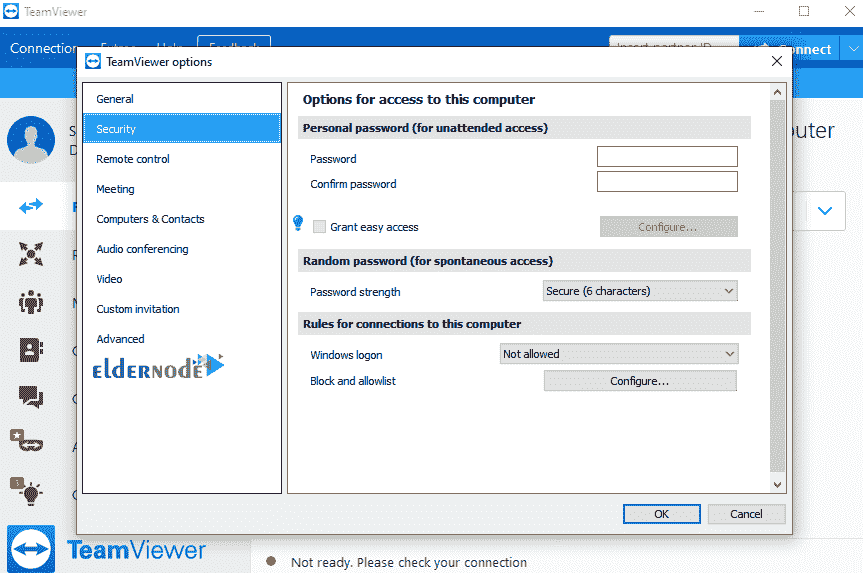

**密码:**请注意，每次您进入并运行团队查看器软件时，都会提供一个新密码，并且该密码不是固定的。如果您想有一个唯一的密码并一直使用它，您可以在这里输入。

**密码强度:**在此部分，您可以指定禁用随机密码或为其分配一个字符。

**Windows 登录:**在此部分，您还可以指定管理员或用户的访问权限。

**黑白名单:**这个部分也是为了确定哪个计算机和系统应该被列入黑名单。

#### *3。*遥控部分

**质量:**在此部分您可以指定连接速度的质量(此速度影响对方的直接形象)

**移除远程壁纸:**在此部分，您还可以移除 Windows 背景，以提高工作速度。

**显示您的合作伙伴光标:**此部分也用于设置屏幕上的鼠标显示，以及您可以设置的用户跟踪。

**播放电脑声音和音乐:**您可以在此指定是否可以听到对方系统的声音。

**自动记录远程控制会话:**在此部分，您还可以启用图像记录来记录活动。

#### *4。*会议区

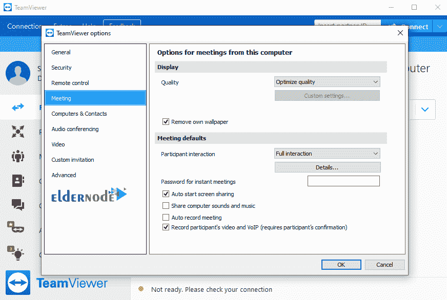

**质量:**这一部分还涉及图像的连接和显示速度。

**移除自己的壁纸:**在这个部分，和前面的设置部分一样，你可以移除 Windows 背景以提高工作速度。

**自动开始屏幕共享:**此部分也用于显示正在共享的信息，您可以设置显示这些信息。

**分享电脑声音和音乐:**这一节也是关于分享电脑声音的。

**自动录制会议:**此部分也用于录制图像和活动，您可以指定自动录制。

#### *5。电脑&联系人栏目*

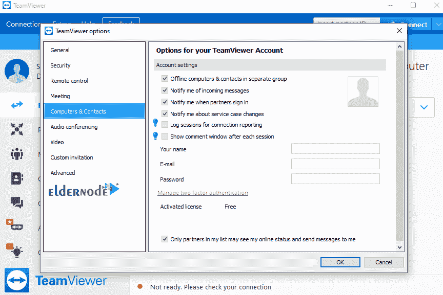

**单独组中的脱机计算机:**此部分是关于显示脱机系统。

**收到消息时通知我:**与显示或不显示在线系统相关，即在线系统会显示在列表中。

**当合作伙伴唱歌时通知我:**这一部分也是关于这个系统的在线性质。

**连接报告的日志会话:**该部分还与显示程序运行中的相关部分相关。

#### *6。自动会议设置*

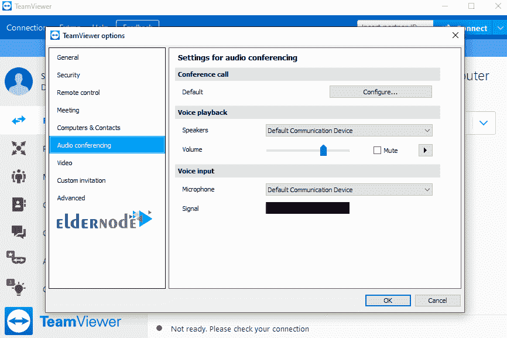

**电话会议:**与会议相关。

**扬声器:**您可以在此设置声音播放器。

**音量:**在这个部分你可以控制音量和静音。

**麦克风:**您可以在此设置音频设备和播放器。

**麦克风音量:**在此部分，您可以调节麦克风音量或将其完全静音。

#### *7。视频部分*

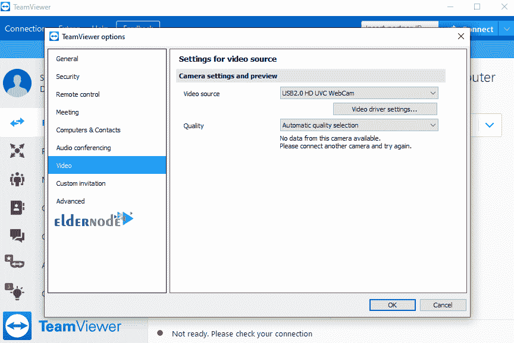

**视频来源:**此部分也与从列表中选择网络摄像头有关。

**质量:**关于提交图像的质量，这个软件是强大的。

#### *8。自定义邀请部分*

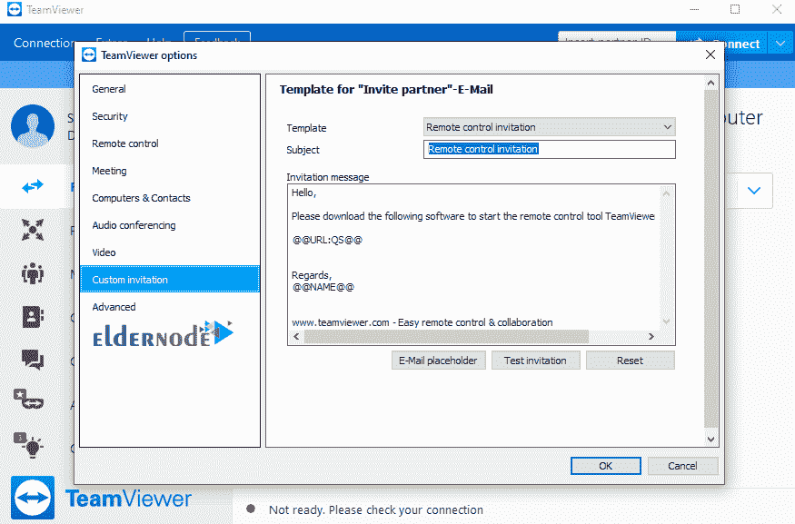

**模板:**是对信函模板类型的设置。

**主题:**这部分也和信的标题有关。

**邀请信息:**这部分也是信的正文。

**测试邀请:**与测试相关，也与返回原始消息相关

## 结论

TeamViewer 软件允许人们通过互联网远程访问您的计算机。(反之亦然)。提供该软件的目的是让系统出现问题的人有另一个可靠的人远程解决问题并指导他们。在本文中，我们试图解释 TeamViewer 软件的一些特性。然后我们讲述了如何在 Windows 10 上连接 teamviewer 远程桌面，最后我们回顾了该软件的所有部分。