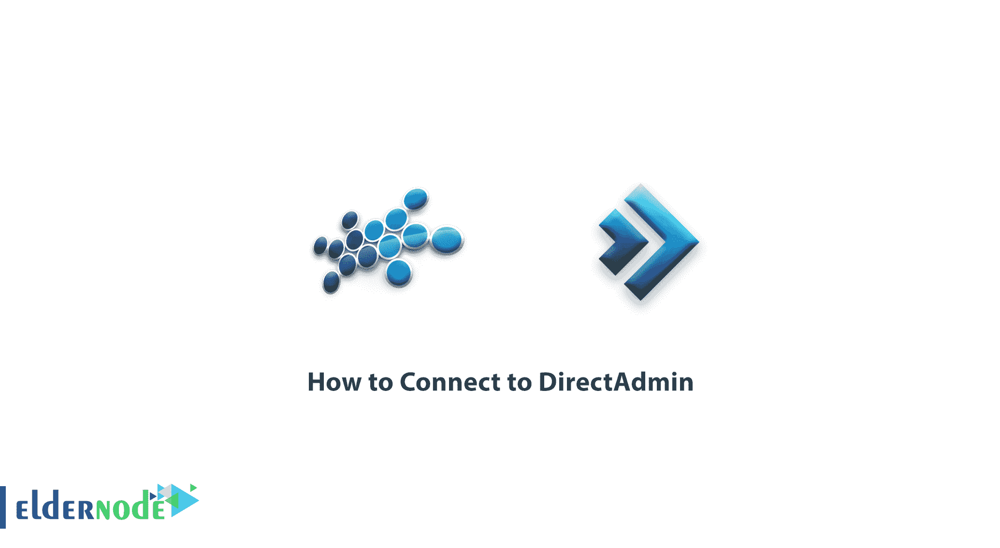
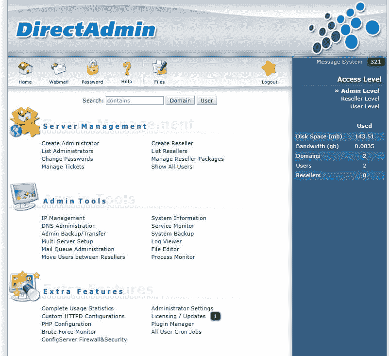

# 如何连接到 DirectAdmin -教程| ElderNode.com

> 原文：<https://blog.eldernode.com/how-to-connect-to-directadmin/>

如何连接到 DirectAdmin，如果您刚刚熟悉 direct admin**服务器，您可能会对使用该控制面板的不同部分感到困惑。由于此控制面板的不同结构，有必要分别执行管理和控制域的所有任务。**

**首先:**

**您需要登录到此控制面板的管理面板。**

**为此，您需要在您的域或 IP 服务器的末尾插入定义为 [**DirectAdmin**](https://www.directadmin.com/) 端口的端口。**

****例如:****

**DirectAdmin 的默认端口是 2222。如果您的 IP 服务器是 10.10.10.123，您必须登录 10.10.10.123:2222 才能登录 Admin。DirectAdmin 管理用户名也是默认的“Admin”。**

**请注意，由于安全问题，默认管理端口可能会从 2222 更改为另一个端口。所以你需要问这个为你安装的人或公司。进入该控制面板的控制部分后，您将看到如下所示的图像。**

****

**正如您在这张图片中看到的，DirectAdmin 的右栏包含了非常有用的信息和链接的摘要。“**消息系统**”选项是通过 DirectAdmin 发送给您的所有消息。**

**这些包括备份、过度使用资源、暴力攻击等。，如果不应用暴力设置，这通常会增加每天的消息数量。**

**在此选项之后，有一个名为“**访问级别**的部分，在开始时您将需要更多。使用本节中提供的各种选项，您可以根据需要自定义 DirectAdmin。**

****例如:****

**如果您需要直接从“**管理员级别**创建新用户，您将无法。如果您希望登录电子邮件帐户，则只能通过“**用户级别**访问该项目。**

**祝您好运**