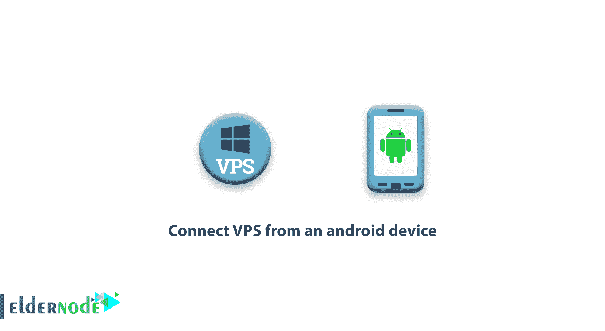
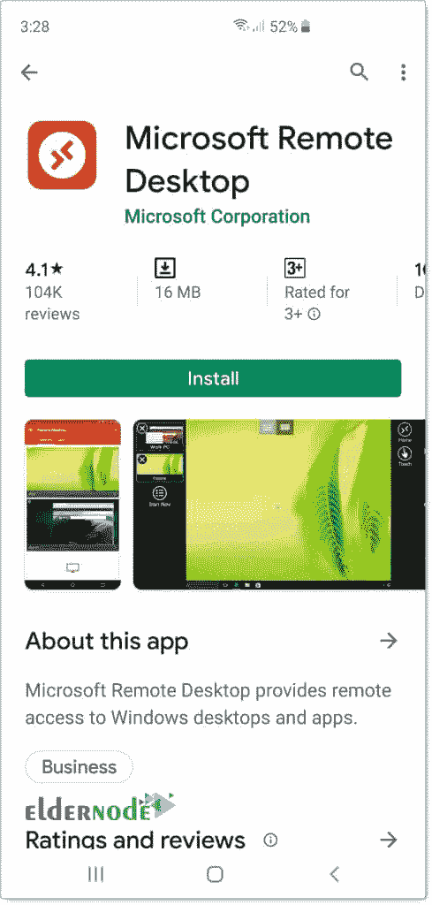
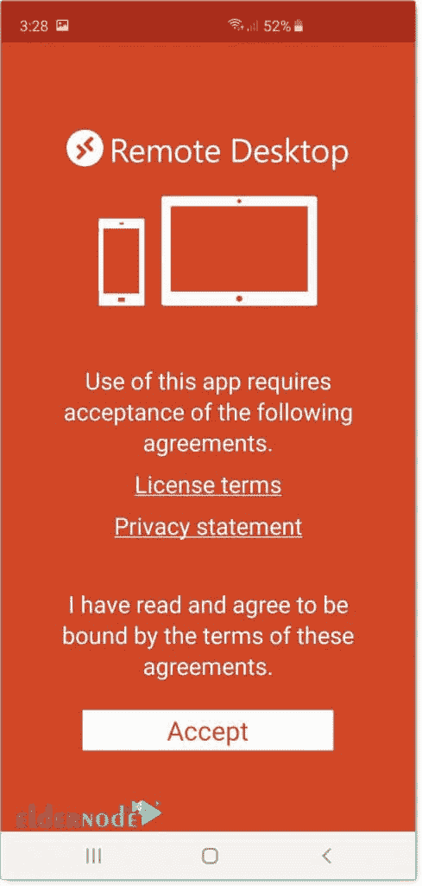
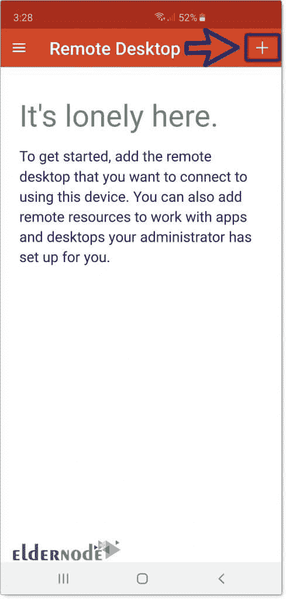
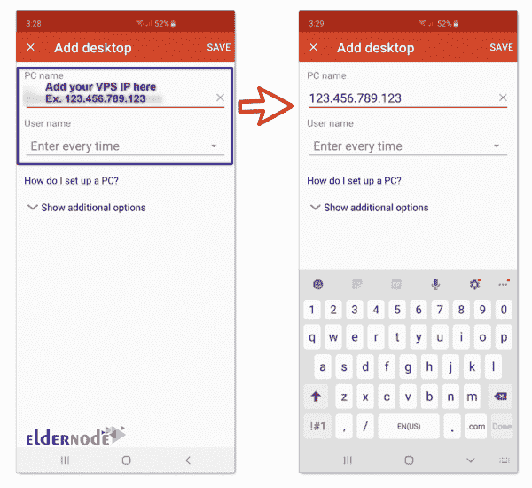
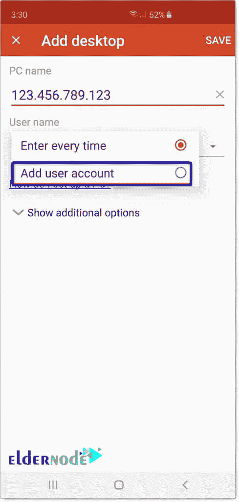
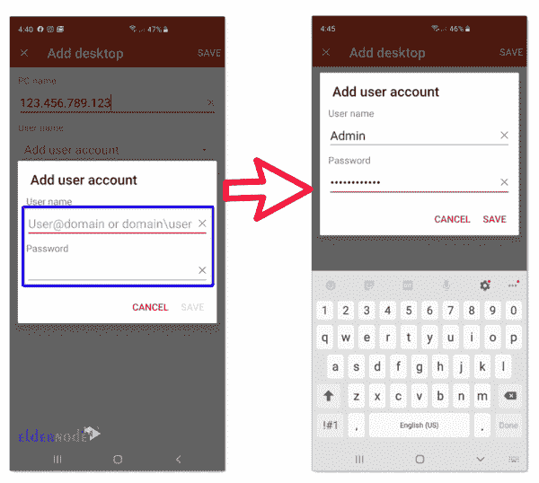
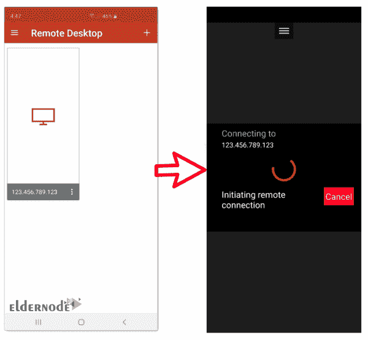

# 如何从 android 设备连接 VPS-elder node

> 原文：<https://blog.eldernode.com/how-to-connect-vps-from-an-android-device/>

如何从 android 设备连接 VPS？微软已经开发了一个名为 RDP 的协议来沟通和远程控制其 Windows 产品，这样用户就可以轻松地进行自己的设置。在这篇文章中，我们将教你如何通过 Android 连接到 [Windows VPS](https://eldernode.com/windows-vps/) 。

## 教程从 android 设备连接 VPS

**1。** 第一步，你必须下载远程桌面应用程序。

你可以通过[谷歌 Play 商店](https://play.google.com/store)来完成。

**2。** 下载应用后，安装并进入。遇到下图后，点击接受。

**3。** 下一步，点击 **+** 如下图所示。

**4。** 然后选择桌面选项。然后选择桌面选项。现在需要输入 IP 和用户名等 VPS 信息。

**注意:** 在 PC 名称字段中，输入 VPS 的 IP。

**5。在用户名栏中点击** ，添加用户账号。通过此操作，您无需在每次登录时输入用户名。

**6。** 你会被要求输入你的 VPS 用户名和密码。输入所需信息后，点击保存。

**7。的**配置完成。点击您创建的连接以连接到 VPS。

**8。** 您现在已经成功登录到您想要的 Windows VPS。

**尊敬的用户**，我们希望您能喜欢这个[教程](https://eldernode.com/category/tutorial/)，您可以在评论区提出关于本次培训的问题，或者解决[老年人节点培训](https://eldernode.com/blog/)领域的其他问题，请参考[提问页面](https://eldernode.com/ask)部分，并尽快提出您的问题。腾出时间给其他用户和专家来回答你的问题。

好运。