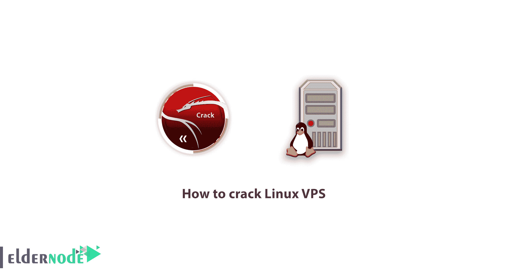

# 如何一步步破解 Linux VPS 服务器- Eldernode 博客

> 原文：<https://blog.eldernode.com/how-to-crack-linux-vps/>



【更新于:2021/01/05】虚拟服务器或 VPS 让你拥有一台非常强大的电脑，拥有无限的专用资源；这是使用最佳和最新的虚拟化方法实现的。VPS 帮助您在最佳的上网条件和速度下使用，具有极高的安全性。虚拟服务器或 VPS 适合长期使用，可以运行几个月的命令和软件，而无需重启和降低速度和效率。如果你有一个流量很大的网站，或者你希望将来会有很大的流量，你可以选择一个像 [Linux VPS](https://eldernode.com/linux-vps/) 服务器来托管它。如果您希望对安装在服务器上的内容有更多的控制，那么 Linux 虚拟服务器是您的最佳选择。在这篇文章中，我们将教你如何破解 Linux VPS。和我们在一起。

## 虚拟服务器特性

**–**因为是主服务器的一部分，所以你的 RAM、CPU、存储空间等资源都是专用的。

**–**完全自由地安装和卸载软件

**–**远程管理的可能性

**–**能够关闭、重启和访问虚拟服务器控制面板

**–**专用 IP

**–**托管一个或多个站点的能力(取决于虚拟服务器资源)

**–**比专用服务器更实惠

虚拟服务器比共享主机更适合托管流行网站。VPS 比共享主机有更高的安全性。(但必须是专门的 0 到 100 安全配置。否则它不具有高安全性)。它也适用于需要非常高速互联网的任务，并被用作电子邮件服务器、数据库服务器、应用服务器。

### Linux 虚拟服务器的优势

使用 Linux 虚拟服务器有很多好处。例如，你可以以更低的成本享受易用性、增强的[安全性](https://blog.eldernode.com/tag/security/)，以及提高的信任度。然而，对于大多数网站管理员、程序员、设计师和开发人员来说，这种服务器的真正优势在于它的灵活性。

每个虚拟服务器都通过自己的操作系统与其他虚拟服务器分开。这意味着您可以轻松安装您喜欢的操作系统，并安装或删除所需的软件。您还可以修改 VPS 环境，以提高性能并优化用户和网站访问者的体验。灵活性可能是虚拟服务器的主要优势之一。

Linux 虚拟服务器最重要也是最明显的优点之一是操作简单，安全性提高，可以用较低的成本实现。

对于大多数站长来说，在购买虚拟服务器的时候，一定要注意服务器的灵活性，这一点在 [Linux vps](https://eldernode.com/linux-vps/) 服务器中就可以看出来。由于任何操作系统或软件都可以安装在服务器上，所以当[购买 vps 服务器](https://eldernode.com/vps/)时，灵活性非常重要。

鉴于以上所述，在定制和开发选项中寻求更多灵活性的个人和公司应该选择 Linux 虚拟服务器。

***注:*** 应该注意的是，今天超过 60%的虚拟主机世界被 Linux 虚拟服务器所占据，这显示了它在虚拟主机中的有效作用。

Linux 有根访问权限和 T2 SSH 权限。Linux 虚拟服务器基础设施拥有强大的英特尔硬件，可为用户提供高速度和高质量的强大虚拟仪器。

## 如何破解 Linux VPS

在这篇文章中，我们将教你如何破解一个 Linux 虚拟服务器。对于许多人来说，发生了重要的事情，他们需要一个虚拟服务器，但由于经济原因，他们无法购买。嗯，在本教程中，我们将教你如何破解 Linux vps 服务器。加入我们吧。

### 什么是懒人 RDP 工具？

它是一个适用于 Linux 的工具，允许对各种服务器服务进行暴力破解，我们用它来破解 RDP Windows 服务。

### 学会用懒惰的 RDP 工具破解 vps 服务器

你必须首先在 Kali Linux 上安装来自 [**GateHub**](https://github.com/getdrive/Lazy-RDP) 的懒惰 RDP 工具:

然后，在 Kali Linux 中安装该工具后，必须使用以下命令打开该工具:

```
cd Lazy-RDP
```

输入以下命令，安装通过 crack 入侵服务器的工具和方法:

```
chmod +x src/rdp_brute.sh patator.py start ; ./start
```

工具窗口在安装后打开，您可以使用该工具轻松执行所有步骤。这个工具的优点是它还使用其他渗透测试工具，如 Nmap。例如，如果要扫描活动的 IP，首先输入默认的 3389 RDP 端口。然后输入数字 1 扫描 IP，再次输入数字 1 使用 Nmap 工具扫描 IP。现在等待扫描完成，结果会显示给你。您可以再次继续这些步骤。

### 使用 Hydra 工具学习用 kali 破解 VPS

打开 **hydra-gtk** 或 **xhydra** 工具。

在目标列表字段中输入您的 IP 列表:

```
Port: 3389
```

```
Protocol: rdp
```

在下一个选项卡中，在“密码”字段中输入列表的密码，在“用户名”字段中，分别输入下一个选项卡中的用户名:

```
Task:15
```

```
Time out: 50
```

要破解 vps 的 IP 列表，你必须首先访问一个网站，如
countryipblocks 获得你想要的任何国家的 IP 范围。然后，使用 KPortScan 软件，这是一种特殊的扫描器，指定活动的 IP 并在 Kali Linux 中列出它们，然后开始爬行。

### VPS 防破解安全性

只有一种方法可以防止这种情况。这是使用硬用户名和强密码。由大写字母、小写字母、数字和符号组成的密码。

在暴力破解技术中，密码每次都会被猜到。如果您输入简单的密码，如出生年份等。，你的服务器就很容易被破解。但是假设密码超过 10 个字符，并且是小写、大写、数字和符号的组合。毫无疑问，你的密码在列表密码里，你被破解的可能性接近于零。

所以要认真对待安全问题，不要使用简单的密码。

## 结论

你们中的许多人听说过“破解”这个词，但你们不知道它实际上是如何做到的，也不知道简单和基本的原理是什么？在这篇短文中，我们将首先解释一下虚拟服务器和 Linux 虚拟服务器的好处。然后我们给你介绍了如何破解 Linux VPS。