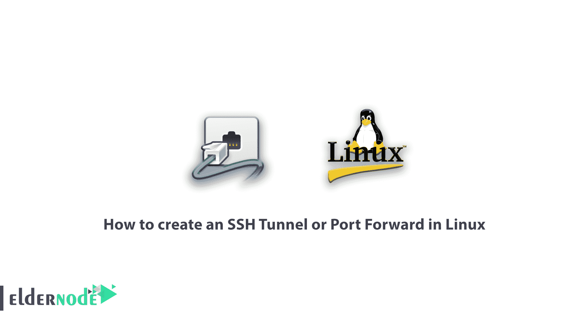
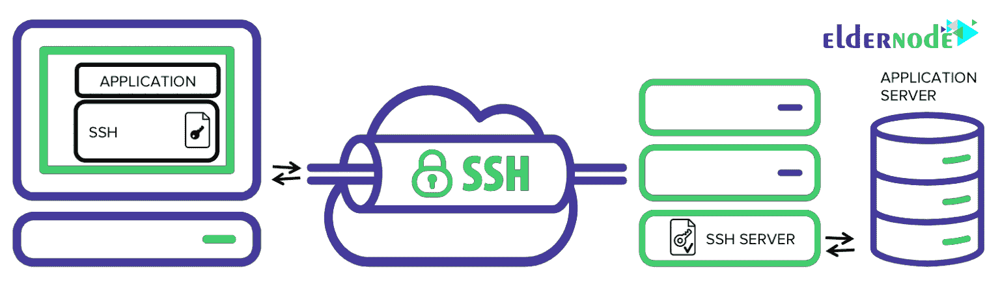
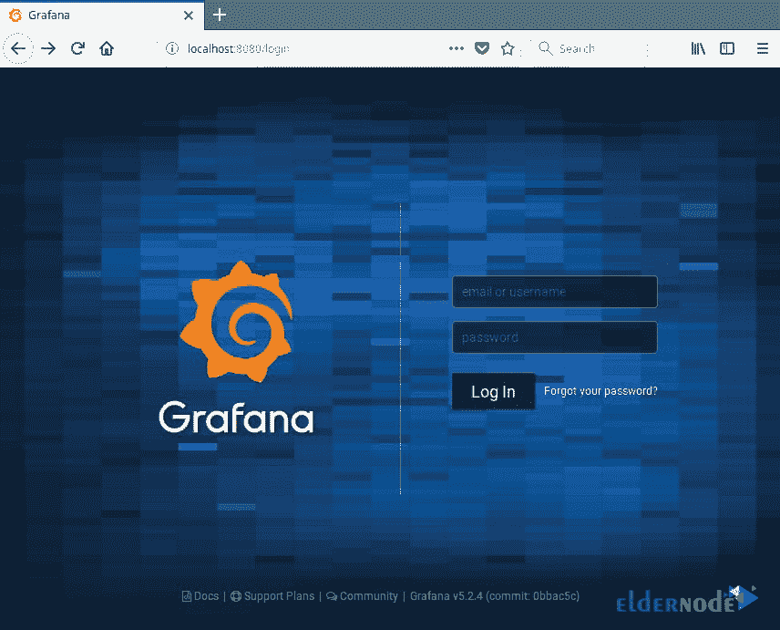
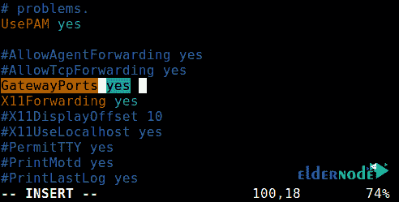

# 如何在 Linux - Eldernode 中创建 SSH 隧道或端口转发

> 原文：<https://blog.eldernode.com/how-to-create-an-ssh-tunnel-or-port-forward-in-linux/>



[更新]网络上的每个设备都有一个 IP。有两种类型的知识产权:公有和私有。公共 IP 地址在世界任何地方都可用。但是私有类型用于内部网络。例如 192.168x.x 或 10.0x.x。为了从互联网接收信息，数据请求要么与路由器拥有的公共 IP 地址交换，要么与计算机或连接到网络的任何其它设备的地址相对应的私有 IP 地址交换。SSH 转发对于传输使用未加密协议的服务的网络数据非常有用。在本文中，您将学习如何在 Linux 中创建 SSH 隧道或端口转发。逛逛 [Eldernode](https://eldernode.com/) 的各种套餐，满足你买自己的 **[Linux VPS](https://eldernode.com/linux-vps/)** 的期望。

## **什么是 SSH 端口转发？**

SSH 隧道或 SSH 端口转发非常简单，能够通过 SSH 隧道将内部网络流量路由到远程主机。这意味着所有传入流量都通过加密得到保护。该解决方案提供了一种创建 VPN 隧道的简单方法，这是一种通过互联网连接到专用网络的实用方法。它还可以使用互联网平台来访问位于 NAT 或防火墙后面的服务器。默认情况下，SSH 会话允许所有网络通信的隧道。SSH 端口转发目前有三种方法:本地、远程和动态。通常我们可以使用 SSH 安全地连接到我们的服务器。

## **教程在 Linux 中设置 SSH 隧道或 SSH 端口转发**

SSH 隧道(也称为 SSH 端口转发)实际上是通过 SSH 将本地网络流量轻松路由到远程主机。这样，您所有的连接都是安全的加密。这提供了一种定义 VPN(虚拟专用网络)的简单方法，VPN 通过不安全的公共网络(如互联网)连接到专用网络。您还可以从一个安全的隧道平台访问 NAT 和防火墙后面的本地服务器，就像 ngrok 中实现的那样。



默认情况下，SSH 会话允许通过隧道进行网络通信。SSH 端口转发也有三种类型:

**1-本地**

**2-动态**

**3-远程**

我们继续下面关于缺省值的例子:

**本地主机:**您的 IP 地址

**远程主机:**server1.example.com

您可以使用 SSH 安全地连接到远程服务器，如下例所示。我已经在远程和本地主机之间配置了没有密码的 ssh 登录[,所以没有要求我输入密码。](https://blog.eldernode.com/linux-login-without-entering-password/)

```
ssh [[email protected]](/cdn-cgi/l/email-protection)
```

### **本地 SSH 端口转发**

这种类型的端口转发允许您从本地计算机连接到远程服务器。假设您位于受限防火墙之后，或者被输出防火墙阻止访问远程服务器上端口 3000 上运行的应用程序。您可以转发一个本地端口(例如 8080)，您可以使用该端口在本地访问应用程序。

***注:*****-L**选项用于定义转发到远程主机的端口和远程端口。

```
ssh [[email protected]](/cdn-cgi/l/email-protection) -L 8080: server1.example.com:3000
```

添加 **-N** 选项意味着不执行远程命令，在这种情况下，您将不会收到一个 shell。

```
ssh -N [[email protected]](/cdn-cgi/l/email-protection) -L 8080: server1.example.com:3000
```

**-f** 选项在后台环境中执行 ssh 命令。

现在，在本地机器上打开浏览器，而不是访问远程应用程序。不用使用***【server1.example.com:3000】***，可以很容易地使用 **localhost: 8080** 或 **YouIPAddress: 8080** 如下图:



### **远程 SSH 端口转发**

远程 SSH 端口转发允许您从远程机器将连接到本地计算机。

***注意:*** 默认情况下，ssh 不允许远程端口转发。您可以使用远程主机上的 **etc/ssh/sshd_config/** 配置文件中的主 sshd 设置中的 GatewayPorts 部分来启用它。

打开文件并使用您最喜欢的文本编辑器编辑它:

```
sudo vim /etc/ssh/sshd_config
```

查找所需的部分，将其从注释中移除，并将其值设置为 **yes** ，如下所示:



**保存**更改并退出。然后，为了应用更改，您需要重新启动 sshd 服务:

```
sudo systemctl restart sshd
```

运筹学

```
sudo service sshd restart
```

然后运行以下命令将**远程机器**上的**端口 5000** 转发到**本地机器**上的**端口 3000** :

```
ssh -f -N [[email protected]](/cdn-cgi/l/email-protection) -R 5000:localhost:3000
```

一旦您理解了这种隧道方法，您就可以轻松安全地发布本地编程服务器，尤其是当它位于 NAT 和防火墙之后时。

像 **Ngrok** 、 **pagekite** 、 **localtunnel、**以及无数其他方法都是以同样的方式工作的。

### **动态 SSH 端口转发**

这是端口转发的第三种方法。与本地端口转发和远程不同，本地端口转发和远程可以与单独的端口进行通信，这种方法允许通过一系列端口进行全面的 TCP 通信。

动态端口转发方法将您的计算机设置并定义为 SOCKS 代理服务器，默认情况下在端口 1080 上运行。

首先，SOCKS 是一种互联网协议，它定义了客户机如何通过代理服务器(这里是 SSH)连接到服务器。您可以使用 **-D** 选项启用动态端口转发。

以下命令在端口 1080 上启动 SOCKS 代理，允许您连接到远程主机。

```
ssh -f -N -D 1080 [[email protected]](/cdn-cgi/l/email-protection)
```

从现在开始，您可以让您机器上的应用程序使用这个 SSH 代理服务器。你所要做的就是配置他们使用这个服务器。

*注意【Socks 代理将在会话 ssh 关闭后停止工作。*

## 结论

在本文中，我们解释了从一台机器到另一台机器的不同类型的端口转发，以及通过安全 SSH 连接的隧道通信。这是 SSH 的众多用途之一。端口转发 ssh 有很大的缺点，这个命令可能会产生负面影响。可用于绕过网络监控和流量过滤(或防火墙)应用程序。黑客可以利用它进行恶意活动。如果你有兴趣了解更多，可以在 Mikrotik 上找到我们关于[用 Putty](https://blog.eldernode.com/setup-ssh-tunnel-with-putty/) 设置 SSH 隧道和[端口转发的文章。](https://blog.eldernode.com/port-forwarding-on-the-mikrotik/)