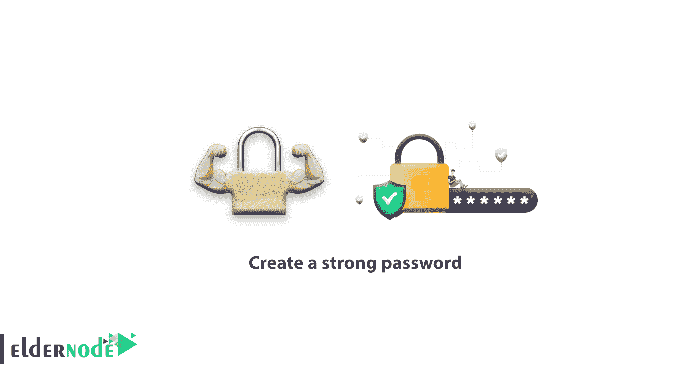

# 如何创建强密码-强密码示例

> 原文：<https://blog.eldernode.com/how-to-create-strong-password/>

所有用户都应该知道[信息安全](https://en.wikipedia.org/wiki/Information_security)和数据的重要性。在本教程中，我们将教你**如何创建一个强密码，什么是复杂密码**

## 如何创建强密码

如今，随着技术对我们生活的影响越来越大，互联网或设备上的个人信息给了一些奸商获取他人个人信息的机会。

但是这些人访问其他人信息的最简单的方法之一就是猜测[密码](https://eldernode.com/change-windows-password-on-vps/)。

不幸的是，由于对此事的无知，许多人受到了伤害或丢失了他们的信息。

### 设置强密码有哪些要点

1-选择强密码的方式应该使投机者**难以**和**不可能**猜到。

2—**不要**选择如下所示的数字、字母形式的密码。

alii 123456
qwerty 987654

3-**不要沉迷于选择密码，这可能会导致你过一会儿就忘记了。**

**4–强密码应该**包括**大小字母、数字和符号，这是确定强密码最重要的一点。**

### **强密码提示**

**强密码或复杂密码必须包括**

**1-包括类似于 **[【电子邮件保护】](/cdn-cgi/l/email-protection)&*()**的符号**

**2-包括像 **1234567890** 这样的号码**

**3-包括大写和小写字符**

#### **强密码的例子**

****马丁伯德= [【电子邮件保护】](/cdn-cgi/l/email-protection)！伯德****

****samlengmure = $amleNGmure****

**有了这些提示，你可以将简单的密码转换成复杂的密码，并在你的设备、网站账户、社交账户等上使用**

**亲爱的用户，我们希望你喜欢如何创建一个强密码的教程，你可以在评论区提出关于这次培训的问题，或者解决 [Eldernode 培训](https://eldernode.com/blog/)领域的其他问题，请参考[提问页面](https://eldernode.com/ask)部分，并尽快提出你的问题。腾出时间给其他用户和专家来回答你的问题。**