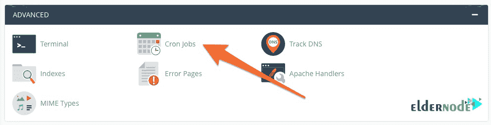
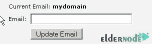
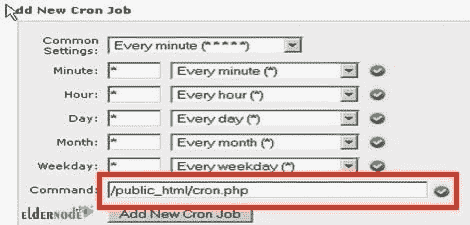
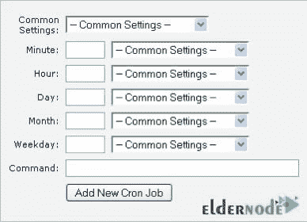

# 如何在 cPanel host - Eldernode 博客上启用 Cron 作业

> 原文：<https://blog.eldernode.com/how-to-enable-cron-jobs-on-cpanel-host/>


[更新]作为一个类似 Unix 的操作系统用户，您可能使用过 Cron，因为它是一个有用的实用程序。您可以使用它在特定时间安排命令。计划命令或任务被称为 Cron 作业。Cron Jobs 是控制面板的软件功能之一，也可以在流行的 cPanel 控制面板中使用，用于在特定时间执行命令。要使用 Cron 作业，您必须将所需的命令复制到主机，并在 Cron 作业部分输入其地址。在本文中，您将学习如何在 cPanel 主机上启用 Cron 作业。找到您喜欢的主持计划的[副总裁，并购买一个由](https://eldernode.com/vps-hosting/)[长老节点](https://eldernode.com/)团队全天候支持的计划。

为了让本教程更好地发挥作用，请考虑以下**先决条件**:

一个域名(www.example.com)

支持 cPanel 的虚拟主机帐户

cPanel 用户名和密码。

## **教程在 CPanel 上启用 Cron 作业**

大多数 Cron 作业有三个组成部分:

1-要调用或执行的脚本。

2-重复执行脚本的命令。这通常在 **cPanel** 中设置。

3-脚本的动作或输出，这取决于被调用的脚本的功能。虽然称为 Cron 作业的脚本会修改文件或数据库，但它们也能够执行不修改服务器上数据的其他任务。(例如:发送电子邮件通知)

### **什么是 Cron 工作？**

您可以使用 [Cron Job](https://blog.eldernode.com/configure-cron-job-in-the-directadmin/) 来自动化您站点上的命令或脚本。“作业”是一个脚本，通常执行更新任务，如下所示:

1-过期用户帐户

2-发送自动电子邮件

3-数据可视化

4-删除用户帐户

5-更新表格

6-维护任务

7-网站更新。

### **如何在 cPanel 上一步步设置 Cro** **n 作业**

让我们通过本指南的步骤来回顾一下**在 cPanel** 上设置 Cron 作业。

*第一步:*

首先，登录你的 [cPanel](https://blog.eldernode.com/tag/cpanel/) 控制面板。

*第二步:*

然后从高级部分，选择 Cron 作业选项。



*第三步:*

在“Cron 作业”页面中，按以下顺序输入字段。

*3-1* 在第一个字段中，您必须输入您的电子邮件地址，以便在运行脚本后发送执行报告。



*3-2* 在常用设置部分，您必须选择您需要运行的时间。

*3-3* 在命令部分，输入所需的脚本地址。

**注意**:您可以使用下面的命令输入一个命令来运行 public_html 文件夹中的脚本。



**PHP 命令示例:**

一般示例:

```
php -q /home/username/public_html/one/cron.php
```

```
/usr/local/bin/php /home/username/public_html/path/to/cron/script
```

**特定领域示例:**

```
/usr/local/bin/ea-php7 /home/username/domain_path/path/to/cron/script
```

输入所需信息后，点击**添加新的 Cron 作业**。



Cron 调度的时间间隔可以在上面相应的框中输入。下面是对。

**通用设置**–您可以使用该下拉列表来填充除最后一个字段之外的所有字段。

**分钟**–Cron 作业的分钟设置。

**小时–Cron 作业的小时设置。**

**Day**–Cron 作业的日期设置。

**月**–Cron 作业的月份设置。

**工作日**–Cron 作业的工作日设置。

**命令**–要执行的 Cron 作业命令。如果您想要执行一个脚本，那么它将类似于下面的命令。

*第四步:*

完成这些步骤后，您将看到所需的 Cron 作业已经添加。现在，您可以使用 cPanel 中的 [Cron Jobs](https://blog.eldernode.com/list-cron-jobs-on-ubuntu-20-04/) 工具来调度命令。

## 结论

在本文中，您了解了如何在 cPanel 主机上启用 Cron 作业。Cron 允许您运行计划的备份、监控磁盘空间、删除不必要的文件、运行系统维护任务等等。如果你有兴趣阅读更多内容，可以在 [cPanel 教程](https://blog.eldernode.com/tag/cpanel/)上找到我们的相关文章。