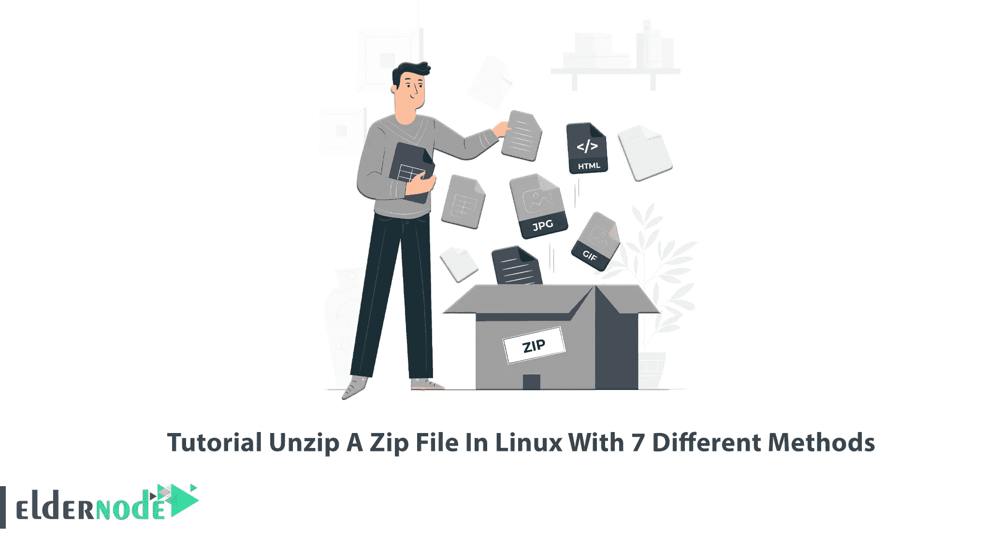

# 如何解压 Linux[命令行] - Eldernode 博客上的文件

> 原文：<https://blog.eldernode.com/how-to-extract-the-file-on-linux/>



如你所知，目前最流行和广泛使用的压缩格式是 zip、tar.gz 和 rar。Zip 是一种包含一个或多个压缩目录的归档文件格式。它支持无损数据压缩。今天我们和你一起学习如何用 7 种不同的方法在 Linux 中解压一个 zip 文件。如果你想购买一台 [Linux VPS](https://eldernode.com/linux-vps/) 服务器，你可以访问 [Eldernode](https://eldernode.com/) 中提供的服务。

## **如何在 Linux 下用 7 种不同的方法解压一个 zip 文件**

压缩和提取是任何操作系统中最重要的任务之一。如果你已经为此使用过 [Windows](https://blog.eldernode.com/tag/windows/) ，你会注意到工作的轻松，但是在 [Linux](https://blog.eldernode.com/tag/linux/) 中，它有一点不同。例如，如果您想要提取一个压缩文件，您可以图形化地输入文件夹或右键单击并提取。但是有时候你根本没有图形化的访问。因此，您应该能够通过终端和命令提取或压缩文件。

### 使用 Linux 终端在 Linux 中解压一个 zip 文件

首先，使用以下命令安装解压软件包:

在 Ubuntu/Debian 上:

```
sudo apt install unzip
```

在 CentOS/Fedora 上:

```
sudo yum install unzip
```

注意，一些 Linux 发行版默认有 unzip 包，您不需要安装它。

在这一步中，您需要导航到 ZIP 文件。为此，请输入以下命令:

```
cd directory
```

现在是时候解压一个 zip 文件了。如果您想将 zip 文件解压缩到当前目录，请运行以下命令:

```
unzip your-file.zip
```

但是如果您想将 zip 文件解压缩到不同的目录，只需使用以下命令:

```
unzip your-file.zip -d directory
```


### **在 Linux 中使用 Python** 解压一个 zip 文件

您可以使用 Python 脚本语言解压缩 zip 文件，其中包含所有必要的模块。为此，请输入以下命令:

```
#!/usr/bin/env python3  import sys  from zipfile import PyZipFile  for zip_file in sys.argv[1:]:      pzf = PyZipFile(zip_file)      pzf.extractall()
```

现在输入下面的命令来解压缩 zip 文件:

```
./pyunzip.py master.zip
```

或者

```
python3 pyunzip.py master.zip
```

### **使用 Perl 在 Linux 中解压一个 zip 文件**

Perl 脚本语言可以在 Linux 上解压 zip 文件。首先，输入以下脚本:

```
#!/usr/bin/env perl  use Archive::Extract;  foreach my $filepath (@ARGV){      my $archive = Archive::Extract->new( archive => $filepath );      $archive->extract;  }
```

运行以下命令解压缩 zip 文件:

```
./perlunzip master.zip
```

或者

```
perl perlunzip.pl master.zip
```

### **在 Linux 中使用 Bzip2** 解压一个 zip 文件

使用 Bzip2，您可以使用以下命令轻松地在 Linux 中解压缩 zip 文件:

```
bzip2 -kvd testfile1.txt.bz2 testfile2.txt.bz2
```

要获得 Bzip2 选项，请输入以下命令:

```
bzip2 -help
```

### **在 Linux 中使用 Tar** 解压一个 zip 文件

您只需输入以下命令:

```
tar -xzvf Documents.tgz Documents
```

xzvf 选项分为 x 表示提取，z 表示用 gzip 解压缩，v 表示详细，f 表示文件，表示保持文件结构。

您可以使用以下命令查看 tar 选项:

```
tar -help
```

### `**使用 Linux GUI** 在 Linux 中解压一个 zip 文件`

`在第一步中，您应该找到压缩的归档文件并右键单击它。从选项中选择**在此提取**。如果你想把内容放在别的地方，你可以选择**提取到**:`

``

`文件将被提取。`

`**在 Linux GUI 中使用归档管理器解压一个 zip 文件**`

### `一些 Linux 发行版有一个归档管理器来解压缩 zip 文件。`

`右键单击压缩文件并选择**用归档管理器打开**:`

``

`现在点击您想要提取的文件以突出显示它们，并点击**提取**:`

``

`选择您要提取文件的位置，并点击**提取**:`

``

`就是这样！`

`结论`

`解压缩文件是任何操作系统中最重要的任务之一，尤其是 Linux 操作系统。在本教程中，我们试图学习如何压缩和提取压缩，焦油，tar.gz 文件，并提取 RAR 文件。在这篇文章中，我们教你如何用 7 种不同的方法在 Linux 中解压一个 zip 文件。如果您有任何问题或建议，可以在评论区联系我们。我希望这篇教程对你有用。`

## `Conclusion`

`Unzipping files is one of the most important tasks used in any operating system, especially the Linux operating system. In this tutorial, we tried to learn you how to compress and extract zip, tar, tar.gz files, and extract RAR files.  In this article, we taught you How to Unzip A Zip File In Linux With 7 Different Methods. If you have any questions or suggestions, you can contact us in the Comments section. I hope this tutorial was useful for you.`