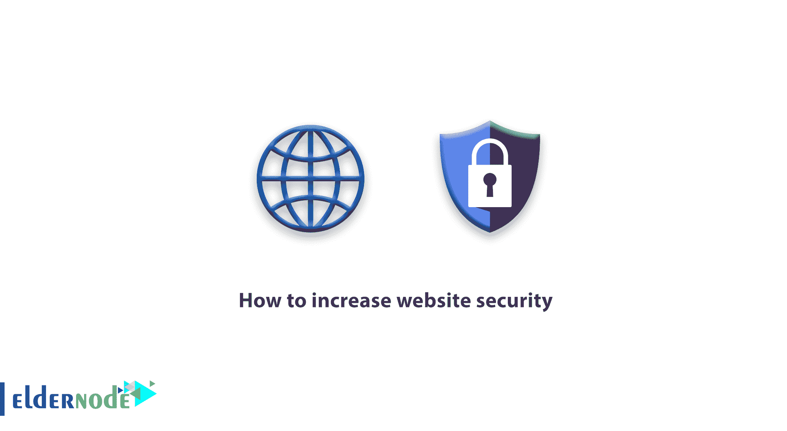

# 如何提高网站安全性-安全性| ElderNode 博客

> 原文：<https://blog.eldernode.com/how-to-increase-website-security/>

**如何增加网站安全性，网站[安全性](https://blog.eldernode.com/tag/security/)教程**

网站安全是创建和维护网站最重要的事情之一。如果你的网站不提供安全保障，可能会给你的网站带来严重的问题。经常遵循简单的方法可以防止你的网站被黑客攻击。

### **提高网站安全性**

在本[教程](https://eldernode.com/category/tutorial/)中，我们将讨论增加[安全站点](https://eldernode.com/installations/configure-linux-server-security/)。

1.  通过组合不同的字母、数字和字符来保护您的控制面板密码。
2.  网站电子邮件安全也非常重要，不应该被用作简单和可猜测的密码。
3.  当安装内容管理系统时，比如 WordPress 或 Joomla …不要使用默认用户名，而要使用不同的用户名。
4.  将 CMS 的管理地址从默认地址更改为其他地址
5.  始终保持你的网站更新
6.  为您的站点创建数据库时，随机选择数据库名称
7.  随机创建一个数据库表前缀
8.  禁用站点上的错误报告
9.  在管理文件夹上创建密码是在控制面板主机中
10.  阻止登录站点管理员的尝试。
11.  每周扫描一次你的网站
12.  阻止用户 id 查看
13.  阻止用户发布 HTML 评论
14.  数据库的定期备份

做个长辈。