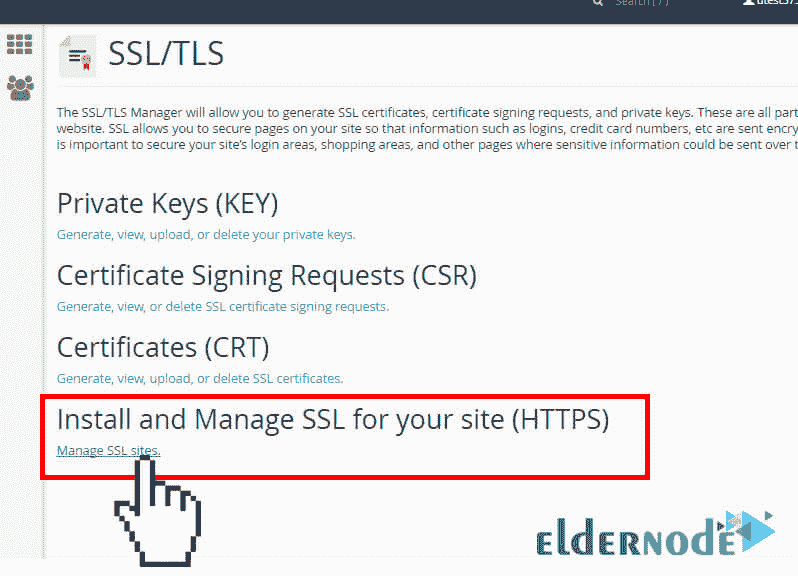

# 如何安装和激活 SSL 证书- ElderNode 博客

> 原文：<https://blog.eldernode.com/how-to-install-and-activate-the-ssl-certificate/>

如何安装和激活 SSL 证书；

一旦证书被激活，您可以将它安装在您自己的 cPanel 中。在本[教程](https://eldernode.com/category/tutorial/)中，我们将解决这个问题。所以请和[老人节点](https://eldernode.com/)在一起。

登录您的 **cPanel 账户**。

在首页找到“**安全”**部分。在此部分中，查找“ **SSL / TLS 管理器”**并单击它。

以下关于为您的网站(HTTPS)安装和管理 SSL 的部分应点击“**管理 SSL 站点**”:

***注意:*** 一些[托管](https://eldernode.com/vps-hosting/)的公司在自己的面板中没有管理 SSL 的选项。在这种情况下，您应该联系该公司，以便您可以直接执行安装过程或从该公司获得帮助。

#### 如何安装和激活 SSL 证书；

复制您从公司收到的证书代码。

该代码包含—**开始证书**和—**结束证书** —。

现在将复制的代码粘贴到下一页的“**证书:(CRT)** ”部分。

证书文件可以在记事本等文本编辑软件的帮助下打开。

证书代码可以在您的***您的域*中找到。crt** 文件。该文件通常会由您收到证书的公司通过电子邮件发送给您。如果您没有收到这样的电子邮件，请登录您的帐户并下载它。

点按将出现在您输入的证书旁边的“**按证书自动填充**”按钮。系统试图获得一个域名和一个**私钥**。

您可以从下拉列表中检索您的域名，并在框中手动输入证书和私钥。

如果系统没有获得私钥，您可以在“ **SSL/TLS 管理器**”的私钥部分获得。

现在您需要在**证书授权捆绑包(CABUNDLE)** 下面的框中输入 **CA 捆绑包**。

如果这部分已经满了，不要碰它。如果您想将此证书用于电子邮件服务，也请选中为邮件服务启用“**SNI”框。这使您能够将您的域用作主机名邮件服务器。**

点击**安装证书**按钮。

你的证书已经安装在服务器上了。你现在应该可以通过 HTTPS 版本访问你的网站了。

如何安装和激活 SSL 证书；

祝您好运