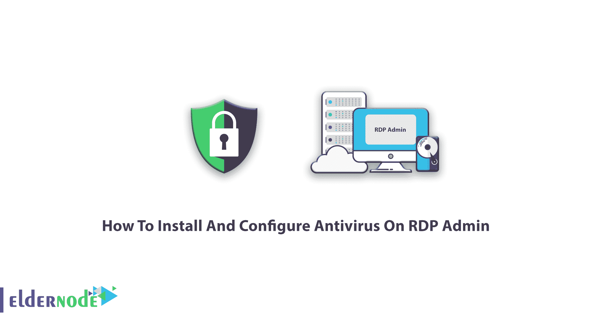
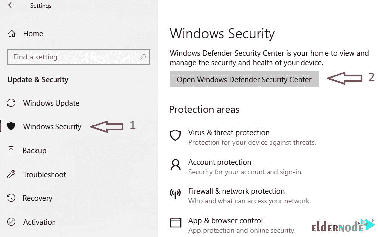
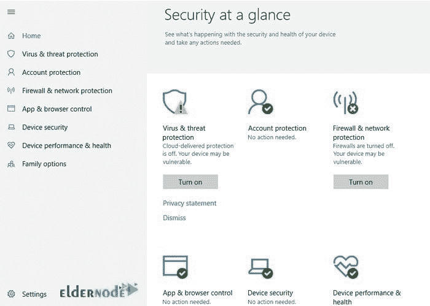
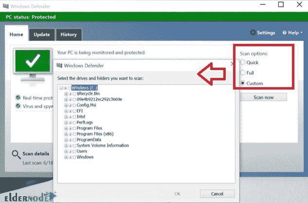
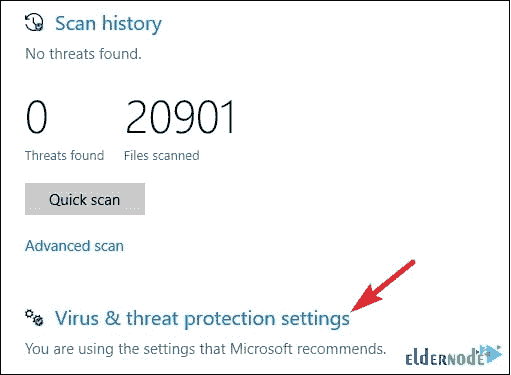
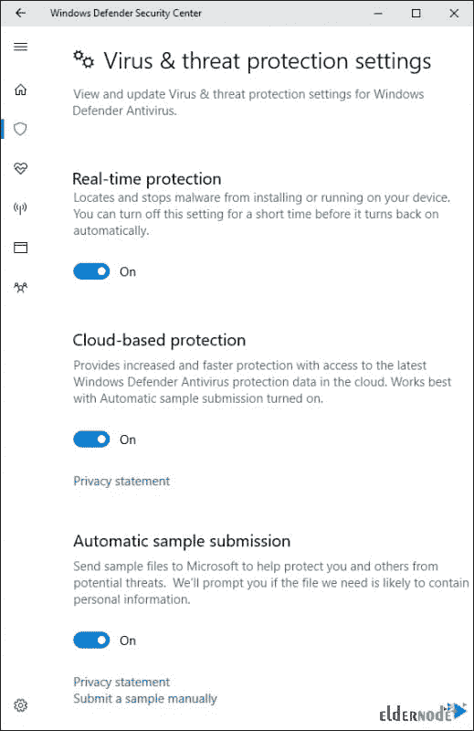

# 如何在 RDP 管理员的博客上安装和配置杀毒软件

> 原文：<https://blog.eldernode.com/how-to-install-and-configure-antivirus-on-rdp-admin/>

[更新日期:2021-1-10]**R**emote**D**esktop**P**rotocol(RDP)允许客户端计算机通过远程控制台连接查看计算机屏幕(适用于大多数版本的 Microsoft Windows)。默认情况下，RDP 协议使用 TCP 协议端口号 3389 进行通信。RDP 协议是微软的专有协议。您可以轻松地将它用于 Unix 和 OS X，作为内置于 Windows 操作系统中的 RDP 服务器。在这篇文章中，你将学习如何在 RDP 管理员上**安装和配置杀毒软件。从提供的 [Eldernode](https://eldernode.com/) 包中选择一个来购买自己的 [RDP 管理](https://eldernode.com/buy-rdp/)。**

## **教程在 RDP 管理员**上安装和配置杀毒

RDP 管理包括 Windows 2012、2016、2019 和 10 的版本。默认情况下，防火墙安装在 Windows 2016、2019 和 10 上。但是你可以通过使用更强大的抗病毒药物来提高你的 RDP 管理员的安全性。遥控器允许快速安全地连接到机器，以便实时解决问题，从而节省您的时间、金钱和压力。虽然你有一个拥有管理员权限的 [RDP 管理服务器](https://eldernode.com/buy-rdp/)，但你需要保护它，所以准备学习如何安装一个**杀毒软件**。为了保护宽带连接上的 RDP 流量，一定要使用防火墙到防火墙的虚拟专用网**和****。**

### **RDP 漏洞**

事实是，默认配置的 5.2 版本容易受到中间人攻击。RDP 会话也容易受到内存中凭据收集的影响，这可用于发起 pass hash 攻击。此外，微软还发布了一个针对 RDP 严重安全漏洞的更新。该漏洞允许未经验证的客户端和计算机蠕虫危害 Windows 计算机。当 RDP 访问对整个互联网开放时(特别是 3389 端口)，您可能会面临攻击。因此，关闭所有的入口，让拦截者无法找到并侵入目标机器是至关重要的。

### **如何保护 RPD**

RDP 保护不是很难，但至关重要。

**首先**，你需要检查你的 RDP 连接是否对互联网开放，并通过配置设置使其保持关闭，只允许通过内部网络访问。请记住，您可以在防火墙级别阻止默认端口中的流量。

你不需要一直保持 RDP 开启。一旦你完成了你的业务，禁用 RDP。建议您使用远程桌面网关来完成此操作。

作为**管理员**甚至是用户，你很清楚应该选择一个[强密码](https://blog.eldernode.com/how-to-create-strong-password/)。

**考虑**使用[双因素认证](https://blog.eldernode.com/configure-ssh-authentication-linux/)。

忘记给你的伴侣打电话没关系，但是千万不要忘记给对方打电话。为了确保你在保护 RPD，后退，后退，还有……**后退**！

你可能会面临**勒索软件**。请记住不要支付赎金，因为勒索者永远不会交付解密密钥。随便找个免费的解密工具弄掉就行了。

**定期更新**你的软件。在标准的 Microsoft 修补程序周期中，组件会自动更新为最新的安全修补程序。但是，通过启用和审核 Microsoft 自动更新，始终检查使用客户端和服务器软件的最新版本

建议您使用防火墙**限制访问**。使用 RDP 网关来完成此操作，或者使用校园 VPN 软件来获取校园 IP 地址，并将校园 VPN 网络地址池添加到您的 RDP 防火墙例外规则中。

**限制可以使用远程桌面登录的用户**。虽然所有管理员都可以访问远程桌面，但您应该将远程访问权限仅限于那些需要它来提高安全性的帐户。

到目前为止，你已经回顾了一些最值得推荐的保护 RDP 的技巧。

## **顶级杀毒与远程控制管理**

**Bitdefender**

借助 Bitdefender 的 GravityZone 工具，您可以全面了解您的整体安全状况、全球范围的安全威胁，以及对保护虚拟或物理桌面、服务器和移动设备的安全服务的控制。

**护板**

其全面的安全套件中的所有 BullGuard 产品都是为您的业务而设计的。其中最引人注目的是其有效和令人愉悦的设计，具有简单的导航和使用仪表板界面，以及清晰标记的功能和操作。

熊猫
熊猫远程控制是熊猫安全公司开发的一款工具，让你从网络控制台远程访问你网络上的电脑。有了这个工具，您可以在不亲自到场的情况下解决问题，或者，如果您是一家代理机构，您可以在客户不干预的情况下解决他们的安全问题，并且对他们的活动几乎没有影响。

**Avast**

Avast 是一款领先的防病毒软件，具有远程控制管理功能，让您足不出户就能顺利运行并解决问题。

Comodo 的远程控制(CRC)为托管服务提供商提供了更快、更容易的远程桌面连接，以便将这些提供商所需的核心服务置于 Comodo 控制台的单一保护伞和登录之下。通过最新的创新和技术，Comodo 提供的工具优于目前使用的大多数第三方软件。

**AVG**

AVG 的管理工作场所 10 配备了集成的高级安全功能，包括扩展的远程控制功能。高级远程控制已得到增强，包括临时和按需会话，以便为互联网上的任何人提供远程支持，而无需部署托管工作区。它还具有最终用户同意功能，通过请求访问来启动对其设备的远程控制，从而尊重您的客户端的隐私。

## 【Windows 10 最佳杀毒软件

为了继续学习安全问题，显然所有安装在个人电脑或笔记本电脑上的 windows 都需要防病毒保护。在众多的抗病毒药物中，我们会试着列出其中最好的来帮助你找到你想要的。

1- Bitdefender

2-诺顿

3-牛栏

4-迈克菲

5-卡巴斯基

## **学习在 RDP** 上安装和配置杀毒

### 如何激活 Windows 10 内置杀毒

当你在电脑上安装一个新的操作系统时，你主要担心的应该是病毒和恶意软件。安装了新的操作系统后，我们每个人都想保护自己的电脑免受病毒和恶意软件的侵害。但是在 **Windows 10** 中，就不需要安装强大兼容的外挂杀毒了。Windows 10 设计中使用的内置工具之一就是内置的 Windows 10 杀毒。下面我们将介绍并**激活**Windows 10 的内置杀毒。

内置的 Windows 10 杀毒软件，和它的 Windows 8 版本一样，带有操作系统的默认设置。这是因为默认情况下，安装操作系统的每个人都只有最低限度的保护和安全性。防止病毒和恶意软件破坏您的信息是非常重要的。

这不再需要单独安装反病毒软件。它还防止操作系统发出重复的防病毒安装警告。这个用于 Windows 10 的内置工具类似于您在其他 Windows 中使用的 Microsoft Security Essentials 软件。

### Windows 10 内置杀毒自动扫描更新

[Windows Defender](https://blog.eldernode.com/windows-defender-configuration-tutorial/) 和其他安全软件一样，在后台运行，有自动更新，防止病毒和恶意软件。使用这个工具不需要特殊的工作。Windows Defender **发现受感染的文件时会自动**将其隔离。然后，它会向您发送一条消息，通知您它已经做了什么。

如果你不经常更新杀毒软件，它将会失效，可能无法正常工作。Windows 10 **自动**通过 Windows Update 下载并更新防病毒和反恶意软件更新。

**设置和异常**

防病毒和反恶意软件并不总是正常工作！他们有时会隔离我们需要的文件。为了防止这种情况在大多数安全软件中发生，有一个功能叫做排除。例外可以用于使用排除法的抗病毒药物。该功能位于 Windows 10 的程序设置部分。要启用它，请转到开始菜单，然后从那里转到设置。选择更新和安全选项。现在选择 Windows Defender 安全中心并点击它打开它的设置。

此部分中的一些设置是云端防护设置、禁用临时扫描以及定义扫描文件的例外等等。你必须非常小心地定义一个异常。因为通过定义例外，防病毒程序将不再扫描这些文件，并且有可能相同的定义会感染您的计算机。异常文件可以是文件、文件夹或文件类型。

**手动扫描**

在这个工具中扫描文件是自动完成的。但是，如果您需要手动扫描，您可以在 Windows Defender 中以三种方式进行扫描。手动扫描的三种方法是快速扫描、自定义扫描和完全扫描。自定义扫描可用于查找特定地址的恶意软件和病毒。自定义扫描允许您在特定地址扫描病毒和恶意软件。点击开始按钮打开 Windows Defender。在搜索框中输入 Defender ，然后在结果列表中点击 Windows Defender 到 进入 Windows Defender 界面。如果你已经用过 SCEP，你会认出这个界面。

**隔离(在 RDP 上安装并配置防病毒软件)**

如果在系统中检测到受感染的文件，Windows Defender 将隔离该文件并通知您。要查看隔离文件，请转到 Windows Defender 窗口并打开“历史记录”选项卡。在此部分，找到并隔离受感染文件的历史记录将显示为列表。在此位置，通过列表可以返回到以前的隔离列表。

配置设置抵御病毒和安全威胁

### 默认情况下，Windows Defender 会自动执行实时保护、基于云的保护和采样；不间断的保护保证你这个安全软件自动扫描系统永久和检测恶意软件。尽量不对系统构成威胁。

基于云的保护和采样允许 Windows Defender 与微软共享有关恶意文件和恶意软件的信息。要启用或禁用这些设置，请单击 Windows Defender 主选项卡中的“病毒和威胁防护设置”链接。

然后，选择如图所示的设置。

如何用外置杀毒替换 Windows Defender】

### 如果您安装了外部防病毒软件，您在执行新的防病毒任务时将不会有任何问题。因为 Windows Defender 是操作系统自己自动禁用的。如果你安装外部防病毒，并前往 Windows Defender 设置，你会看到他们都被禁用和灰色。如果您删除外部防病毒，Windows 10 内部防病毒将再次自动激活，并继续其工作进程。

如果安装另一个杀毒软件会怎么样？

### 如果安装另一款杀毒，Windows 10 会自动禁用 Windows Defender。它也不再提供实时保护和扫描，以免干扰已安装的防病毒软件。当然，您仍然可以手动或离线运行该软件，并进行原始防病毒备份。

如果删除已安装的防病毒软件，Windows Defender 将被重新激活以保护系统。此外，请注意，Malwarebytes 等反恶意软件可以与默认的 Windows 安全软件一起安装，并一起提供实时保护。

安装你选择的任何杀毒软件，但要知道 Windows 10 自带默认杀毒软件。你可能认为这个软件不够好，但它是最不烦人的，当结合电脑使用和互联网浏览的其他安全原则时，它可能足以单独保护你的系统。

结论

## 在本文中，您了解了如何在 RDP 管理系统上安装和配置防病毒软件。如果你有兴趣阅读更多内容，可以找到相关文章，如[如何解决远程桌面](https://blog.eldernode.com/troubleshoot-remote-desktop/) *和* [如何在 Windows 服务器](https://blog.eldernode.com/rdp-limit-on-windows-server/)上设置 RDP 限制。

in this article, you learned How To Install And Configure Antivirus On RDP Admin. In case you are interested to read more, find the related articles on [How to troubleshoot Remote Desktop](https://blog.eldernode.com/troubleshoot-remote-desktop/) *AND* [How to Set the RDP limit on Windows Server](https://blog.eldernode.com/rdp-limit-on-windows-server/).