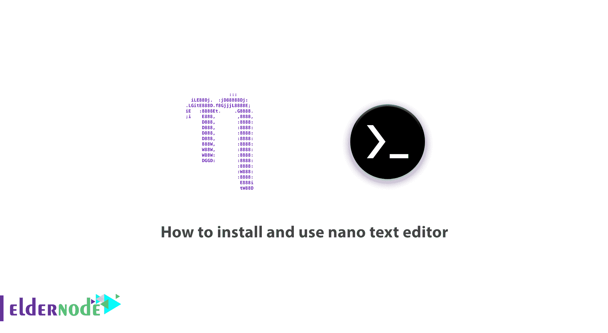
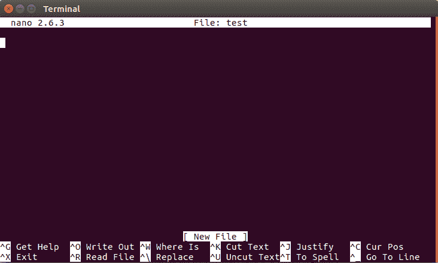

# 如何安装和使用纳米文本编辑器- Eldernode

> 原文：<https://blog.eldernode.com/how-to-install-and-use-nano-text-editor/>



Linux 发行版有几个编辑器，其中一些编辑器比其他编辑器更受欢迎，因为它们无处不在且易于使用。这个领域的编辑有 VI，VIM，Nano。Nano Editor 如此受其他编辑器欢迎的原因之一是它的编辑和使用方式。以至于在 Linux 终端中执行这个命令之后，就好像给了你一个图形模式进行文本编辑一样，让编辑过程变得更加简单快捷。这就是为什么我们决定教如何安装和使用纳米文本编辑器。

## 如何安装和使用 nano 文本编辑器

在本教程中，您将学习如何安装和使用纳米文本编辑器。当您使用 SSH 登录时，Nano Learning 将使您能够在您的 [VPS](https://eldernode.com/vps/) 命令行上编辑文本文件。虽然 Linux 新手使用 [Vim](https://www.vim.org/) 和 [Emacs](https://en.wikipedia.org/wiki/Emacs) ，但 Nano 更容易使用。这就是为什么它是 Unix 系统中最受欢迎的文本编辑器之一。

在本教程中，您将学习如何在 Ubuntu 和 CentOS 上安装 Nano。此外，还教授了一些用于文本编辑的基本 nano 命令。

### 安装和使用 Nano Text Editor 的先决条件

访问运行 Ubuntu 或 CentOS 的机器(SSH 远程访问运行这些操作系统之一的机器也可以)。

### 如何安装 Nano 文本编辑器

Nano Text Editor 的安装过程取决于您的操作系统。一般来说，Nano 预装在一些操作系统上，用户可以使用 Nano 文本编辑器。但是如果没有安装这个项目或者您不熟悉它，首先安装 Nano Text Editor，然后阅读本文剩余部分中使用它时的必要说明。

### 如何在 Debian / Ubuntu 中安装 Nano Text Editor

要在 Debian 或 Ubuntu 操作系统上安装 Nano text editor，请运行以下命令:

```
sudo apt-get install nano
```

等待安装过程完成，Nano 文本编辑器安装完成。

***注意:***sudo 部分旨在作为根用户运行该命令。如果您可能从一开始就没有以 root 用户身份登录，系统可能会要求您输入密码。所以不用担心。

### 如何在 CentOS / RHEL 上安装 Nano Text Editor

要在 CentOS 或 RHEL 操作系统上安装 Nano Editor，请运行以下命令:

```
yum install nano
```

该命令启动 Nano 文本编辑器安装。一旦设置完成，就可以使用了！

以下命令将为您打开一个 Nano 文本编辑器页面。如果您对文本进行任何更改，它们将被保存为 test . txt。**CTRL+X**键可用于关闭 nano。然后将询问您是否要保存文件更改？输入 **Y** 获得肯定回答，然后按回车键。

```
nano test.txt
```

以下是 Nano 编辑器的使用方法。我们将涉及的项目:

**–**如何打开和关闭文件并进行编辑

**–**Nano 编辑器的提示和技巧

**–**搜索并替换文本

**–**检查基本命令

### 如何打开和关闭纳米文本编辑器

打开编辑器的主要命令如下:

```
nano filename
```

***注意:*** 您可以输入所需的文件名或新文件名来代替文件名。请注意，如果您想要编辑预先存在的文件，您必须位于该文件所在的目录中。您也可以指定完整的文件路径。

**例如**，要打开你所在目录下的文件，可以使用以下命令:

```
nano test.txt
```

要打开另一个目录中的文件:

```
nano /path/to/directory/test.txt
```

***注意:*** 如果目录中不存在某个文件，Nano 会根据给定的文件名创建一个新文件。如果没有指定文件名，将创建一个未命名的空文件，当离开编辑器时，如果有任何更改，将询问文件名。

执行该命令后，您将被带到编辑器窗口。在此窗口中，您可以使用 Nano 文本编辑器编辑文本。使用键盘上的箭头键在文本周围移动光标。



在该窗口的底部，有一些快捷方式，通过它们可以使用 nano 文本编辑器。 **^** 符号表示你必须按 ctrl+[key](MAC 用户按 CMD + [key])才能执行你想要的命令。

按下 **CTRL + O** 保存对文件的更改并继续编辑。

使用 **CTRL + X** 退出编辑器。如果对当前打开的文件进行了任何更改，它会询问您是否要保存它。如果要保存更改，请输入 y，然后按 enter 键。

***注意:*** 每当你想在 Nano 中打开一个配置好的文件时，使用 **-w** 选项。默认情况下，Nano 会旋转文本以适应屏幕。这可能会损坏一些已配置的文件，并导致许多问题。

**例如**，要打开一个已配置的文件，使用以下命令:

```
sudo nano -w /etc/apache2/apache2.conf
```

### 纳米编辑器提示和窍门

要选择文本，请转到所选文本的开头并按下 **ALT + A** 键。这将设置一个复选标记来选择。

然后滚动文本，用箭头键选择文本。这将选择文本。

使用 **ALT + 6** 键复制所选文本。这将把文本复制到剪贴板。

使用 **CTRL + K** 剪切文本。

按下 **CTRL + U** 粘贴文本。

如果在复制或粘贴之前没有选择文本，它将复制或粘贴整行。

### 搜索并替换文本

按下 **CTRL + W** 搜索文本。这将询问您想要搜索的文本。输入所需的文本，然后按 Enter 键。使用 **ALT + W** 来搜索相似的文本。

要查找和替换文本，请按下 **CTRL + W** ，然后按下 **CTRL + R** 。这将要求您输入要搜索的文本以及要替换的文本。这将带您到文本的第一个实例，并询问您是否要替换这部分或所有事件。

以下是编辑文本时使用的一些基本 nano 命令:

**CTRL + A:** 转到起始行

转到行尾

**CTRL + Y:** 向下滚动文本

**CTRL + V:** 向上移动文本

**CTRL + G:** 该命令打开一个帮助窗口，显示可在 Nano 中使用的所有命令列表。

**CTRL + O:** 保存的基本命令。使用时，系统会提示您编辑或确认文件名，并按 Enter 键保存文件。

**CTRL + W:** 最有用的 nano 命令之一。用于在文本中搜索特定短语。这与其他程序和操作系统中常见的 CTRL + F 命令非常相似。使用 ALT + W 再次搜索相似的短语。

**CTRL + K:** 剪切整个选中的行，并将其放入剪切缓冲区。

**CTRL + U:** 将剪切缓冲区中的文本粘贴到所选行上。

**CTRL + J:** 对齐当前段落

**CTRL + C:** 显示光标在文本(行/段/列)中的当前位置

**CTRL + X:** 使用该命令，可以关闭 nano 软件。如果文本有任何变化，将立即出现保存消息。

**CTRL + R:** 用“读取文件”命令打开一个文件。将文件从磁盘插入到当前光标位置。

**CTRL + \:** 替换常规字符串或短语。

如果可以的话，使用拼写检查器。

**_ + CTRL:** 转到指定的行号和列号。

**ALT + A:** 选择文本。首先将光标移动到您想要选择的文本，然后按 ALT + A。然后通过向右移动光标和箭头键来选择文本。您可以将此命令与 CTRL + K 结合使用，剪切所选文本并将其移动到剪切缓冲区。

这些命令是基本命令，也是最有用和最常用的 nano 命令。如果你需要更多的命令，不要忘记 **CTRL + G** ，这个命令将带你到 nano 命令窗口。

## 结论

在本教程中，您将学习如何安装和使用 nano 文本编辑器。请注意，根据您使用的 Linux 操作系统，您必须在命令行环境中输入相关的命令。如上所述，有一些基本的说明和实用的方法可以帮助你更快更容易地编辑你的文件。下次不需要安装 Nano，只需使用文件编辑命令即可。