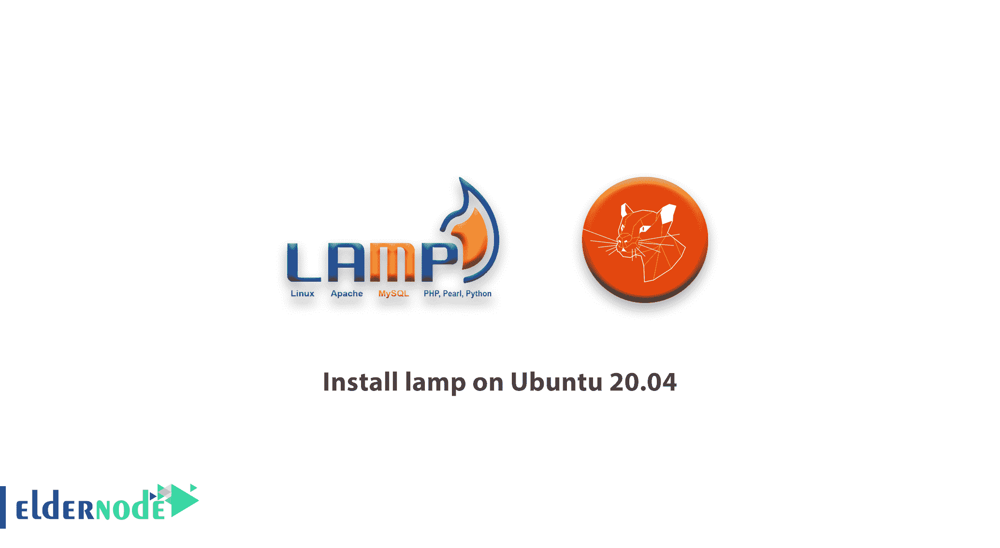
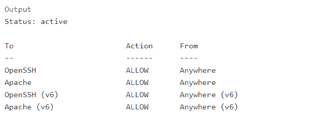
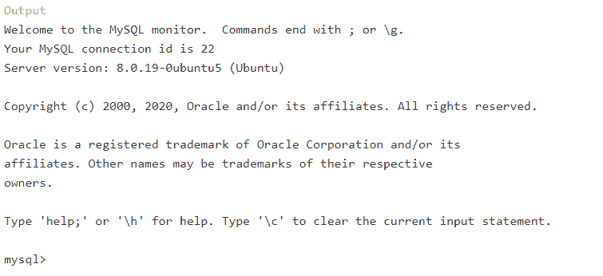
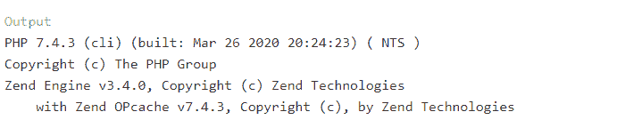

# 如何在 Ubuntu 20.04 上安装 Lamp LTS[完整] - ElderNode 博客

> 原文：<https://blog.eldernode.com/how-to-install-lamp-on-ubuntu-20-04/>



【更新】LAMP Stack 是一个开源的 Web 开发平台，使用 Linux 作为操作系统，Apache 作为 Web 服务器，MySQL 作为关系数据库管理系统，PHP 作为面向对象的脚本语言。在本教程中，我们将教你如何在 ubuntu 20.04 上安装 LAMP。需要注意的是，如果你想购买一台 [Ubuntu VPS](https://eldernode.com/ubuntu-vps/) 服务器，你可以访问 [Eldernode](https://eldernode.com/) 中提供的软件包。

## **教程在 Ubuntu 20.04 上逐步安装 Lamp**

在上一篇文章中，我们谈到了[在 ubuntu 18.04 LTS](https://blog.eldernode.com/install-lamp-stack-on-ubuntu-18-04-quick-start/) 上用 tasksel 安装灯栈。但是在本教程中，我们手动将所有东西都放在灯堆栈上。请继续关注我们的这篇文章。

## **在 Ubuntu 上安装灯 20.04 | Ubuntu 18.04**

在本帖中，我们以 root 用户的身份通过 SSH 连接到了 **Ubuntu 20.04** 。如果你没有使用 root 用户或者 Sudo 用户名，请在我们下面写的每个命令前加上 Sudu 命令。

### **如何在 Ubuntu 20.04 上设置 Apache**

为了在 [Ubuntu](https://blog.eldernode.com/tag/ubuntu/) 上安装 Apache webserver，您必须使用 apt 命令，如下所示:

```
apt update
```

```
apt install apache2
```

安装完成后，您需要调整防火墙设置，以允许 HTTP 和 HTTPS 流量。UFW 有不同的应用配置文件，您可以利用它们来实现这一目标。要在 UFW 上打开 Web 服务器端口，请执行以下命令:

```
ufw allow in "Apache"
```

之后，您可以使用下面的命令来检查状态并启用规则:

```
ufw status
```

如果您看到如下所示的输出，则 UFW 上的配置对于端口 80 和 443 上的服务是可以的:



现在，你可以打开浏览器，使用服务器的静态 IP 来检查一切是否正常。

*例如:*

```
http://your_server_ip 
```

### **如何安装 MySQL Ubuntu Linux**

现在 Ubuntu 服务器已经有了一个网络服务器，你需要安装一个数据库系统来为你的站点存储和管理数据。要在 ubuntu 20.04 上安装 MySQL，请运行以下命令:

```
sudo apt install mysql-server
```

出现提示时，输入 **Y** 确认安装，并按 **Enter** 键。

安装完成后，您需要运行 MySQL 预装的[安全](https://blog.eldernode.com/tag/security/)脚本。所以运行以下命令，对预装的 MySQL 进行保护:

```
sudo mysql_secure_installation
```

这将询问您是否要配置验证密码插件。

回答 **Y** 是或其他任何继续不启用。

如果您回答是，您将被要求选择一个密码验证级别，我们建议您回答 2 并按**键输入**，但是您可以选择任何您想要的选项。之后，你需要为 MySQL 的 root 用户名输入两次你喜欢的密码。之后每次提示都按 **Y** 和 **Enter** 键，直到结束。脚本完成后，您可以使用以下命令登录到 MySQL 控制台来验证 MySQL:

```
sudo mysql
```

如果您的 MySQL 服务安装正常，您将看到如下输出。



要退出控制台，需要键入 **exit** 并按下 **Enter** 。

### **在 Ubuntu 20.04 上安装配置 PHP**

您安装了 Apache 来提供您的内容，安装了 MySQL 来存储和管理您的数据。PHP 是我们设置的组件，它将处理代码以向最终用户显示动态内容。除了 PHP 包，你还需要 PHP-MySQL，这是一个 PHP 模块，允许 PHP 与基于 MySQL 的数据库进行通信。您还需要 libapache2-mod-php 来使 apache 能够处理 php 文件。核心 PHP 包将作为依赖项自动安装。

要安装这些软件包，请执行以下命令:

```
apt install php libapache2-mod-php php-mysql
```

安装完成后，您可以运行以下命令来确认您的 PHP 版本:

```
php -v
```

如果 PHP 成功安装，您会看到如下输出:



***注意:*** 通过上面的命令，Ubuntu 安装了 PHP 的最新版本，所以如果你需要 PHP 上的任何版本，就要键入 PHP 的版本。

#### **测试 web 服务器上的 PHP 处理**

现在您已经有了一个定制的位置来存放您的网站的文件和文件夹，我们将创建一个 PHP 测试脚本来确认 Apache 能够处理 PHP 文件请求。在您的自定义 webroot 文件夹中创建一个名为 info.php 的新文件:

```
nano /var/www/html/info.php
```

在上面添加下面的 PHP 命令并**保存**文件:

```
<?php  phpinfo();
```

为了测试这一点，进入您的 web 浏览器并访问您的服务器的域名或 IP 地址，然后是脚本名称，在本例中是**info.php**:

```
http://server_domain_or_IP/info.php
```

您将看到一个类似如下的页面:


## 结论

您成功地在 Ubuntu 20.04 LTS VPS 服务器上安装了 Lamp，您可以创建虚拟主机，并使用它们访问任何 [CMS](https://blog.eldernode.com/tag/wordpress/) 或 PHP 和 HTML 网站。我们准备了所有步骤的视频，你可以看到下面的视频。如果你愿意，你可以参考我们关于[如何在 Debian](https://blog.eldernode.com/install-lamp-debian-10/) 和 [CentOS 8](https://blog.eldernode.com/install-lamp-stack-on-centos-8/) 上安装 Lamp 的文章。