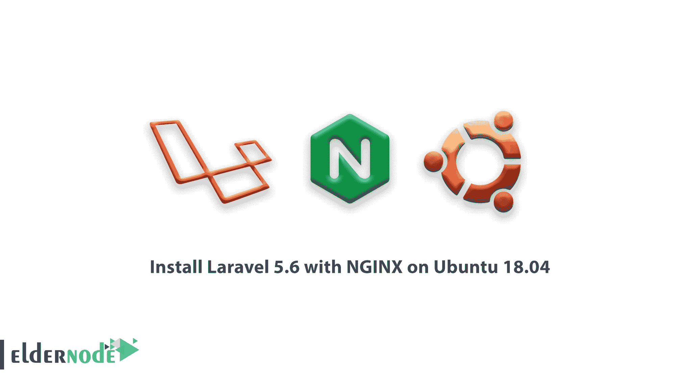

# 如何在 Ubuntu 18.04 上用 NGINX 安装 Laravel 5.6-elder node 博客

> 原文：<https://blog.eldernode.com/how-to-install-laravel-5-6-with-nginx-on-ubuntu-18-04/>



Laravel 是一个开源的 PHP 框架，可以帮助你构建现代的 PHP 应用程序。这个流行的工具是许多开发人员的首选，因为它是简化开发过程的好主意。在本文中，我们试图教你如何在 Ubuntu 18.04 上安装带有 NGINX 的 Laravel 5.6。你可以访问 [Eldernode](https://eldernode.com/) 提供的包来购买 [Ubuntu VPS](https://eldernode.com/ubuntu-vps/) 服务器。

此选项旨在为 CI 框架提供更高级的替代方案。2011 年，laravel 发布了第一版和第二版。laravel 的最新版本，5.6 版，带有命令行支持、支持各种数据库系统和路由改进等改进功能。如果你还没有自己的[VP](https://eldernode.com/vps/)，是时候接触一下这种体验了。

为了让本教程更好地发挥作用，请考虑以下**先决条件** :
一个拥有须藤权限
的非根用户要进行设置，请遵循我们的[Ubuntu 18.04 初始设置](https://blog.eldernode.com/initial-setup-ubuntu-18/)。

## 如何在 Ubuntu 18.04 上用 NGINX 安装 Laravel 5.6

请阅读本文，让我们向您展示如何部署一个简单的 Laravel 应用程序环境，这需要一些常见的步骤。如果您有兴趣学习 CentOS 8 上的 [Laravel，请不要错过该教程。](https://blog.eldernode.com/installation-laravel-nginx-centos-8/)

#### **我们来看看需要的步骤:**

1:更新 Ubuntu 库

**2:** 安装 nginx

安装 PHP-FPM 7.2

安装 MariaDB

**5:** 安装 PHP 编写器

**6:** 为 laravel 配置虚拟主机

**7:** 安装 laravel

**8:** 测试

**步骤 1:更新 Ubuntu 虚拟服务器**

首先，在开始安装过程之前，您必须更新 **Ubuntu 库**。然后将所有可用的软件包更新到最新版本。为此，首先登录到您的 Ubuntu 服务器:

### 现在更新 Ubuntu 存储库，并使用以下命令将系统上所有可用的软件包更新到最新版本:

```
ssh [[email protected]](/cdn-cgi/l/email-protection) 
```

```
sudo apt update  sudo apt upgrade
```

 **第二步:安装 NGINX**

重启你的虚拟私有服务器，并使用 SSH 重新连接它**。**

### 此时，你需要**在我们的系统上安装 NGINX 1.14** 。默认情况下，这个选项在 Ubuntu 存储库中可用。您应该使用以下命令安装它:

安装过程结束后，启动 NGINX 服务，并将其设置为在系统启动时自动运行。使用以下命令获取帮助:

如你所知，NGINX 工作在 80 端口。使用以下命令检查现状:

```
sudo apt install Nginx -y
```

```
systemctl start Nginx  systemctl enable Nginx
```

```
netstat -plntu  curl -I localhost
```

步骤三:安装 PHP7.2 和 PHP-FPM

到目前为止，您已经安装了 NGINX，现在您需要安装 PHP-FPM 版本 7。你将安装 laravel 需要的 **PHP7.2** 和一些 **PHP 插件**。使用以下命令获取帮助:

### 现在转到 PHP 配置目录，编辑该目录中的 php.ini 文件:

**取消注释**下面的 CGI 行，并将其更改为**零**:

```
sudo apt install php7.2 php7.2-curl php7.2-common php7.2-cli php7.2-MySQL php7.2-mbstring php7.2-fpm php7.2-XML php7.2-zip -y
```

现在保存文件并退出。你可以启动 PHP-FPM 并设置它在系统启动时自动运行。

```
cd /etc/php/7.2/  vim fpm/php.ini
```

默认情况下，在 Ubuntu 中，PHP-FPM 在 sock 文件监管下运行。使用以下命令检查该文件:

```
cgi.fix_pathinfo=0
```

现在，你可以在 Ubuntu 虚拟私有服务器上安装 PHP 和 PHP-FPM 了。现在你需要继续下一步。

```
systemctl start php7.2-fpm  systemctl enable php7.2-fpm
```

```
netstat -pl |
```

```
grep php7.2-fpm
```

第四步:安装 MariaDB 数据库

这是可选的，但是当您的 laravel 项目基于 MYSQL 时，您应该为您的项目这样做。您将在服务器上安装最新版本的数据库。您可以使用以下命令从存储库中安装数据库:

### 安装过程完成后，运行 **MariaDB** 并准备好在系统上引导。

这个数据库工作在**端口 3306** 上。使用以下命令检查它:

```
sudo apt install mariadb-server mariadb-client -y
```

现在，使用以下命令指定数据库密码:

```
systemcl start mysql systemctl enable mysql
```

输入 root 密码，删除匿名用户，并删除远程 root 登录:

```
netstat -plntu
```

```
mysql_secure_installation
```

数据库安装和配置也已经完成。

```
Set root password? [Y/n] Y  Remove anonymous users? [Y/n] Y  Disallow root login remotely? [Y/n] Y  Remove test database and access to it? [Y/n] Y  Reload privilege tables now? [Y/n] Y
```

第五步:安装 PHP Composer

### Composer 是 PHP 编程语言的包管理器。该选项创建于 2011 年。在 Ubuntu 18.04 VPS 上，composer 在资源库中可用，你可以用 **apt 命令**安装它。

### 安装过程完成后，运行以下命令查看结果。

Composer is a package manager for PHP programming language. This option was created in the Year 2011\. On the Ubuntu 18.04 VPS, the composer is available in the repository and you can install it with the **apt command**.

```
sudo apt install composer -y
```

After the installation process is complete, run the following command to see the result.

```
composer
```

### **S** 步骤 6:为 laravel 配置虚拟主机

### 此时，您将为 laravel 配置虚拟主机。但是在这样做之前，您需要决定我们的 laravel 项目所需的目录。我们的项目使用'/ var / www / laravel '目录。使用以下命令创建它:

### 现在转到 NGINX 配置目录。在“ **sites-available** 目录下新建一个名为 **laravel** 的虚拟主机文件；

将以下配置粘贴到其中:

```
mkdir -p /var/www/laravel
```

```
cd /etc/Nginx/ vim sites-available/laravel
```

现在保存文件并退出。您可以通过为您想要的目录创建**符号链接文件**来启用虚拟主机。测试配置文件，确保没有看到错误:

```
server { listen 80; listen [::]:80 ipv6only=on;#  Log files for Debugging access_log /var/log/nginx/laravel-access.log;  error_log /var/log/nginx/laravel-error.log;  # Webroot Directory for Laravel project root /var/www/laravel/public;  index index.php index.html index.htm;  # Your Domain Name server_name laravel.hakase-labs.co;  location / { try_files $uri $uri/ /index.php?$query_string; }   # PHP-FPM Configuration Nginx location ~ \.php$ { try_files $uri =404;  fastcgi_split_path_info ^(.+\.php)(/.+)$;  fastcgi_pass unix:/run/php/php7.2-fpm.sock; fastcgi_index index.php;  fastcgi_param SCRIPT_FILENAME $document_root$fastcgi_script_name;  include fastcgi_params; } }
```

虚拟主机是为 laravel 创建的。您现在应该重新启动 NGINX 服务:

```
ln -s /etc/Nginx/sites-available/laravel /etc/Nginx/sites-enabled/ nginx -t
```

```
systemctl restart Nginx
```

**第七步:安装拉索**

在继续安装 laravel 之前，您需要确保 VPS 上安装了**解压缩功能**。如果您还没有这个工具，请使用以下命令安装它:

### 在“/var/www/laravel”中已经有一个 laravel 的目录。转到此目录:

用 **Composer 命令**安装 laravel。安装 laravel 有两种方法。一种是通过 laravel 安装程序安装。其次，借助“**作曲家创作项目**”进行安装。您将使用第二个选项。运行以下命令:

```
sudo apt install  unzip -y
```

你必须等待**拉韦尔安装**。几分钟后，该过程完成。您需要将对 laravel 项目的访问权限更改为用户' **www-data** '。

```
cd /var/www/laravel
```

Install laravel with the **Composer command**. There are two ways to install laravel. One is to install it through the laravel installer. Second, install it with the help of “**Composer create project**“. You will use the second option. Run the following command:

```
composer create-project laravel/laravel.
```

You must wait for the **laravel installation**. After a few minutes, the process is complete. You need to change the access to the laravel project to the user ‘**www-data**‘.

```
chown -R www-data:root /var/www/laravel  chmod 755 /var/www/laravel/storage
```

### **第八步:测试**

### 在虚拟主机配置文件中，您将 laravel 的域名定义为“**laravel.hakase-labs.co**”。打开浏览器，输入短语。(你的域名可能和这个不一样。所以用你的域名)。在这种情况下，您应该会看到 laravel 主页。

### **Step 8 : Test**

In the Virtual Host configuration file, you define the domain name for laravel as ‘**laravel.hakase-labs.co**‘. Open your browser and enter the phrase. (Your domain name may be different from this one. So use your domain name). In this case, you should see the laravel homepage.

### 结论

在本文中，您了解了如何在 Ubuntu 18.04 上使用 NGINX 安装 Laravel 5.6。成功通过上述步骤，现在您可以使用 Laravel 并享受其功能。如果您正在使用

## ，请使用相关指南。

In this article, you learned how to install Laravel 5.6 with NGINX on Ubuntu 18.04\. By passing the above steps successfully, now you can use the Laravel and enjoy its features. In case you are using

[Ubuntu 20.04](https://blog.eldernode.com/install-laravel-on-ubuntu-20-04-lts/)

, use the related guide.