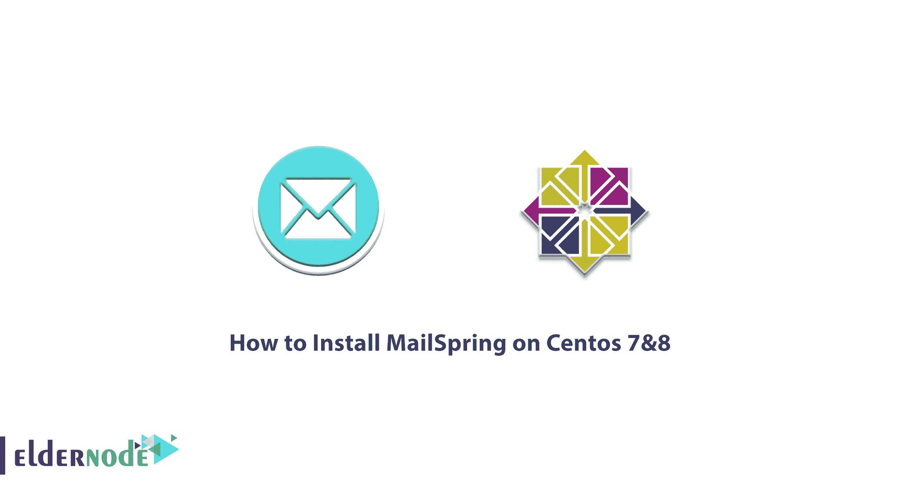

# 如何在 Centos 7 & 8 - Eldernode 博客上安装 MailSpring

> 原文：<https://blog.eldernode.com/how-to-install-mailspring-on-centos/>



Mailspring 是 Nylas Mail 的新版本，由原作者之一维护。Mailspring 的 UI 是开源的(GPLv3 ),用电子和反应的类型脚本编写——建立在插件架构上，易于扩展。Mailspring 同步引擎由 Electron 生成，在您的计算机上本地运行。这个资源将来会是开源的，但目前是关闭的。当您设置您的开发环境时，Mailspring 使用同步过程的最新版本。所以不需要在编译时获取资源或安装依赖项。在本文中，我们试图学习如何在 Centos 7 & 8 上安装 MailSpring。你可以访问 [Eldernode](https://eldernode.com/) 提供的套装来购买 [CentOS VPS](https://eldernode.com/centos-vps/) 服务器。

## **教程在 Centos 上安装 mail spring 7&8**

Mailspring 提供了强大的功能，如统一收件箱、暂停、稍后发送、邮件规则、模板等等。在下一节中，我们将介绍 MailSpring 的一些特性，然后我们将讨论如何在 [Centos](https://blog.eldernode.com/tag/centos/) 7 & 8 上安装 Mailspring。请和我们在一起。

### **MailSpring 功能**

以下是 MailSpring 的一些特性:

1.能够创建多个帐户(IMAP 和 Office 365)

2.触摸和手势支持

3.高级快捷方式

4.闪电般的搜索

5.撤消发送

6.统一收件箱

7.能够阅读收据，链接跟踪，等等

8.Mac、Windows 和 Linux 支持

9.包括各种主题和布局(包括黑暗模式)

10.本地化为 9 种语言

关注我们，了解如何在 Centos 7 & 8 上安装 MailSpring。

### **在 Centos 7&8**T3 上安装 MailSpring

请加入我们，了解如何在 Centos 7 & 8 上安装 MailSpring。为此，只需遵循以下步骤。第一步是使用以下命令将 **Epel 存储库**添加到系统中:

```
sudo yum install epel-release
```

然后需要安装 **Snap:**

```
sudo yum install snapd
```

现在您需要启用管理主通信套接字的系统子目录:

```
sudo systemctl enable --now snapd.socket
```

在下一步中，您必须启用经典快照支持。注意，这样做在 **/var/lib/snapd/snap** 和 **/snap** 之间创建了一个符号链接:

```
sudo ln -s /var/lib/snapd/snap /snap
```

现在，您需要**重启**系统一次，以更新系统并应用更改。

成功完成上述步骤后，您现在可以通过运行以下命令轻松地**安装 Mailspring** :

```
sudo snap install mailspring
```

## 结论

对电子邮件进行分类，检查电子邮件是否被阅读，以及同时管理多个帐户是免费的 Mailspring 软件的主要功能之一。你可以下载适用于所有电脑操作系统的 Mailspring，并管理你的电子邮件。在本文中，我们试图了解如何在 Centos 7 & 8 上安装 MailSpring。