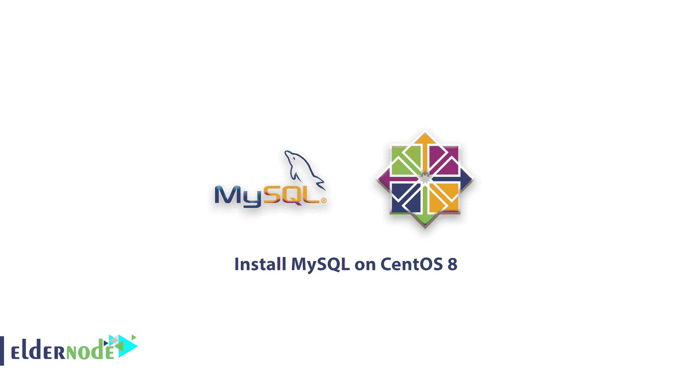

# 如何在 CentOS 8 上安装 MySQL-安装 MySQL

> 原文：<https://blog.eldernode.com/how-to-install-mysql-on-centos-8/>



通过前面的文章，你知道 [MySQL](https://www.mysql.com/) 是一个开源的数据库管理系统。在本文中，您将了解如何在 CentOS 8 上安装 MySQL。它是作为流行的 [LAMP](https://eldernode.com/install-lamp-stack-on-centos-8/) (Linux，Apache，MySQL，PHP/Python/Perl)栈的一部分安装的

**先决条件**

如果您知道以下内容，本教程可能会更有用:

## 如何在 CentOS 8 上安装 MySQL

### 1- 安装 MySQL

您可以从默认存储库访问 CentOS 8 上的 MySQL 版本 8。

要安装 mysql-server 包及其许多依赖项，请运行下面的命令。

```
sudo dnf install mysql-server
```

当你被要求继续时，按下 y ，然后输入。

输出

```
. . .  Install  49 Packages    Total download size: 46 M  Installed size: 252 M  Is this ok [y/N]: y
```

虽然你已经安装到这里的 MySQL 是不可操作的，你需要用 systemctl 命令来启动它。

```
sudo systemctl start mysqld.service
```

是时候检查服务是否正常运行了。所以输入下面的命令。

```
sudo systemctl status mysqld 
```

如果成功启动，您将看到下面的活动 MySQL 服务。

输出

```
● mysqld.service - MySQL 8.0 database server     Loaded: loaded (/usr/lib/systemd/system/mysqld.service; enabled; vendor preset: disabled)     Active: active (running) since Thu 2020-03-12 14:07:41 UTC; 1min 7s ago   Main PID: 15723 (mysqld)     Status: "Server is operational"      Tasks: 38 (limit: 5056)     Memory: 474.2M     CGroup: /system.slice/mysqld.service             └─15723 /usr/libexec/mysqld --basedir=/usr    Mar 12 14:07:32 cent-mysql-3 systemd[1]: Starting MySQL 8.0 database server...  Mar 12 14:07:32 cent-mysql-3 mysql-prepare-db-dir[15639]: Initializing MySQL database  Mar 12 14:07:41 cent-mysql-3 systemd[1]: Started MySQL 8.0 database server.
```

您可以使用下面的命令设置 MySQL 在服务器启动时启动。

**注意** :如果你想禁止 MySQL 在引导时启动，使用下面的命令。

```
sudo systemctl enable mysqld
```

**现在** MySQL 现在安装好了。

```
sudo systemctl disable mysqld
```

[购买 Linux 虚拟私有服务器](https://eldernode.com/linux-vps/)

2- 保护 MySQL

### MySQL 包含一个安全脚本，要使用该安全脚本，请运行以下命令。

无论是否要求您设置验证密码插件，如果您愿意，脚本都会要求您选择一个密码验证级别。

```
sudo mysql_secure_installation 
```

whether you are asked to set up the Validate Password Plugin and you prefer to do that, the script will ask you to choose a password validation level.

然后输入并确认安全密码。

```
Output
```

```
Securing the MySQL server deployment.    Connecting to MySQL using a blank password.    VALIDATE PASSWORD COMPONENT can be used to test passwords  and improve security. It checks the strength of password  and allows the users to set only those passwords which are  secure enough. Would you like to setup VALIDATE PASSWORD component?    Press y|Y for Yes, any other key for No: Y    There are three levels of password validation policy:    LOW    Length >= 8  MEDIUM Length >= 8, numeric, mixed case, and special characters  STRONG Length >= 8, numeric, mixed case, special characters and dictionary                  file    Please enter 0 = LOW, 1 = MEDIUM and 2 = STRONG: 2
```

输出

因此，如果您对从强度和安全性角度选择的密码感到满意，请输入 Y 继续脚本:

```
Please set the password for root here.      New password:     Re-enter new password:
```

输出

3- 测试 MySQL

```
Estimated strength of the password: 100   Do you wish to continue with the password provided?(Press y|Y for Yes, any other key for No) : Y
```

如果您想通过连接到 mysqladmin 工具来验证安装，请使用下面的命令作为 **root 连接到 MySQL。**

### 输出将如下所示:

如果您想在连接到 MySQL 后添加数据，请运行以下命令:

```
mysqladmin -u root -p version
```

然后，当您输入您的 **root** MySQL 用户的密码时，您将看到 MySQL 提示。

```
mysqladmin  Ver 8.0.17 for Linux on x86_64 (Source distribution)  Copyright (c) 2000, 2019, Oracle and/or its affiliates. All rights reserved.    Oracle is a registered trademark of Oracle Corporation and/or its  affiliates. Other names may be trademarks of their respective  owners.    Server version      8.0.17  Protocol version    10  Connection      Localhost via UNIX socket  UNIX socket     /var/lib/mysql/mysql.sock  Uptime:         2 hours 52 min 37 sec    Threads: 2  Questions: 20  Slow queries: 0  Opens: 131  Flush tables: 3  Open tables: 48  Queries per second avg: 0.001
```

从现在开始，您可以开始安装 MySQL 并创建和加载数据库。

```
mysql -u root -p
```

```
mysql>
```

亲爱的用户，我们希望您喜欢本教程，您可以在评论区提出关于本次培训的问题，或者解决[老年节点培训](https://eldernode.com/blog/)领域的其他问题，请参考[提问页面](https://eldernode.com/ask)部分并在其中提出您的问题。

**不要错过**

[教程在 CentOS 8 上设置 SSH 按键](https://eldernode.com/set-up-ssh-keys-on-centos-8/)

**Do not miss**

[Tutorial set up SSH Keys on CentOS 8](https://eldernode.com/set-up-ssh-keys-on-centos-8/)