# 如何在 RDP admin 2016 - Eldernode 上安装 Wamp 服务器

> 原文：<https://blog.eldernode.com/how-to-install-wamp-server-on-rdp-admin-2016/>

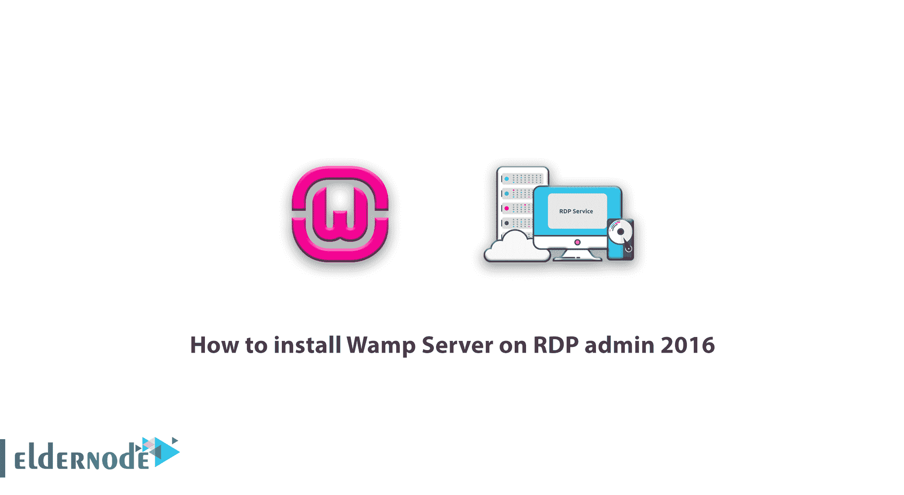

使用 Wamp 程序，就像 Xampp 程序一样，你可以离线建立一个网站，而不需要在你的个人电脑上设置主机和域名。通过使用 Wamp 程序，就像 Xampp 程序一样，您可以设置一个离线站点，而不需要在您的个人计算机上运行主机和域名。

使用 Wamp 程序，你可以安装任何类型的脚本和站点生成器，包括 WordPress。轻松实现一个网站，并在最终确定后，将所有设置进行备份，并将其传输到您购买的主机上。在本文中，我们将讨论在 RDP 管理 2016 环境中安装 Wamp 服务器的步骤。您可以通过访问 [Eldernode](https://eldernode.com/) 中的 [Buy RDP](https://eldernode.com/buy-rdp/) 管理页面查看和购买各种套餐。

## 什么是本地主机？我们为什么要使用它？

Localhost 允许您通过使用所需的软件，在您的个人计算机上使用相同的 Apache 解释器和服务器，并使用 Mysql 数据库和安装 php 和其他要求来处理信息和查看 php 代码的输出，在您的 PC 上轻松安装所需的软件。在 Wamp 程序中，您还可以通过在浏览器中设计一个本地主机地址并在那里设计和实现一个站点来访问本地环境。

现在你肯定已经意识到 wamp 程序为你提供了一个合适的 php、Mysql 数据库和 Apache 服务器的平台，让你可以在个人电脑上离线创建一个网站。

使用本地主机的最大好处是你不需要花钱购买主机和域名。您可以在您的计算机上创建一个精确的站点并使用它。唯一不同的是，其他人无法通过自己的计算机在本地输入网站地址来查看网站。

## 如何在 RDP 管理 2016 上安装 Wamp 服务器

要开始使用，首先进入 wamp 服务器的[官方网站，下载与下图类似的适用于您的操作系统的最新版本的 wamp 程序。](https://www.wampserver.com/en/)

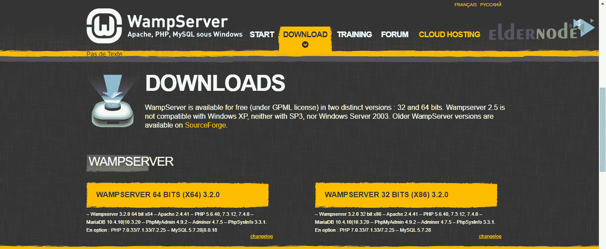

如红框所示，您可以根据 Windows 操作系统的版本(32 位或 64 位)下载该程序。

请注意，如果您的 Windows 版本是 32 位，则不应使用 64 位版本，但如果您的 Windows 版本是 64 位，则可以使用这两个版本。

我的 Windows 版本是 64 位，我点击了这个版本的黄色按钮。点击此按钮，将会打开一个窗口，如下图所示。点击下载按钮，会被定向到程序的直接下载链接，在打开的页面中，等待程序开始下载并保存。

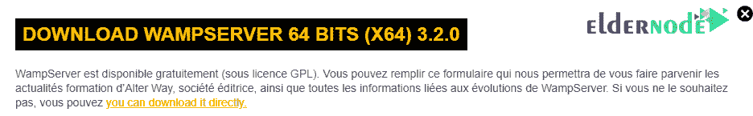

要安装 wamp 程序，下载完与其他 Windows 软件类似的文件后，只需双击 **EXE 文件**即可准备安装操作。

点击安装文件后，将会打开一个类似下面的窗口，在这里您必须选择您想要的语言。默认情况下，程序的语言是英语，我们选择它而不改变它，并通过选择 **Ok** 按钮进入下一步。

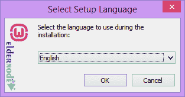

在下一步中，将介绍与该计划相关的规则和条例，您需要批准这些规则和条例才能使用该计划。所以在如下所示打开的窗口中，首先选择**我接受协议**选项。

然后点击**下一步**按钮进入下一步。

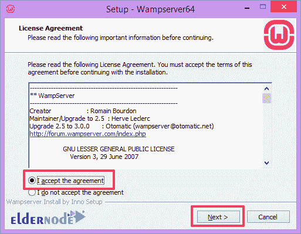

在下一步中，将显示运行 wamp 程序所需的程序信息和项目，您必须在 Windows 上安装这些程序，并使用最新的可用版本。所以在这一步，就像下图一样，只需点击**下一步**按钮，进入下一步。

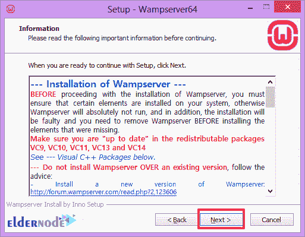

通过这一步，你将到达的步骤，你必须选择驱动器和文件夹，你要安装的 wamp 程序。

从驱动器上所需文件夹的指定部分点击**眉头**按钮，选择计算机空间的分区，点击**下一步**按钮。

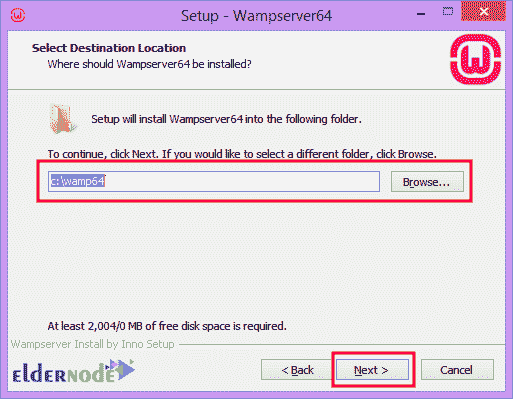

通过这一步后，在下一步中，您还可以指定您喜欢的文件夹的名称，以将 wamp 程序放在您选择的 Windows 开始菜单中。

点击**眉头**按钮，可以浏览 Windows 启动中的目录，选择想要的文件夹。

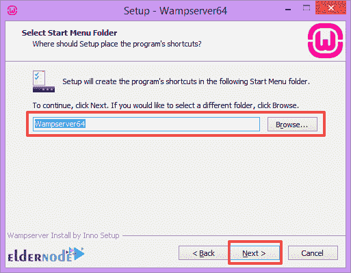

点击**下一步**按钮进入一个步骤，告诉你是否准备好安装。

如果安装 Wamp 所需的所有项目都已在您的系统上正确安装并激活，您将到达此选项，并且不会收到错误消息。

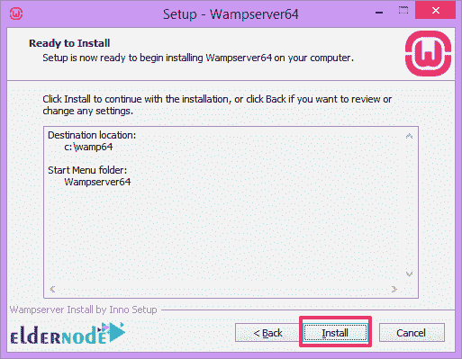

通过此步骤后，通过点击**安装**按钮，您将被引导至下一步，这将开始在 Windows 中安装 Wamp。

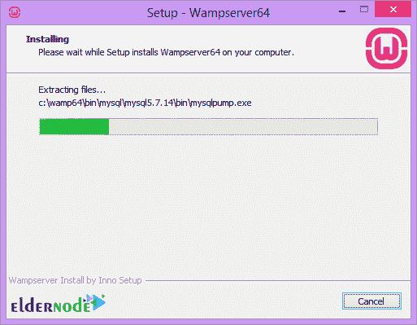

在 Windows 中安装 Wamp 时，您会看到两个连续的窗口要求您选择**默认浏览器**以显示程序中的本地主机和您的默认文本编辑器。为此，只需在两个窗口中点击**是**按钮，选择默认浏览器和**文本编辑器**，如记事本或 sublime text，以及您在 windows 中安装的任何类型的文本和代码编辑器程序。

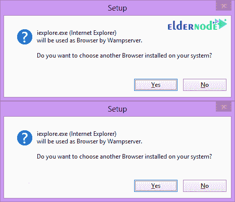

如果 wamp 程序不能访问防火墙，可能会显示一个窗口，要求您授予防火墙对 wamp 程序的访问权限。为此，只需单击“允许访问”按钮来确定防火墙的可访问性。

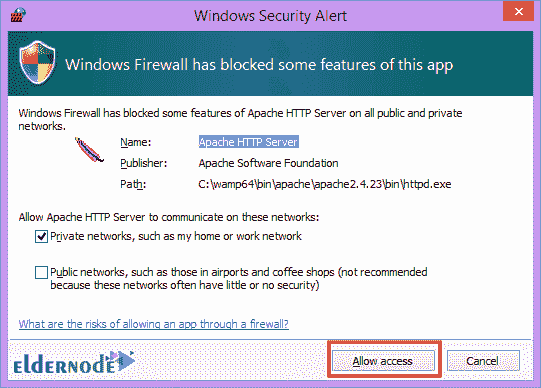

在安装 wamp 程序时完成加载步骤后，安装程序时会显示一个包含信息的窗口，类似于下图，您可以通过单击**下一步**按钮进入在 Windows 中安装 wamp 的最后步骤。

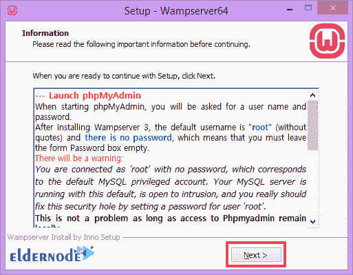

现在只需点击**完成**按钮即可完成安装过程。

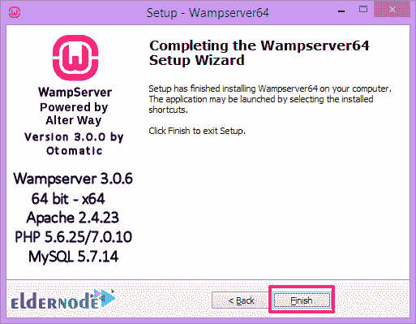

*安装成功完成！*

现在要运行 Wamp 程序，只需双击它即可，或者在 Windows 任务栏上单击 Wamp 图标，它最初是红色的。

***注意:*** 红色图标表示 Apache 和 mysql 服务器关闭，需要运行并启动它们才能运行。

点击图标选择**启动所有服务**选项，清除所有与运行本地 wamp 主机环境相关的项目。当黄色图标指示本地主机在您的 PC 上正确且完整地运行时，请等待 Wamp 图标变为绿色。

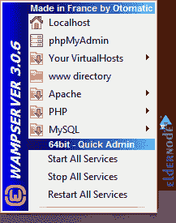

打开 localhost 后，打开浏览器并转到 localhost 以确保安装和设置步骤正确完成。或者从 home 图标旁边的 Localhost 选项上的 wamp 菜单转到本地环境，如上图所示。如果 wamp 程序正常工作，localhost 环境将显示如下，您可以通过参考 wamp 的各个部分来管理 wamp 中的 localhost 环境设置，并对其应用您的更改。

## 结论

在本教程中，我们研究了如何在 RDP admin 2016 上下载、安装和设置 Wamp 服务器。在 Wampserver(一个服务器模拟器)的帮助下，你将能够在你的本地系统上免费运行 WordPress 或任何其他内容系统。