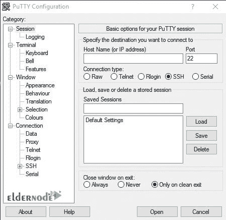
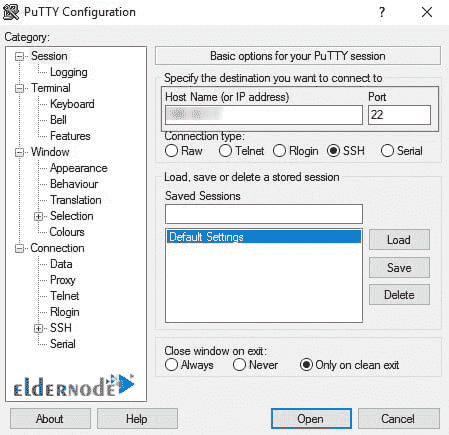

# 介绍 Putty 以及如何使用 Putty - Eldernode 登录 VPS

> 原文：<https://blog.eldernode.com/how-to-login-into-vps-with-putty/>


Putty 是一个免费的电信软件，支持各种协议，如 SSH、Telnet、rlogin 和 SCP。该软件正式适用于 Windows 操作系统，但也适用于各种 UNIX 平台。例如，Putty 可以定义为允许您通过 ssh 连接到 VPS 或云服务器的工具。在本文中，我们将讨论**引入 Putty 以及如何使用 Putty** 登录 VPS。如果你想购买一台 [**VPS 服务器**](https://eldernode.com/vps/) ，你可以访问 [Eldernode](https://eldernode.com/) 中提供的软件包。

## 介绍腻子及其特性

### **什么是腻子？**

Putty 是使用 Telnet、Rlogin 和 SSH 协议与远程计算机通信的软件。我们假设您已经购买了服务器，现在准备配置它。您必须使用该软件连接并登录到服务器。

Putty 软件是客户端软件。这意味着网络级必须有一个服务器，软件才能连接到它。我们的服务器是当前在我们的服务器上运行的同一个 SSH 服务。如果服务器关闭或 SSH 服务运行不正常，您将无法通过 SSH 协议连接到服务器。

Putty 最早开发于 1998 年，如前所述，最初是为 [Windows](https://blog.eldernode.com/tag/windows/) 设计的。在 2000 年晚些时候，这个程序变成了 SSH-2 客户机协议。然后，提供软件接口将该仿真器与其他操作系统连接，如 [Linux](https://blog.eldernode.com/tag/linux/) ，Windows Mobile，Mac OS，Mac Phone 等。

应该注意的是，Putty 是一个多平台应用程序，可以在大多数操作系统上运行。这个程序可以配置任何类型的服务器和功能，如端口传输和公钥在这个程序中提供。在 Putty 软件界面的帮助下，还可以传输无法通过电子邮件和其他信使发送的大文件。

### 使用油灰的优点

腻子最重要的优点如下:

1.Putty 提供了某些功能，尤其是在远程工作时。

2.它比其他类似的程序更容易配置，也更稳定。

3.断开连接后，一旦连接恢复，远程连接就可以恢复，文件或文本传输也可以恢复。

4.Putty 有一个易于使用的图形用户界面。

5.Putty 支持远程安全终端配置更改。

6.Putty 支持一些终端控制序列，例如 Xterm 不支持的 Linux 控制台序列。

### **使用油灰的弊端**

油灰有以下缺点:

1.只有会话中的用户名可以保存。

2.应该使用 WinSCP 之类的接口来传输非文本文件。

3.Putty 模拟器与某些 Cisco 网络设备不兼容。

4.建立连接时，复制和粘贴选项被禁用。

### **如何下载 Putty**

为了学习如何使用 Putty，应该说开始使用 Putty 首先需要 [**下载 Putty**](https://www.chiark.greenend.org.uk/~sgtatham/putty/latest.html) 。可以从 Putty 软件官网下载。访问完网站后，进入下载部分。在打开的页面上，您会看到为不同平台提供的不同版本的 Putty。


在**包文件**部分，您将看到安装版本。还为基于 UNIX 的系统(如 Mac 操作系统)提供了安装包。

下载所需版本后，轻松**运行安装包**并遵循安装步骤。安装包包括所有的 **Putty 工具**，除了 telnet 通讯。

在下一节中，我们将讨论如何使用 [Putty](https://blog.eldernode.com/what-is-putty-and-what-does-it-do/) 登录 VPS。

## **如何用 Putty 登录 VPS**

在完全熟悉了上一节中的 Putty 及其特性之后，我们现在想教您如何使用 Putty 登录 VPS。为此，只需遵循以下步骤。

下载安装 Putty 后，Putty 软件的主页如下:



**1。**在**主机名**字段中，输入目的服务器的 **IP 地址**。

**2。**在**端口**字段中，输入连接到服务器所需的端口号。连接端口默认为**22**。

**3。**在**连接类型**部分将连接类型设置为 **SSH** 。

**4。**点击**打开**。



如果这是您第一次使用 Putty 软件连接到服务器，将显示一条**警告消息**,以确保您连接到受信任的服务器和主机。如果您确定您输入的信息，点击**是**进入**登录页面**。

当然，在以后的连接中，您将不会看到此消息，因为此服务器的密钥存储在您的系统注册表中。如果您从另一个系统连接到此服务器，您将再次看到此消息。

在你接受提醒信息后，会出现一个**终端屏幕**，要求你输入**用户名**和**密码**。

如果你是第**次**登录该服务器，你必须**以 root 用户**登录。输入相关密码并按下**回车**。

如果输入的信息正确，您将登录到服务器命令行，并且可以完全访问服务器。


建议您在第一次登录服务器时**更改****根用户密码**。您可以使用以下命令轻松实现这一点:

```
passwd
```

输入上述命令后，输入两次**新密码**，每次输入新密码时，按下 **Enter** 键。

### **如何在 Putty 软件中保存服务器地址**

这样你就可以保存服务器的 **IP 地址**和**端口号**，不需要每次都输入。此外，如果您有多台服务器，您可以保存服务器列表，并在每次单击列表记录时连接到该服务器。为此，请执行以下操作:

**1。**首先输入你的 **IP 地址**和**服务器端口**。

**2。**在**保存的会话**部分，为其选择一个自定义名称。

**3。**然后点击**保存**。


从现在开始，要连接到服务器，只需在保存的会话部分双击您的服务器名称。

## 结论

如果您有 Linux 服务器，您可以使用 Putty 来连接和管理您的服务器。根据本文中关于 Putty 软件、Putty 管理以及如何登录 VPS 的提示，您可以轻松地管理您的服务器。在本文中，我们试着讨论一下 Putty 的介绍以及如何使用 Putty 登录 VPS。如果你愿意，可以参考文章[教程在 Linux 服务器](https://blog.eldernode.com/tutorial-connect-to-ssh-on-linux/)上连接 ssh。