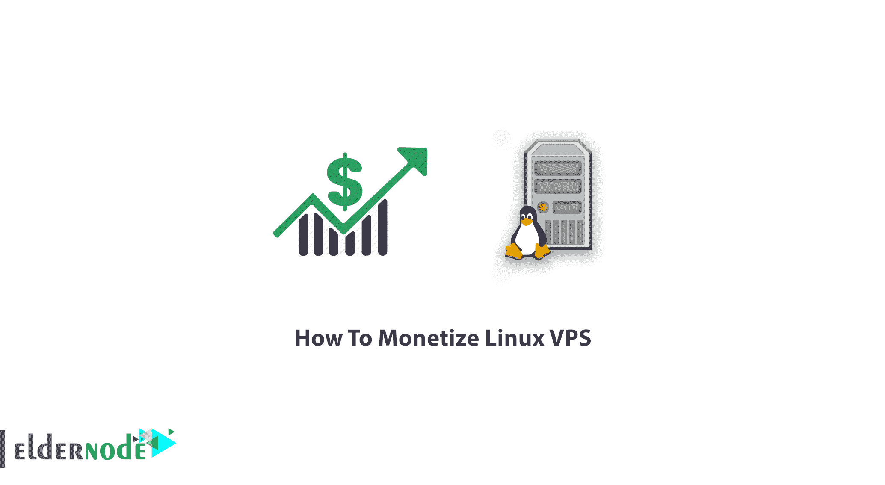

# 教程如何一步一步赚钱 Linux VPS-elder node

> 原文：<https://blog.eldernode.com/how-to-monetize-linux-vps/>

Linux VPS 如何一步步货币化？VPS 或**V**I virtual**P**rivate**S**server 是你可以用于你的网站的最流行的主机服务之一。要在互联网上拥有自己的网页或网站，您需要将其托管在虚拟或物理服务器上。拥有一台专用服务器成本很高，对于知识贫乏的普通人来说太难管理。这就是为什么[买个 VPS](https://eldernode.com/vps/) 比较便宜。如果你的网站有大量的流量和流量，有一个专用的服务器或者租用一个服务器是有意义的。

## 教程如何将 Linux VPS 货币化

在贸易和商业的世界里，你可以从你付出的任何东西中获得收入。你买 VPS，但也是一个很好的想法来赚钱。使用虚拟专用服务器作为一个伟大的虚拟主机平台来做许多其他事情是你在这篇文章中学到的。VPS 是一个永远在线的服务器，能够运行任何可以在标准 Linux 机器上运行的东西，这使得它对许多项目都很有用。尽管下面的提示向你展示了 Linux VPS 的主要特性，你还是可以考虑通过你的 Linux VPS 赚钱。

运行**私有**分析

管理您的项目

**开发**和**测试**你的代码

**管理**您的物联网设备

运行一个 **VOIP** 服务器

**管理**您的物联网设备

运行一个 **VOIP** 服务器

自动化一切

### VPS 特性

**1-能力**

如果**安全**问题对您非常重要，并且您正在考虑增加它，我们建议您使用 VPS。虚拟服务器的特点包括:拥有**更多空间**用于数据恢复和备份，先进的**监控** **能力**，提高**网站性能**，增加**在线支付**的可能性等。能帮你实现目标。在共享主机空间上使用虚拟服务器可以显著提高网站速度和性能。

**双速**

当开始工作时，由于输入量低，肯定不会成为你的网站的问题。但是随着你网站内容的增加和访问者数量的增加，你的网站将会面临太多的缓慢。因此，使用虚拟服务器比**必要的多**。

**3-个性化**

可以使用 EPACH，PHP 等应用。在您的虚拟专用服务器上，这意味着您可以定制服务器来满足您的需求。这是因为主机服务设置将对您不可用。

**4-增加流量**

如果你的网站刚刚起步，一个共享主机或主机可能对你来说就足够了，**但是**一旦你的受众增加，你需要考虑改变。在这些情况下，您应该考虑由于流量增加而导致网站出现问题或速度过度变慢的风险，并将您的服务器升级到 VPS。

**5-网上商店**

如果你打算建立一个**网上商店**，我们建议你使用虚拟服务器，因为这些服务器中有许多已经在**保护用户银行卡**信息方面非常成功，通过了无数测试和安全测试。

**6 根访问**
虚拟服务器最显著的特点之一就是可以访问根服务器，这就允许用户运行操作系统、安装应用程序和各种服务。

VP 的类型

### **Linux 虚拟服务器**

Linux VPS 是托管您的网站的最强大的服务之一，将为您的网站提供高速、安全和稳定的服务。分配给你的资源和空间提高了你的网站的质量，减少了出现任何问题的可能性。

**Windows 虚拟服务器**

[Windows VPS](https://eldernode.com/windows-vps/) 将为您提供一个完全熟悉的使用 Windows 操作系统的用户界面。由于大多数人在他们的个人系统上使用 Windows 操作系统，服务器管理也将更加容易。

介绍 Linux VPS 的盈利方式

### 虽然您已经大致了解了什么是 VPS，以及购买 VPS 后您将拥有哪些功能，但是让我们来看看我们如何将它货币化。

**1-运行 HitLeap**

如果你在 VPS 上运行 HitLeap，你的网站可能会有点击率。我不打算考虑**【PTP】**[**Adfly**](https://topoffers.com/blog/affiliate-tips/make-money-by-sharing-links-an-adfly-review/#:~:text=AdFly%2C%20also%20referred%20to%20as,their%20service%2C%20product%20or%20content.)或者**站长**因为你很可能会立刻被封杀，而且不会寻求你的盈利。

**2-托管游戏服务器** 

虽然游戏是最受欢迎的爱好之一，特别是在美国有 70%的粉丝，但你可以玩《反恐精英》、《《我的世界》》等游戏。当然，建议你在托管这些游戏服务器时使用 Linux，因为 Windows 需要更高的性能

**3-运行宏**

要通过宏赚钱，你有两个计划。

第一:获得积分

第二:在任何市场上出售客户

此外，你可以在任何其他网站上使用宏，比如 PTC，当然也可以在你自己的社交媒体网络上使用。

**4-正在运行的机器人** 

“自动点击器”是帮助我们增加网站流量的机器人。使用“GSA 验证码断路器”来处理可能会中断或干扰您的陪同任务的路障。

**5-正在运行的 FTP 服务器** 

你可能会发现这个解决方案很难，但是如果你学会了如何创建 **FTP** 服务器并把它们卖给新公司，它会为你赚钱。

**6-** **云上渗透测试**

这种货币化方式的作用是通过安装 Kali Linux 工具并转售给其他人用于底层目的来提供 pentest 云服务。

**7-挖掘比特币**

虽然有许多用户认为采矿不是一个好主意，但你可以找到其他人作为这种货币化方式的粉丝。然而，你可以加入购买奖励计划，开设一个有息的比特币账户，成为一名代销商，甚至可以在没有任何专门硬件的情况下获得开采比特币的报酬

结论

在本文中，您研究了如何将 Linux VPS 货币化。从现在开始，通过搜索本指南的每一个技巧，选择最佳的解决方案，更好地为您从自己的 VPS 中赚钱。如果你需要阅读更多内容，可以找到我们的相关文章，关于[如何选择最好的 Linux VPS 服务](https://blog.eldernode.com/how-to-choose-the-best-linux-vps-service/) **和** [如何破解 Linux VPS](https://blog.eldernode.com/how-to-crack-linux-vps/) 。

Though there are many users who believe that mining is not a good idea, you can find others as a fan of this way of monetization. However, you can join purchase reward programs, open an interest-bearing [bitcoin](https://eldernode.com/bitcoin-vps/) account, become an affiliate marketer, and even get paid to mine bitcoin without any specialized hardware

## Conclusion

In this article, you studied How To Monetize Linux VPS. From now on by searching for every single tip of this guide, choose the best solution would work better for you to make money from your own VPS. In case you need to read more, find our related articles on [How to choose the best Linux VPS service](https://blog.eldernode.com/how-to-choose-the-best-linux-vps-service/) **AND** [How to crack Linux VPS](https://blog.eldernode.com/how-to-crack-linux-vps/).