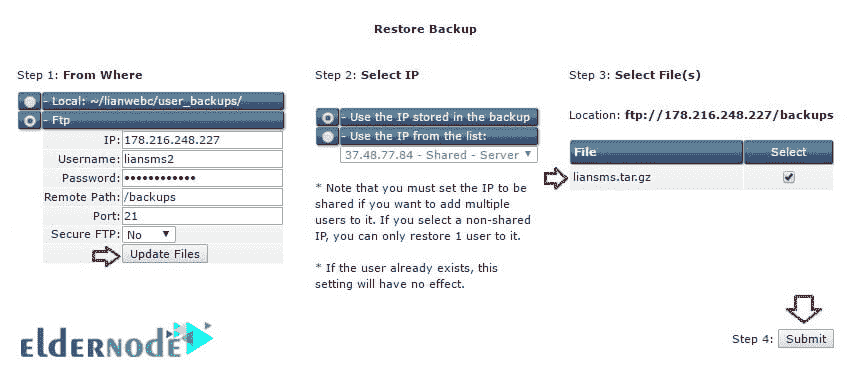

# 如何从一个 DirectAdmin 转移到另一个- ElderNode 博客

> 原文：<https://blog.eldernode.com/how-to-move-from-one-directadmin-to-another/>

如何从一个 [DirectAdmin](https://blog.eldernode.com/tag/direct-admin/) 移动到另一个；

许多用户出于各种原因迁移和更换服务器。将一个站点从一个服务器移动到另一个服务器并不是一件困难的事情，根据你所拥有的控制面板，你必须做一些特殊的事情。

在这个关于 eldernode 的[教程](https://eldernode.com/category/tutorial/)中，我们将研究如何从一个 DirectAdmin 迁移到另一个 direct admin。

### **如何从一个 DirectAdmin 转移到另一个**

此方法适用于那些在源服务器和目标服务器上都使用 [DirectAdmin](https://www.directadmin.com/) 控制面板的用户。想要将一个或多个帐户从 DirectAdmin 移动到另一个 DirectAdmin 的用户必须首先在源 DirectAdmin 中创建备份，然后将其移动到他们的经销商或用户目录。

但是怎么做呢？请遵循以下步骤:

**从源获得备份 DirectAdmin**

### 要在用户级别或代理级别从 DirectAdmin 移动到另一个 DirectAdmin，您必须备份。

要备份 DirectAdmin，首先，请转到源 DirectAdmin 进行完整备份。

只需点击**创建/恢复备份**即可获得完整备份。

然后，您将被重定向到一个页面，以选择您的收藏夹。

选择您想要备份的选项，并从 DirectAdmin 移动到另一个 DirectAdmin，最后单击**创建备份**按钮。

最后，从 DirectAdmin 显示一条消息，表明备份成功。确保在消息或“**消息系统”**部分检查备份未崩溃。

**提示:**尝试为您要转移的每个用户指定一个特定的名称，这样就不会出现错误。你可以把这个名字放在你的备份上。**例如**，当尝试转移用户“Alex”时，您应该将其重命名为 Alex.tar.gz，以便您在接下来的步骤中不会遇到备份错误。

**将 DirectAdmin 的备份移动并恢复到另一个 DirectAdmin**

### 这种转移有两种模式:

将用户级 DirectAdmin 移动到另一个用户级 DirectAdmin

1.  将备份 DirectAdmin 转让给另一个 DirectAdmin 经销商
2.  我们分别研究这两种方法。

**将用户级 DirectAdmin 移动到另一个用户级 DirectAdmin**

#### 此方法适用于具有用户级 DirectAdmin 且不具有代表性的人员。

如果您处于 DirectAdmin 的这个级别，只需加载并恢复您在上一步中所做的备份，以便从 DirectAdmin 移动到另一个 DirectAdmin！

点击**恢复选中项**将备份恢复到 DirectAdmin。

然后，不要忘记检查"**消息系统"**，以确保从 [DirectAdmin](https://eldernode.com/directadmin-vps-server/) 到另一个 DirectAdmin 的恢复和传输正确完成。

**将备份 DirectAdmin 转移到另一个 DirectAdmin 经销商**

#### 如果你是一个代表，你应该从这个方法中得到帮助。在初级教育的帮助下启动备份后，转到目标 DirectAdmin。

在目标 DirectAdmin 中，单击“**管理用户备份”**从 DirectAdmin 移动到 DirectAdmin 经销商。

***注** :* 该页面包含备份和恢复两个部分。

***注意:*** 页面顶部是为打算将所有账户直接转让给另一家经销商的代理商准备的。

你会发现一个类似于下面的页面。

IP 是源 IP 地址。您可以通过 cmd 中的 ping 命令获得这个 IP。

*   "**从何处"**部分:我们将确定从何处获取此备份，然后恢复它。
*   务必选择“**FTP”**选项。因为您打算从另一个位置获取文件。
*   "**用户名"**字段:输入进行备份的源 DirectAdmin 的用户名。
*   " **password"** 部分:键入源 DirectAdmin 的密码。
*   "**远程路径"**部分:输入源备份访问地址，该地址基本存储在备份的目录中。
*   端口为 1。
*   最后，点击**更新文件**按钮。这将显示在备份文件的右侧。选中它，然后点击**提交**按钮执行恢复。

如何从一个 [DirectAdmin](https://eldernode.com/directadmin-vps-server/) 移动到另一个；

祝您好运

Goodluck.