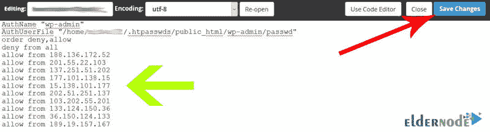

# 如何限制用户登录站点管理- Eldernode

> 原文：<https://blog.eldernode.com/how-to-restrict-users-from-logging-in-to-the-site-management/>


想象一下，你是一个大型网站的经理，该网站每天为大量的互联网用户提供大量的服务，你雇佣了一些人来帮助你管理这个网站，来完成你的工作和管理这个大型网站。事实上，如果你有一个服务网站，你必须从他们那里获取你的客户和用户的姓名和家庭或工作地址和电话号码等重要信息，然后向他们提供服务。像许多其他伟大的网站一样，我们现在设想通过用密码保护 Cpanel 来增加在您的网站管理路径上保存这些重要信息的安全性，但随着时间的推移，这可能会被密码黑客攻击。在这篇文章中，我们将教你如何在 Cpanel 中限制用户只能使用特定的 IP 进入站点管理。

## 如何限制特定计算机对网站管理的访问？

答案很简单！通过 IP 技术。事实上，每台连接到互联网的计算机都被分配了一个由四部分组成的 ID，我们称之为 IP。每台计算机在进入万维网时都有自己唯一的 IP 地址，例如，我们计算机的 IP 地址是 31.29.33.229，它可能会随着每次上网而改变。通常有两种类型的 IP:

***1-静态 IP:***这些 IP 始终如一，从不改变。

***2-动态 IP:***这些 IP 总是随着每次上网而变化，我们的电脑被分配了一个特定的 IP。

但是现在，我们想做的是识别公司内部员工的 IP 地址，以提高我们网站的安全性。然后应用主机内的设置，只有那些 IP 和那些计算机可以访问我们的网站管理。

当然，这个功能并不是只用于大公司。即使您是站点的唯一管理员，您也可以只通过您的个人计算机和互联网来访问您的站点管理，除您之外，任何人都不能访问您的站点管理。

## 如何创建在 Cpanel 中输入站点路径的限制

**1。**首先，**登录**到你站点的 Cpanel 主机，从**文件**部分点击**文件管理器**。


您在该路径中看到的内容是主机的基本和结构化文件。我们给你的建议是永远不要改变这些。您必须在 **public_html** 目录中完成所有您想要的工作和设置，该目录是您站点可执行文件的位置。

**2。**为此，从该部分找到 **public_html** 并双击**上的**。


### 只允许使用特定的 IP 访问 WordPress admin 登录表单

这些是我们 WordPress 网站的文件和内容。现在，假设我们网站的域名地址是**yourdomain.com**，如果我们想进入我们 WordPress 网站的管理，我们在浏览器中输入**yourdomain.com/wp-admin**并按回车键打开 WordPress 管理的登录页面。

现在请注意，如果世界上任何其他人在他们的浏览器中输入这个地址，他们可以看到我们网站管理的登录页面。


而如果它能找到登录网站管理的用户名和密码，那么很有可能我们网站管理内部的信息安全就会严重受损。

我们希望在主机内部应用设置，只有这台计算机可以从我们的网站访问此页面。为此，**重新进入****Cpanel 主机文件管理器**。

现在，考虑到为了进入我们网站的管理，我们不得不在网站地址的末尾加上一个 **/** ，并写上 **wp-admin** ，所以现在我们必须进入 **wp-admin** **文件夹**。为此，根据下图选择该文件夹，双击方法进入。


### 如何创建登录 WordPress admin 的 IP 限制

为此，我们需要在*中放一系列代码**。从站点 htaccess 文件**中的这个文件夹*。因为 ***。htaccess 文件*** 是确定对站点路径的访问级别的文件。因此，如果我们想要为人们创建访问站点管理路径的限制，比如 IP 限制，我们必须配置这个文件。

如您所见，当我们选择该文件时，它就在我们面前。现在，为了能够将我们想要的代码添加到这个文件中，我们需要能够编辑它。然后**根据图片右键**，点击编辑按钮。


如您所见，这个文件中已经包含了一系列代码。我们与这些代码无关，我们把需要的代码放在下一行。

```
Order deny,allow  Deny from all  Allow from 46.224.25.35
```

我们决定自己键入这些代码，以允许某些 IP 从我们的网站进入此路径。于是我们开始书写和打字**命令拒绝**，**允许**。

这一行代码意味着我们的命令有两种模式，一个 deny 表示不允许访问，另一个 allow 表示允许访问。现在，在接下来的几行中，我们必须指定哪些人希望从站点访问此路径，哪些人不希望从站点访问此路径。所以在下一行中，我们键入 **Deny from all** ，这意味着世界上所有的人都不能从我们的站点访问这条路径来缓解我们的焦虑。

现在在下一行我说除了这些我们说的属于我们的 IP，其他人不应该被允许访问。因此，要通过另一台计算机从该站点访问此路径，并从 46.224.25.35 键入 **Allow** 。

这一行意味着 IP 地址为 46.224.25.35 的计算机可以从站点访问该路径，现在我们完成了，我们单击**保存**更改按钮。


现在要在浏览器中看到工作的最终结果，键入***【yourdomain.com/wp-admin】***，正如你所看到的，一个 **403 错误**或同样的禁止将为我们显示。


### 如何在互联网上找到电脑 ip 地址

获取电脑的 IP 地址有几种解决方案，但最简单和最新的方法是去**谷歌**网站找到我们电脑的 IP 地址，并搜索**我的 IP 是什么**。正如你所看到的，谷歌在显示结果的第一行为我们打开了一个盒子，在里面，它显示了我们计算机的 IP 地址，完整地由 4 部分组成。


现在我们完全复制这个地址，重新输入**。我们放置代码的站点路径的 htaccess** 文件。在第三行中，我们删除了与 IP 地址 46.224.25.35 相关的代码，代之以输入我们从 Google 站点复制的计算机的 IP 地址。

***注意:*** 一定不要改别的。

再次点击上面的**保存** **修改**按钮。


### 如何将具有不同 IP 的多个站点计算机访问到站点管理路径

第一步是重新输入**。htaccess** 文件，并引用您放在该 IP 行中的最后一行。

现在从头到尾完整地复制这一行，并按回车键进入下一行。

现在，在下一行中，粘贴您复制的上一行的内容，并根据图像键入另一台计算机的 IP 地址，而不是上一行的 IP 地址。

最后，点击**保存更改**按钮。



### 如何设置进入站点管理路径的动态 IP

需要注意的重要一点是，通常 90%的电脑都是动态 IP。这意味着每次您连接到互联网时，您的计算机的 IP 地址都会发生变化，在这种情况下，在更改您的计算机的 IP 地址后，您将无法看到您的站点管理页面，有两种通用解决方案可以解决此问题:

**1-** 第一种方法是联系你的互联网服务提供商，比如你提供 ADSL 的同一家公司，让他们给你提供一个静态 IP 地址。这不会在您每次登录到互联网后更改您计算机的 IP 地址，在这种情况下，您可以轻松地只设置在中从不更改的静态 IP 地址。htaccess 文件。这样做之后，除了你之外，没有人能看到你的站点管理的登录页面。

**2-** 第二种方法是，如果您不决定从您的互联网服务提供商处获得专用 IP，并且每次您的计算机的 IP 地址发生变化时，将您的计算机的固定 IP 范围放在**中。htaccess 文件**。**举个例子**，如果你现在输入 148.251.29.39 的 IP 地址，关机再开机后，你的 IP 地址就会是 148.251.21.43，这意味着你的 IP 地址只有后两部分会发生变化。因此，您可以将不变的两部分放在该文件中，而不是您计算机的完整 IP 地址。

**比如**，如果你确定自己 IP 地址的前两部分永远不会变，就把 148.251 放在**里。htaccess** 文件而不是完整的 IP 地址。这意味着任何最初是 148，251 的 IP 应该被允许进入站点的管理页面，并且 IP 的最后两个部分应该无关紧要。

但是，你的网站的安全性仍然显著增加，因为世界上很少有计算机的第一个 IP 地址是 148，251。但是如果你的网站的安全性对你来说非常重要，我们建议你使用同样的第一种方法，即提供服务公司的静态 IP。

## 结论

在本文中，我们试图教如何在 Cpanel 中限制用户登录站点管理。您还学习了如何添加自定义 IP 来登录。