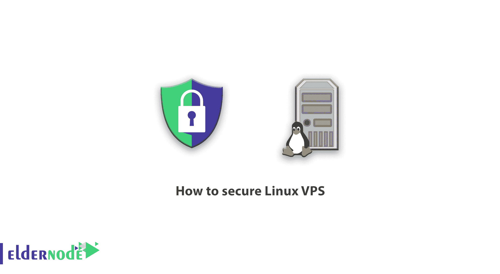
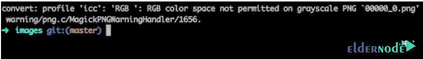

# 如何保护 Linux VPS[快速方法] - Eldernode 博客

> 原文：<https://blog.eldernode.com/how-to-secure-linux-vps/>

【更新】VPS 服务器安全是你要特别注意的问题。Linux VPS 服务器有很多优点。事实上，Linux VPS 比 Windows 等其他操作系统更安全，因为安装了 LSM (Linux 安全模型)。但是这个系统是不够的，不能完全保护你的 VPS 服务器。在这篇文章中，我们将学习如何保护 Linux VPS，有 20 种方法可以在 Linux VPS 服务器上创建更多的安全性。你可以访问 [Eldernode](https://eldernode.com/) 提供的包来购买 [Linux VPS](https://eldernode.com/linux-vps/) 服务器。

## **教程一步一步保护 Linux VPS**

默认情况下， [Linux](https://blog.eldernode.com/tag/linux/) 比它的竞争对手有更好的安全性，但是仍然有漏洞需要解决。我们在 Eldernode 有一句话，好的服务器是安全的服务器。这就是为什么我们为您提供解决方案，以便您可以阻止黑客用来渗透网站和访问您的信息的访问。

我们今天学习的使 Linux 更加安全的技术不需要太多的专业知识，你可以很容易地使用这些方法。请跟随这篇教程学习 20 种在 Linux 服务器上增加[安全性](https://blog.eldernode.com/tag/security/)的方法。

## 用快速方法学习安全的 Linux VPS

### **【禁用 root 用户登录(安全 Linux VPS)**

想要一个安全的 VPS？永远不要以 root 用户的身份登录。

默认情况下，每个 Linux VPS 服务器都有一个“root”作为主用户名。因此，黑客试图获得并访问他们实施的[暴力](https://blog.eldernode.com/ftp-configuration-to-prevent-brute-force-attacks-on-windows-server-2012/)攻击的密码。禁用从“root”用户名登录为您的服务器增加了另一个安全级别，并防止黑客进入 root 用户。

您需要创建另一个用户名，并使用“ **sudo** ”命令来执行根级命令，而不是以根用户身份登录。

Sudo 是一种特殊的访问权限，可以授予经过身份验证的用户，这样他们就可以执行管理命令，并且不再需要 root 访问权限。

***注意:*** 在禁用根用户之前，请确保您指定了想要使用的用户权限。

当您准备好这样做时，在服务器控制台中打开 nano 或 vi 中的命令，并找到“ **PermitRootLogin** ”参数。默认情况下，其值等于“**是**”。将其更改为“**否**，并保存更改。

### **更改 SSH 端口(安全 Linux VPS)**

**黑客用来连接 SSH 服务器的第一个端口是**端口 22** 。如果您更改了这个端口，就在很大程度上阻止了他们对 SSH 的访问。为此，您需要打开它，将适当的设置放入此部分。**

*****注意:*** 当然，在这样做之前，要确保你选择的端口没有被服务器上的另一个服务使用。**

### ****保持服务器软件最新****

**保持服务器软件最新并不困难。**

**您可以轻松地使用 **rpm/yum** 或**apt-get([Ubuntu](https://blog.eldernode.com/tag/ubuntu/)/Debian)**软件包管理器来更新已安装软件、模块和元素的新版本。您甚至可以将操作系统配置为通过电子邮件发送 yum 软件包更新警报。这使得跟踪更改变得更加容易。如果您想要自动执行任务，可以设置一个 cronjob 来应用您这边的所有安全更新。**

**如果你使用像 [DirectAdmin](https://blog.eldernode.com/tag/direct-admin/) 或 [Cpanel](https://blog.eldernode.com/tag/cpanel/) 这样的面板，你应该经常更新它们。当然，这些面板中的大部分都有自动更新功能，不需要担心。您应该总是尽早安装安全补丁，因为侵入服务器的风险会随着时间的推移而增加。**

### ****禁用未使用的网络端口****

**不使用的开放网络端口是黑客的好目标。关闭它们可以保护你免受攻击。**

**使用“ **netstat** ”命令显示所有打开的网络端口。**

****

**使用 **iptables** 设置关闭所有端口，或者使用 **chkconfig** 命令禁用不需要的服务。如果你使用的是防火墙，比如 **CSF** ，你可以自动化 iptables 规则。**

### ****删除不需要的模块/包****

**您的服务器上可能有并非所有 Linux 服务器都需要的服务。请注意，您从服务器上移除的任何服务都会减轻您的一些安全顾虑，因此请确保您在服务器上使用了您真正需要的服务。**

*****注意:*** 以后一定要避免安装不必要的软件，以免出现安全问题。**

### ****禁用 IPv6****

**IPv6 比 IPv4 有很多优势，但是你用的可能性很小，因为用的人很少，但是黑客用 IPv6 的很多。**

**如果您不使用 IPv6，请将其禁用。他们通常通过 IPv6 发送恶意流量，放弃该协议会给他们带来风险。要解决此问题，请单击 edit /etc/sysconfig/ network 并更新设置，使其显示 NETWORKING_ IPV6 = no 和 IPV6INIT = no。**

### ****使用 GnuPG 加密****

**黑客通常在数据通过网络传输时攻击数据。这就是为什么必须使用密码、密钥和证书对传输到服务器的数据进行加密。GnuPG 是一种流行的工具，一种用于加密通信的基于密钥的认证系统。该系统使用“公钥”，该公钥只能由仅在接收方可用的“**私钥**解密。**

### ****设置强密码****

**弱密码总是对安全性的一大威胁。不要让您的服务器用户使用容易被发现的弱密码。要选择密码，最好使用大写和小写的单词、数字和符号。您还可以指定一个特定的时间段，以便用户在该时间后必须更改密码。此外，使用“ **faillog** ”命令设置登录失败限制，并在尝试保护系统免受暴力攻击失败后关闭用户帐户。**

### ****防火墙配置****

**如果你真的想要一个安全的 VPS，你需要一个防火墙。 **NetFilter** 是一个与 Linux 内核集成的防火墙，你可以配置它来过滤掉不想要的流量。有了 NetFilter 和 iptables，你可以对抗拒绝服务( **DDoS** )攻击。**

*****注意:*** 防火墙调整不够，确保配置正确。**

****TCPWrapper** 是另一个有用的应用。基于主机的访问控制列表系统用于过滤各种应用程序的网络访问。它还提供**主机名认证**、**标准化日志**和**间谍保护**，所有这些都有助于增加您的安全性。**

**其他热门防火墙还有 **CSF** 和 **APF** ，两者都有 **cPanel** 和 **Plesk** 等热门面板的插件。**

### ****使用磁盘分区****

**为了提高安全性，最好对磁盘进行分区，将操作系统文件与用户文件、tmp 文件和第三方程序分开。您可以禁用 **SUID / SGID (nosuid)** 访问，并在操作系统分区上运行二进制文件( **noexec** )。**

### ****开机正好读取****

**在 Linux 服务器上，所有内核文件都存储在“ **/boot** ”目录中。但是这个目录的默认访问级别是“**读写**”。为了防止对服务器性能至关重要的引导文件进行未经授权的更改，请将访问级别更改为“**只读**”。**

**为此，只需编辑 **/etc/fstab** 文件，并在底部添加默认的 LABEL =/boot/boot ext2，ro 1 2。如果将来需要更改内核，可以很容易地将其重置为“**读写**模式。然后，您可以进行更改，并在完成后将其返回到“**只读**模式。**

### ****用 SFTP 代替 FTP****

**[FTP](https://blog.eldernode.com/install-ftp-server-on-windows-server/) 文件传输协议不再安全，即使使用加密的“**FTP over TLS**”(FTPS)连接。**

**FTPS 和 FTP 都容易受到攻击。当计算机程序介入并监控网络流量时。FTP 是干净的，FTPS 文件传输是干净的，这意味着只有证书是加密的。**

**SFTP，即“ **FTP over SSH** ”(也称为“安全 FTP”)，完全加密所有数据，使您的服务器安全。**

### ****使用防火墙****

**您的防火墙是一个网关，它允许和阻止对服务器的访问，是您抵御黑客的第一道防线。安装和配置防火墙是您在安装和保护 VPS 或裸机服务器时需要做的第一件事。**

### ****安装杀毒软件****

**防火墙的主要功能是阻止对服务器信息的访问，是您抵御黑客的第一道防线，但是没有防火墙是完全安全的，任何恶意软件都可以绕过它。因此，需要其他安全措施。**

**许多服务器管理员不在他们的服务器上安装防病毒软件，因为他们发现它有局限性。他们不这样做，因为安装这些抗病毒药物需要一些专业知识和费用。因为这些人不想为他们服务器的安全性付费。但是如果你没有足够的钱购买付费杀毒软件，你可以使用免费版本，比如 ClamAV T1 和 T2 Maldet T3，它们可以扫描你的服务器并显示可疑文件。**

### ****自动 CMS 更新****

**黑客总是试图找到安全漏洞。尤其是在内容管理系统方面，最著名的有 **Joomla** 、 **Drupal、**和 [WordPress](https://blog.eldernode.com/tag/wordpress/) ，大多数网站都在他们的网站上使用这些内容管理系统。**

**这些 CMS 的大多数开发者发布了很多安全更新。在这些内容管理系统中，WordPress 发布的更新最多。这个内容管理系统还允许您随着新版本的发布而自动更新。如果你使用的是旧版本的 WordPress，请立即更新以防止黑客攻击。**

### ****激活 WHM 的绿巨人****

**除了防火墙，cPanel 还有一个“ **cPHulk** 蛮力安全系统。防火墙并非没有漏洞，有时会出错，黑客也能渗透进来，这往往是由于防火墙设置不正确。**

**同时，cPHulk 充当二级防火墙，防止对服务器的暴力攻击。cPHulk 首先阻止登录功能，防火墙后来阻止它并阻止整个 IP。要启用它，你需要去 [WHM](https://blog.eldernode.com/cpanel-and-whm-installation-tutorial/) 安全中心，选择 cPHulk 蛮力保护。这是安全强化过程中的另一个步骤。**

### ****阻止匿名 FTP 上传****

**cPanel 和 [Plesk](https://blog.eldernode.com/tag/plesk/) 都默认禁用匿名 FTP 上传，但其他服务默认可以启用。**

**允许匿名用户通过 FTP 上传是一个主要的安全风险。因为它允许任何人上传任何他们想上传的东西到你的网络服务器上。你可以想象，这是完全不推荐的，这意味着你把你的钥匙给了一个小偷。**

*****注意:*** 要禁用访客上传，编辑您的 FTP 服务器配置设置。**

### ****安装一个 rootkit 扫描器****

**最危险的恶意软件之一是 rootkit。Rootkit 存在于操作系统级别，低于其他正常的安全软件，并允许未被发现的访问服务器。幸运的是，您可以使用开源工具 chrootkit 来确定您的服务器是否被感染。但是 rootkits 并不总是容易移除，移除它们的最好方法是重新安装操作系统。**

### ****定时备份****

**有许多人忘记定期备份，并在出现问题时后悔，因为他们没有数据的副本。不管你有多小心，不管你的服务器有多安全，总有出错和麻烦的可能。**

**不要冒不备份之类的危险，也不要过于依赖主机来备份。将副本保存到不同的位置，并考虑使用备份空间或 Google Drive。**

### ****使用强密码****

**到处都在说，但是再听一遍。糟糕的密码对您的 Linux 服务器是一种安全威胁，但对 Windows 服务器也是如此！尽量选择复杂的密码，由大小写字母，不同的数字和符号组成的密码就很好了。尽可能选择长而复杂的密码。**

*****注意:*** CPanel 和 Plesk 都可以应用强密码策略，定期让密码过期。**

## **结论**

**Web 服务器基础设施问题可能非常糟糕。全世界有数百万黑客在研究你的 VPS 中最小的漏洞。你需要保护你的 VPS 免受这些威胁，因为黑客迟早会找上你。企业网站和在线商店是全世界黑客的最佳目标。虽然大多数公司都有基本的安全标准，但它们通常很容易被攻破。在本文中，我们尝试使用 20 种方法来学习如何保护 Linux VPS。**