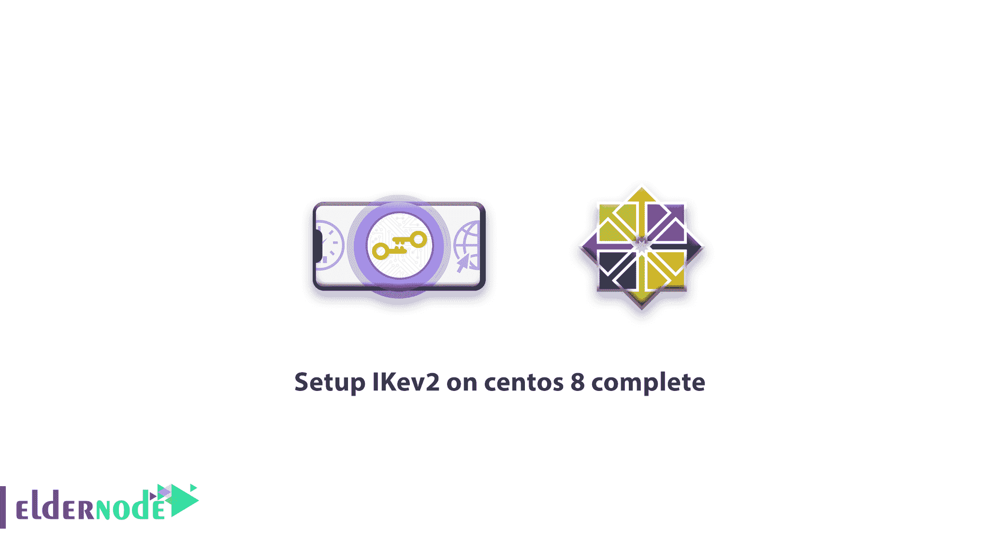

# 如何在 centos 8 complete - Eldernode 博客上设置 IKev2

> 原文：<https://blog.eldernode.com/how-to-setup-ikev2-on-centos-8-step-by-step/>



【更新】现在最常用的协议叫互联网密钥交换(IKE)。第一个版本发布于 1998 年，它的通用名称是 IKEv1。因为 IPsec 默认使用的是 IKE 的第一个版本。IKEv1 规范升级了它的隐藏部分，在 2005 年，IKEv2 被创建。有了这次更新，该协议变得更加可靠，对 DOS 攻击更有弹性。IKEv2 是一种基于 IPsec 的协议，代表 Internet 密钥交换版本 2。在本文中，我们将一步一步地教你如何在 centos 8 上设置 IKev2。如果你想购买一台 [CentOS VPS](https://eldernode.com/centos-vps) 服务器，你可以访问 [Eldernode](https://eldernode.com/) 中提供的软件包。

## **教程 CentOS 8 上设置 ike v2**

首先，向您介绍一下 **StrongSwan** 软件是很好的，然后，让我们来设置如何在 [CentOS](https://blog.eldernode.com/tag/centos/) 8 上设置 IKev2。

### **什么是强天鹅？**

通过访问 [Strongswan 网站](https://www.strongswan.org/)，您将认识到，Strongswan 是一个开源的多平台 IPsec 实现。这是一个基于 IPsec 的 VPN 解决方案，侧重于强认证机制。StrongSwan 支持 **IKEv1** 和 **IKEv2** 密钥交换协议、基于 X.509 证书或预共享密钥的认证以及安全的 IKEv2 EAP 用户认证。

在阅读了**什么是 StrongSwan** 部分之后，现在我们将一步一步地教你如何在 centos 8 上设置 IKev2，最后在 CentOS 8 上运行 VPN 服务器。

### 在 CentOS 8 上设置 IKev2 的先决条件

在 CentOS 8 上启动 IKev 2 之前，务必准备好以下先决条件。准备好这些先决条件后，您可以按照下一节中的设置步骤进行操作:

_ 全新 CentOS 8 服务器

_ Root 权限

## **如何在 CentOS 8 上设置 ike v2**

要在 centos 8 上设置 IKev2，您需要按顺序遵循以下章节。

### **在 CentOS 8** 上安装 StrongSwan

在第一步中，我们将安装 Strongswan IPsec 实施软件和 EPEL 存储库中所需的所有软件包。因此**使用以下命令添加 EPEL 回购**:

```
dnf install epel-release
```

EPEL 库安装成功后，运行以下命令**安装 stronswan**:

```
dnf install strongswan
```

### **生成 SSL 证书让我们加密**

要生成证书，您需要一个域和一个子域指向此服务器。所以我们在我们的域名系统上选择**vpn.eldernode.com**记录，你必须选择你的记录并替换我们使用我们域名的所有记录。

首先，您需要使用以下命令安装[让我们加密](https://letsencrypt.org/) bot:

```
wget https://dl.eff.org/certbot-auto -O /usr/local/bin/certbot-auto
```

之后，使用以下命令使其可执行:

```
chmod +x /usr/local/bin/certbot-auto
```

现在 certbot 工具安装完毕，可以为您的服务器生成 SSL 了。

要使用 let's encrypt 生成 SSL，您需要打开 HTTP 和 HTTPS 端口，对于此指令，请遵循以下命令:

```
firewall-cmd --add-service=http --permanent 
```

```
firewall-cmd --add-service=https --permanent
```

```
firewall-cmd --reload
```

记住不要关闭或禁用[防火墙](https://blog.eldernode.com/configure-firewalld-on-centos-8/)，因为我们稍后需要防火墙服务。

现在，您可以为您的 VPN 服务器生成一个新的 SSL 并获得一个证书文件:

```
certbot-auto certonly --rsa-key-size 2048 --standalone --agree-tos --no-eff-email --email your [[email protected]](/cdn-cgi/l/email-protection) -d vpn.eldernode.com
```

***注:*** 请将邮箱改为您的邮箱，将 vpn.eldernode.com 改为您的域名。

完成命令后，您会看到祝贺！现在使用您的 SSL 证书

接下来，您需要将证书文件' ***fullchain.pem*** '、' ***privkey.pem*** '和' ***chain.pem*** '复制到'**/etc/strong swan/IPSec . d/**'目录中。

```
cp /etc/letsencrypt/live/vpn.eldernode.com/fullchain.pem /etc/strongswan/ipsec.d/certs/ 
```

```
cp /etc/letsencrypt/live/vpn.eldernode.com/privkey.pem /etc/strongswan/ipsec.d/private/ 
```

```
cp /etc/letsencrypt/live/vpn.eldernode.com/chain.pem /etc/strongswan/ipsec.d/cacerts/
```

我们使用我们的域名，所以 certbot 用我们的服务器名为 SSL 创建一个目录。对于您，certbot 在您的域名目录上创建并生成 SSL。

### **如何将 StrongSwan 配置为 IKev2 VPN 服务器**

转到 **/etc/strongswan** 目录，使用以下命令从 **ipsec.conf，**进行备份:

```
cd /etc/strongswan 
```

```
mv ipsec.conf ipsec.conf.original
```

之后，使用以下命令创建一个新的 ipsec.conf:

```
vi ipsec.conf
```

您可以使用 centos 8 上的任何编辑器，如 vim 或 [nano](https://blog.eldernode.com/how-to-install-and-use-nano-text-editor/) 来创建和编辑文件。然后在 ipsec.conf 文件中复制并粘贴以下配置:

```
config setup      uniqueids=never # for allow multiple connections per user      charondebug="ike 2, knl 2, cfg 2, net 2, esp 2, dmn 2,  mgr 2"  conn %default      fragmentation=yes      closeaction=restart      rekey=no      dpdaction=clear      keyexchange=ikev2      compress=yes      dpddelay=35s      lifetime=3h      ikelifetime=12h      ike=aes256gcm16-prfsha512-ecp384!      esp=aes256gcm16-ecp384!      left=%any      [[email protected]](/cdn-cgi/l/email-protection)      leftcert=fullchain.pem      leftsendcert=always      leftsubnet=0.0.0.0/0      right=%any      rightid=%any      rightauth=eap-mschapv2      rightsourceip=192.168.20.0/24      rightdns=1.1.1.1,8.8.4.4      rightsendcert=never      eap_identity=%identity  conn ikev2-pubkey      auto=add
```

***注意:*** 替换您的域名而不是我们配置上的域名。

之后，**保存**并退出文件。现在，我们想创建一些连接到服务器的用户。所以下面的命令打开 **ipsec.secret** 文件:

```
vi ipsec.secrets
```

将以下配置复制并粘贴到文件上，然后**保存**并退出。有关更多信息，您可以添加更多用户，如配置中的所示:

```
: RSA "privkey.pem"  alex : EAP "[[email protected]](/cdn-cgi/l/email-protection)"  john : EAP "johni#poe"
```

**用下面的命令使能**和**启动 StrongSwan** 服务:

```
systemctl enable strongswan 
```

```
systemctl start strongswan
```

现在 Strongswan 服务已激活并运行，您可以使用以下命令进行检查:

```
systemctl status strongswan
```

### **如何在防火墙中启用 NAT**

在之前的文章中，我们介绍了 Firewalld 并学习了如何使用它。如果你需要了解防火墙，你可以阅读 centos 8 上的[配置防火墙。](https://blog.eldernode.com/configure-firewalld-on-centos-8/)

在这一步中，您将使用丰富的规则配置在 Firewalld 上启用 AH、ESP 和 NAT 伪装。您可以使用以下命令添加 **ipsec UDP 端口和服务**:

```
firewall-cmd --zone=public --permanent --add-port=4500/udp 
```

```
firewall-cmd --zone=public --permanent --add-port=500/udp 
```

```
firewall-cmd --zone=public --permanent --add-service="ipsec"
```

然后，您可以通过执行以下认证和加密协议命令，将 **AH** 和 **ESP** 添加到 Firewalld:

```
firewall-cmd --zone=public --permanent --add-rich-rule='rule protocol value="esp" accept' 
```

```
firewall-cmd --zone=public --permanent --add-rich-rule='rule protocol value="ah" accept'
```

现在**启用 NAT** 并重新加载防火墙配置规则:

```
firewall-cmd --zone=public --permanent --add-masquerade 
```

```
firewall-cmd --reload
```

### **如何在 sysctl**T3 上启用端口转发

要在 CentOS 8 上启用端口转发，需要编辑 **sysctl.conf** 文件。首先，用下面的命令编辑 **/etc/sysctl.conf** 文件:

```
vi /etc/sysctl.conf
```

用编辑器打开文件后，复制并粘贴以下配置，**保存**，并退出:

```
net.ipv4.ip_forward = 1  net.ipv4.conf.all.accept_redirects = 0  net.ipv4.conf.all.send_redirects = 0
```

您需要使用以下命令重新加载 sysctl 配置:

```
sysctl -p
```

现在端口转发已启用，您只需**重启 Strongswan** 服务:

```
systemctl restart strongswan
```

太好了。CentOS 8 上的 IKev2 VPN 服务器已准备就绪，您可以在 iPhone、Windows、android Strongswan 应用程序、iMac 等上使用它。

## 结论

在本文中，我们试图一步一步地向您介绍如何在 centos 8 上设置 IKev2。现在，如果您有任何问题，可以在下面的页面上发表评论，或者在 [Eldernode 社区](https://community.eldernode.com/)上提出您的问题。